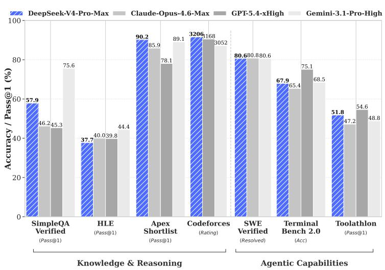
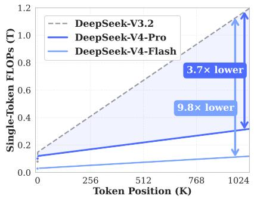
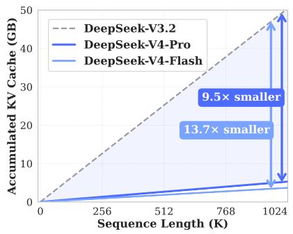

# DeepSeek-V4: Towards Highly Efficient Million-Token Context Intelligence

DeepSeek-AI — research@deepseek.com

## Abstract

We present a preview version of **DeepSeek-V4 series**, including two strong Mixture-of-Experts (MoE) language models — **`DeepSeek-V4-Pro`** with 1.6T parameters (49B activated) and **`DeepSeek-V4-Flash`** with 284B parameters (13B activated) — both supporting a context length of **one million tokens**. DeepSeek-V4 series incorporate several key upgrades in architecture and optimization: (1) a **hybrid attention architecture** that combines **Compressed Sparse Attention (CSA)** and **Heavily Compressed Attention (HCA)** to improve long-context efficiency; (2) **Manifold-Constrained Hyper-Connections (mHC)** that enhance conventional residual connections; (3) and the **Muon optimizer** for faster convergence and greater training stability. We pre-train both models on more than 32T diverse and high-quality tokens, followed by a comprehensive post-training pipeline that unlocks and further enhances their capabilities. **`DeepSeek-V4-Pro-Max`**, the maximum reasoning effort mode of `DeepSeek-V4-Pro`, redefines the state-of-the-art for open models, outperforming its predecessors in core tasks. Meanwhile, DeepSeek-V4 series are highly efficient in long-context scenarios. In the one-million-token context setting, `DeepSeek-V4-Pro` requires only **27% of single-token inference FLOPs** and **10% of KV cache** compared with `DeepSeek-V3.2`. This enables us to routinely support one-million-token contexts, thereby making long-horizon tasks and further test-time scaling more feasible. The model checkpoints are available at https://huggingface.co/collections/deepseek-ai/deepseek-v4.

Figure 1 | Left: benchmark performance of `DeepSeek-V4-Pro-Max` and its counterparts. Right: inference FLOPs and KV cache size of DeepSeek-V4 series and `DeepSeek-V3.2`.

## Contents

1 Introduction 4  
2 Architecture 6  
2.1 Designs Inherited from DeepSeek-V3 . 7  
2.2 Manifold-Constrained Hyper-Connections 7  
2.3 Hybrid Attention with CSA and HCA 9  
2.3.1 Compressed Sparse Attention . 9  
2.3.2 Heavily Compressed Attention . 11  
2.3.3 Other Details 12  
2.3.4 Efficiency Discussion . 13  
2.4 Muon Optimizer 14  
3 General Infrastructures 15  
3.1 Fine-Grained Communication-Computation Overlap in Expert Parallelism . . . 15  
3.2 Flexible and Efficient Kernel Development with TileLang . 16  
3.3 High-Performance Batch-Invariant and Deterministic Kernel Libraries 18  
3.4 Training Framework 19  
3.4.1 Efficient Implementation of Muon 19  
3.4.2 Cost-Effective and Memory-Efficient Implementation of mHC 20  
3.4.3 Contextual Parallelism for Long-Context Attention 20  
3.4.4 Extended Automatic Differentiation for Flexible Activation Checkpointing 21  
3.5 Inference Framework . 21  
3.5.1 KV Cache Structure and Management 21  
3.5.2 On-Disk KV Cache Storage 23  
4 Pre-Training 24  
4.1 Data Construction . . 24  
4.2 Pre-Training Setups . 24  
4.2.1 Model Setups 24  
4.2.2 Training Setups 25  
4.2.3 Mitigating Training Instability 26  
4.3 Evaluations 27  
4.3.1 Evaluation Benchmarks 27  
4.3.2 Evaluation Results 27  
5 Post-Training 28  
5.1 Post-Training Pipeline 28  
5.1.1 Specialist Training 28  
5.1.2 On-Policy Distillation 32  
5.2 Post-Training Infrastructures 33  
5.2.1 FP4 Quantization-Aware Training 33  
5.2.2 Efficient Teacher Scheduling for Full-Vocabulary OPD 34  
5.2.3 Preemptible and Fault-Tolerant Rollout Service 34  
5.2.4 Scaling RL Framework for Million-Token Context 35  
5.2.5 Sandbox Infrastructure for Agentic AI . 35  
5.3 Standard Benchmark Evaluation 36  
5.3.1 Evaluation Setup . 36  
5.3.2 Evaluation Results 37  
5.4 Performance on Real-World Tasks 41  
5.4.1 Chinese Writing . 41  
5.4.2 Search 42  
5.4.3 White-Collar Task . 42  
5.4.4 Code Agent . 44  
6 Conclusion, Limitations, and Future Directions 44  
A Author List and Acknowledgment 54  
A.1 Author List . 54  
A.2 Acknowledgment . . 55  
B Evaluation Details 55

## Summary of Core Evaluation Results

- **Knowledge:** In assessments of broad world knowledge, `DeepSeek-V4-Pro-Max`, the maximum reasoning effort mode of `DeepSeek-V4-Pro`, significantly outperforms leading open-source models on the `SimpleQA` [OpenAI, 2024d] and `Chinese-SimpleQA` [He et al., 2024] benchmarks. Regarding educational knowledge — evaluated via `MMLU-Pro` [Wang et al., 2024b], `HLE` [Phan et al., 2025], and `GPQA` [Rein et al., 2023] — `DeepSeek-V4-Pro-Max` shows a marginal lead over its open-source counterparts. `DeepSeek-V4-Pro-Max` has significantly closed the gap with the leading proprietary model, `Gemini-3.1-Pro`, despite still trailing it in these knowledge-based evaluations.

- **Reasoning:** Through the expansion of reasoning tokens, `DeepSeek-V4-Pro-Max` demonstrates superior performance relative to `GPT-5.2` and `Gemini-3.0-Pro` on standard reasoning benchmarks. Nevertheless, its performance falls marginally short of `GPT-5.4` and `Gemini-3.1-Pro`, suggesting a developmental trajectory that trails state-of-the-art frontier models by approximately 3 to 6 months. Furthermore, `DeepSeek-V4-Flash-Max` achieves comparable performance to `GPT-5.2` and `Gemini-3.0-Pro`, establishing itself as a highly cost-effective architecture for complex reasoning tasks.

- **Agent:** On public benchmarks, `DeepSeek-V4-Pro-Max` is on par with leading open-source models, such as `Kimi-K2.6` and `GLM-5.1`, but slightly worse than frontier closed models. In our internal evaluation, `DeepSeek-V4-Pro-Max` outperforms `Claude Sonnet 4.5` and approaches the level of `Opus 4.5`.

- **Long-Context:** `DeepSeek-V4-Pro-Max` delivers strong results on synthetic and real use cases with a 1-million-token context window, surpassing even `Gemini-3.1-Pro` on academic benchmarks.

- **`DeepSeek-V4-Pro` v.s. `DeepSeek-V4-Flash`:** `DeepSeek-V4-Flash-Max` exhibits lower performance in knowledge evaluations due to its smaller parameter scale. However, it achieves comparable results on reasoning tasks when allocated a larger thinking budget. In agent evaluations, while `DeepSeek-V4-Flash-Max` matches the performance of `DeepSeek-V4-Pro-Max` on several benchmarks, it still trails its larger counterpart on more complex, high-difficulty tasks.

## 1. Introduction

The emergence of **reasoning models** (DeepSeek-AI, 2025; OpenAI, 2024c) has established a new paradigm of **test-time scaling**, driving substantial performance gains for Large Language Models (LLMs). However, this scaling paradigm is fundamentally constrained by the quadratic computational complexity of the vanilla attention mechanism [Vaswani et al., 2017], which creates a prohibitive bottleneck for ultra-long contexts and reasoning processes. Concurrently, the emergence of **long-horizon scenarios and tasks** — from complex agentic workflows to massive cross-document analysis — has also made efficient support for ultra-long contexts critical for future progress. While recent open-source efforts [Bai et al., 2025a; DeepSeek-AI, 2024; MiniMax, 2025; Qwen, 2025] have advanced general capabilities, this core architectural inefficiency in handling ultra-long sequences remains a key impediment, limiting further gains from test-time scaling and hindering further exploration into long-horizon scenarios and tasks.

In order to break the efficiency barrier in ultra-long contexts, we develop the **DeepSeek-V4 series**, including the preview versions of `DeepSeek-V4-Pro` with 1.6T parameters (49B activated) and `DeepSeek-V4-Flash` with 284B parameters (13B activated). Through architectural innovations, DeepSeek-V4 series achieve a dramatic leap in computational efficiency for processing ultra-long sequences. This breakthrough enables efficient support for a context length of **one million tokens**, ushering in a new era of million-length contexts for next-generation LLMs. We believe our capability to efficiently handle ultra-long sequences unlocks the next frontier of test-time scaling, paves the way for deeper research into long-horizon tasks, and establishes a necessary foundation for exploring future paradigms like online learning.

Compared with the DeepSeek-V3 architecture [DeepSeek-AI, 2024], DeepSeek-V4 series retain the **DeepSeekMoE** framework [Dai et al., 2024] and **Multi-Token Prediction (MTP)** strategy, while introducing several key innovations in architecture and optimization. To enhance long-context efficiency, we design a **hybrid attention mechanism** combining **Compressed Sparse Attention (CSA)** and **Heavily Compressed Attention (HCA)**. CSA compresses the KV caches along the sequence dimension and then performs DeepSeek Sparse Attention (DSA) [DeepSeek-AI, 2025], whereas HCA applies more aggressive compression to the KV caches but keeps dense attention. To strengthen modeling capability, we incorporate **Manifold-Constrained Hyper-Connections (mHC)** [Xie et al., 2026] that upgrade conventional residual connections. Additionally, we introduce the **Muon** optimizer [Jordan et al., 2024; Liu et al., 2025] to the training of DeepSeek-V4 series, leading to faster convergence and improved training stability.

To enable efficient training and inference for DeepSeek-V4 series as well as productive development, we introduce several infrastructure optimizations. First, we design and implement a single fused kernel for MoE modules that fully overlaps computation, communication, and memory access. Second, we employ **TileLang** [Wang et al., 2026], a Domain-Specific Language (DSL) to balance development productivity and runtime efficiency. Third, we provide efficient batch-invariant and deterministic kernel libraries to ensure bitwise reproducibility across training and inference. Fourth, for the training framework, we extend the autograd framework with tensor-level checkpointing for fine-grained recomputation control; and we enhance training efficiency with a hybrid ZeRO strategy for the Muon optimizer, cost-effective mHC implementations via recomputation and fused kernels, and two-stage contextual parallelism to manage compressed attention. Fifth, for the inference framework, we design a heterogeneous KV cache structure with on-disk storage strategies to enable efficient shared-prefix reuse. In addition, during the post-training stage, we incorporate FP4 quantization-aware training for MoE expert weights and the indexer QK path to reduce memory and computation.

By employing hybrid CSA and HCA, along with precision optimizations on computation and storage, DeepSeek-V4 series achieve significantly lower inference FLOPs and a substantially reduced KV cache size compared with `DeepSeek-V3.2`, especially in long-context settings. The right part of Figure 1 demonstrates the estimated single-token inference FLOPs and accumulated KV cache size of `DeepSeek-V3.2` and DeepSeek-V4 series. In the scenario of 1M-token context, even `DeepSeek-V4-Pro`, which has a larger number of activated parameters, attains only **27% of the single-token FLOPs** (measured in equivalent FP8 FLOPs) and **10% of the KV cache size** relative to `DeepSeek-V3.2`. Furthermore, `DeepSeek-V4-Flash`, with its smaller number of activated parameters, pushes efficiency even further: in the 1M-token context setting, it achieves only **10% of the single-token FLOPs** and **7% of the KV cache size** compared with `DeepSeek-V3.2`. Additionally, for DeepSeek-V4 series, the routed expert parameters utilize FP4 precision. While the peak FLOPs for FP4 × FP8 operations are currently the same as FP8 × FP8 on existing hardware, they can theoretically be implemented to be 1/3 more efficient on future hardware, which will further enhance the efficiency of DeepSeek-V4 series.

During pre-training, we train `DeepSeek-V4-Flash` on 32T tokens and `DeepSeek-V4-Pro` on 33T tokens, respectively. After pre-training, these two models can natively and efficiently support 1M-length contexts. In our internal evaluations, `DeepSeek-V4-Flash-Base` already surpasses `DeepSeek-V3.2-Base` across a majority of benchmarks with its more parameter-efficient design. `DeepSeek-V4-Pro-Base` further extends this advantage to set a new performance standard among DeepSeek foundation models, achieving comprehensive superiority across reasoning, coding, long-context, and world knowledge tasks.

The post-training pipeline of DeepSeek-V4 series features a **two-stage paradigm**: the independent cultivation of domain-specific experts, followed by unified model consolidation via **on-policy distillation** [Gu et al., 2024; Lu and Lab, 2025]. Initially, for each target domain — such as mathematics, coding, agent, and instruction following — a separate expert model is trained independently. The base model first undergoes Supervised Fine-Tuning (SFT) on high-quality, domain-specific data to establish foundational capabilities. Subsequently, Reinforcement Learning (RL) is applied using **Group Relative Policy Optimization (GRPO)** [DeepSeek-AI, 2025], which further optimizes the model for domain-aligned behaviors guided by reward models tailored to specific success criteria. This phase yields a diverse set of specialized experts, each excelling in its respective field. Finally, to integrate these distinct proficiencies, a single unified model is trained through on-policy distillation, wherein the unified model acts as the student learning to optimize the reverse KL loss with teacher models.

