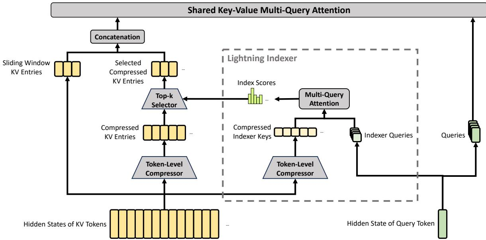
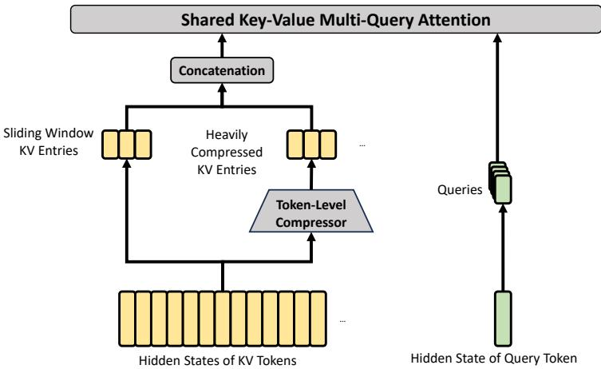

## 2. Architecture

Overall, DeepSeek-V4 series retain the Transformer (Vaswani et al., 2017) architecture and Multi-Token Prediction (MTP) modules (DeepSeek-AI, 2024; Gloeckle et al., 2024), while introducing several key upgrades over DeepSeek-V3: (1) firstly, we introduce the **Manifold-Constrained Hyper-Connections (mHC)** (Xie et al., 2026) to strengthen conventional residual connections;

(2) secondly, we design a **hybrid attention architecture**, which greatly improves long-context efficiency through **Compressed Sparse Attention** and **Heavily Compressed Attention**. (3) thirdly, we employ **Muon** (Jordan et al., 2024; Liu et al., 2025) as the optimizer. For the Mixture-of-Experts (MoE) components, we still adopt the DeepSeekMoE (Dai et al., 2024) architecture, with only minor adjustments from DeepSeek-V3. The Multi-Token Prediction (MTP) (DeepSeek-AI, 2024; Gloeckle et al., 2024; Li et al., 2024; Qi et al., 2020) configuration remains identical to that of DeepSeek-V3. All other unspecified details follow the settings established in DeepSeek-V3 (DeepSeek-AI, 2024). Figure 2 illustrates the overall architecture of DeepSeek-V4, and the details are described below.

## 2.1. Designs Inherited from DeepSeek-V3

**Mixture-of-Experts.** As previous DeepSeek-series models (DeepSeek-AI, 2024; DeepSeek-AI, 2024), DeepSeek-V4 series also adopt the **DeepSeekMoE** paradigm (Dai et al., 2024) for Feed-Forward Networks (FFNs), which sets fine-grained routed experts and shared experts. Different from DeepSeek-V3, we change the activation function that computes the affinity scores from $\mathrm{Sigmoid}(\cdot)$ into $\mathrm{Sqrt}(\mathrm{Softplus}(\cdot))$. For load balancing, we also employ the auxiliary-loss-free strategy (DeepSeek-AI, 2024; Wang et al., 2024a), augmented by a slight sequence-wise balance loss that prevents extreme imbalance within individual sequences. For DeepSeek-V4, we remove the constraint on the number of routing target nodes, and carefully redesign the parallelism strategy to maintain training efficiency. Furthermore, compared with DeepSeek-V3, we replace the dense FFN layers in the initial several Transformer blocks with MoE layers that employ **Hash routing** (Roller et al., 2021). The Hash routing strategy determines the target experts of each token according to a predefined hash function with regard to the input token ID.

**Multi-Token Prediction.** As DeepSeek-V3, DeepSeek-V4 series also set MTP modules and objectives. Given that the MTP strategy has been validated in DeepSeek-V3, we adopt the same strategy for DeepSeek-V4 series without modification.

## 2.2. Manifold-Constrained Hyper-Connections

As shown in Figure 2, DeepSeek-V4 series incorporate **Manifold-Constrained Hyper-Connections (mHC)** (Xie et al., 2026) to strengthen the conventional residual connections between adjacent Transformer blocks. Compared with naive Hyper-Connections (HC) (Zhu et al., 2025), the core idea of mHC is to constrain the residual mapping onto a specific manifold, and thus enhance the stability of signal propagation across layers while preserving model expressivity. This subsection briefly introduces the standard HC and describes how we design mHC for stable training.

**Standard Hyper-Connections.** The standard HC expands the width of the residual stream by a factor of $n_{\mathrm{hc}}$. Specifically, the shape of the residual stream is expanded from $\mathbb{R}^{d}$ to $\mathbb{R}^{n_{\mathrm{hc}} \times d}$ where $d$ is the hidden size of the actual layer input. Let $X_{l} = [\mathbf{x}_{l,1}; \ldots; \mathbf{x}_{l, n_{\mathrm{hc}}}]^{T} \in \mathbb{R}^{n_{\mathrm{hc}} \times d}$ be the residual state before the $l$-th layer. HC introduces three linear mappings: an input mapping $A_{l} \in \mathbb{R}^{1 \times n_{\mathrm{hc}}}$, a residual transformation $B_{l} \in \mathbb{R}^{n_{\mathrm{hc}} \times n_{\mathrm{hc}}}$, and an output mapping $C_{l} \in \mathbb{R}^{n_{\mathrm{hc}} \times 1}$. The update of the residual state is then formulated as:

$$X_{l+1} = B_{l} X_{l} + C_{l} \mathcal{F}_{l}(A_{l} X_{l}),\tag{1}$$

where $\mathcal{F}_{l}$ denotes the $l$-th layer (e.g., an MoE layer), whose input and output shapes are both $\mathbb{R}^{d}$. Note that the actual layer input $A_{l} X_{l} \in \mathbb{R}^{d}$ is also $d$-dimensional, so the expanded residual width does not influence the design of the inner layers. HC decouples the residual width from the actual hidden size, offering a complementary scaling axis with minimal computational overhead, as $n_{\mathrm{hc}}$ is typically much smaller than the hidden size $d$. However, even though HC has demonstrated potential in improving model performance, we find that the training will frequently exhibit numerical instability when stacking multiple layers, which hinders the scaling of HC.

**Manifold-Constrained Residual Mapping.** The core innovation of mHC is to constrain the residual mapping matrix $B_{l}$ to the manifold of **doubly stochastic matrices** (the Birkhoff polytope) $\mathcal{M}$, and thus enhance the stability of signal propagation across layers:

$$B_{l} \in \mathcal{M} := \{ M \in \mathbb{R}^{n \times n} ~|~ M \mathbf{1}_{n} = \mathbf{1}_{n}, ~ \mathbf{1}_{n}^{T} M = \mathbf{1}_{n}^{T}, ~ M \geqslant 0 \}.\tag{2}$$

This constraint ensures that the spectral norm of the mapping matrix $\|B_{l}\|_{2}$ is bounded by 1, so the residual transformation is non-expansive, which increases the numerical stability during both the forward pass and backpropagation. Besides, the set $\mathcal{M}$ is closed under multiplication, which guarantees stability in the scenarios of deep stacks of mHC. In addition, the input transformation $A_{l}$ and output transformation $C_{l}$ are also constrained to be non-negative and bounded via a Sigmoid function to avoid the risk of signal cancellation.

**Dynamic Parameterization.** The parameters of three linear mappings are dynamically generated, which are decomposed into a dynamic (input-dependent) component and a static (input-independent) component. Given the input $X_{l} \in \mathbb{R}^{n_{\mathrm{hc}} \times d}$, it is first flattened and normalized: $\hat{X}_{l} = \mathrm{RMSNorm}(\mathrm{vec}(X_{l})) \in \mathbb{R}^{1 \times n_{\mathrm{hc}} d}$. Then, we follow the conventional HC to generate the unconstrained raw parameters $\tilde{A}_{l} \in \mathbb{R}^{1 \times n_{\mathrm{hc}}}$, $\tilde{B}_{l} \in \mathbb{R}^{n_{\mathrm{hc}} \times n_{\mathrm{hc}}}$, and $\tilde{C}_{l} \in \mathbb{R}^{n_{\mathrm{hc}} \times 1}$:

$$\tilde{A}_{l} = \alpha_{l}^{\mathrm{pre}} \cdot (\hat{X}_{l} W_{l}^{\mathrm{pre}}) + S_{l}^{\mathrm{pre}},\tag{3}$$

$$\tilde{B}_{l} = \alpha_{l}^{\mathrm{res}} \cdot \mathrm{Mat}(\hat{X}_{l} W_{l}^{\mathrm{res}}) + S_{l}^{\mathrm{res}},\tag{4}$$

$$\tilde{C}_{l} = \alpha_{l}^{\mathrm{post}} \cdot (\hat{X}_{l} W_{l}^{\mathrm{post}})^{T} + S_{l}^{\mathrm{post}},\tag{5}$$

where $W_{l}^{\mathrm{pre}}, W_{l}^{\mathrm{post}} \in \mathbb{R}^{n_{\mathrm{hc}} d \times n_{\mathrm{hc}}}$ and $W_{l}^{\mathrm{res}} \in \mathbb{R}^{n_{\mathrm{hc}} d \times n_{\mathrm{hc}}^{2}}$ are learnable parameters for generating the dynamic components; $\mathrm{Mat}(\cdot)$ reshapes a vector of size $1 \times n_{\mathrm{hc}}^{2}$ into a matrix of size $n_{\mathrm{hc}} \times n_{\mathrm{hc}}$; $S_{l}^{\mathrm{pre}} \in \mathbb{R}^{1 \times n_{\mathrm{hc}}}$, $S_{l}^{\mathrm{post}} \in \mathbb{R}^{n_{\mathrm{hc}} \times 1}$, and $S_{l}^{\mathrm{res}} \in \mathbb{R}^{n_{\mathrm{hc}} \times n_{\mathrm{hc}}}$ are learnable static biases; and $\alpha_{l}^{\mathrm{pre}}, \alpha_{l}^{\mathrm{res}}, \alpha_{l}^{\mathrm{post}} \in \mathbb{R}$ are learnable gating factors initialized to small values.

**Applying Parameter Constraints.** After obtaining the unconstrained raw parameters $\tilde{A}_{l}, \tilde{B}_{l}, \tilde{C}_{l}$, we then apply constraints described earlier to them to enhance the numerical stability. To be specific, for the input and output mappings, we employ a Sigmoid function $\sigma(\cdot)$ to ensure their non-negativity and boundedness:

$$A_{l} = \sigma(\tilde{A}_{l}),\tag{6}$$

$$C_{l} = 2\sigma(\tilde{C}_{l}).\tag{7}$$

As for the residual mapping $\tilde{B}_{l}$, we project it onto the manifold of doubly stochastic matrices $\mathcal{M}$. This is achieved by the **Sinkhorn-Knopp algorithm**, which first applies an exponential function to $\tilde{B}_{l}$ to ensure positivity, getting $M^{(0)} = \exp(\tilde{B}_{l})$, and then iteratively performs column and row normalization:

$$\boldsymbol{M}^{(t)} = \mathcal{T}_{r}(\mathcal{T}_{c}(\boldsymbol{M}^{(t-1)})),\tag{8}$$

where $\mathcal{T}_{r}$ and $\mathcal{T}_{c}$ denote row and column normalization, respectively. This iteration converges to a constrained doubly stochastic matrix $B_{l} = M^{(t_{\max})}$. We choose $t_{\max} = 20$ as a practical value.

Figure 3 | Core architectures of CSA. It compresses the number of KV entries to $\frac{1}{m}$ times, and then applies DeepSeek Sparse Attention for further acceleration. Additionally, a small set of sliding window KV entries is combined with the selected compressed KV entries to enhance local fine-grained dependencies.

## 2.3. Hybrid Attention with CSA and HCA

As the context length reaches extreme scales, the attention mechanism emerges as the dominant computational bottleneck in a model. For DeepSeek-V4, we design two efficient attention architectures — **Compressed Sparse Attention (CSA)** and **Heavily Compressed Attention (HCA)** — and employ their interleaved hybrid configuration, which substantially reduces the computational cost of attention in long-text scenarios. CSA integrates both compression and sparse attention strategies: it first compresses the Key-Value (KV) cache of every $m$ tokens into one entry, and then applies DeepSeek Sparse Attention (DSA) (DeepSeek-AI, 2025) where each query token attends to only $k$ compressed KV entries. HCA aims for extreme compression by consolidating the KV cache of every $m'$ ($\gg m$) tokens into a single entry. The hybrid architecture of CSA and HCA remarkably improves the long-context efficiency of DeepSeek-V4 series, making one-million-token context feasible in practice. This subsection describes the core techniques of our hybrid attention architecture, and we also provide an open-source implementation[^1] to specify more details unambiguously.

[^1]: Reference to the open-source implementation in the original paper.

### 2.3.1. Compressed Sparse Attention

The core architecture of CSA is illustrated in Figure 3, which first compresses the KV cache of each $m$ tokens into one entry, and then applies DeepSeek Sparse Attention for further acceleration.

**Compressed Key-Value Entries.** Let $H \in \mathbb{R}^{n \times d}$ be a sequence of input hidden states, where $n$ is the sequence length and $d$ is the hidden size. CSA first computes two series of KV entries $C^{a}, C^{b} \in \mathbb{R}^{n \times c}$ and their corresponding compression weights $Z^{a}, Z^{b} \in \mathbb{R}^{n \times c}$, where $c$ is the head dimension:

$$C^{a} = H \cdot W^{aKV}, \quad C^{b} = H \cdot W^{bKV},\tag{9}$$

$$Z^{a} = H \cdot W^{aZ}, ~ Z^{b} = H \cdot W^{bZ},\tag{10}$$

where $W^{aKV}, W^{bKV}, W^{aZ}, W^{bZ} \in \mathbb{R}^{d \times c}$ are trainable parameters. Next, each $m$ KV entries in $C^{a}$ and $C^{b}$ will be compressed into one entry according to their compression weights and learnable positional biases $B^{a}, B^{b} \in \mathbb{R}^{m \times c}$, producing $C^{\mathrm{Comp}} \in \mathbb{R}^{\frac{n}{m} \times c}$. Each compressed entry $C_{i}^{\mathrm{Comp}} \in \mathbb{R}^{c}$ is computed by

$$\begin{array}{r} [S_{mi:m(i+1)-1}^{a}; S_{m(i-1):mi-1}^{b}] = \mathrm{Softmax}_{\mathrm{row}}([Z_{mi:m(i+1)-1}^{a} + B^{a}; Z_{m(i-1):mi-1}^{b} + B^{b}]), \end{array}\tag{11}$$

$$C_{i}^{\mathrm{Comp}} = \sum_{j=mi}^{m(i+1)-1} S_{j}^{a} \odot C_{j}^{a} + \sum_{j=m(i-1)}^{mi-1} S_{j}^{b} \odot C_{j}^{b},\tag{12}$$

where $\odot$ denotes the Hadamard product; $\mathrm{Softmax}_{\mathrm{row}}(\cdot)$ denotes the softmax operation along the row dimension, which performs normalization across the total of $2m$ elements from both $Z^{a}$ and $Z^{b}$. When $i = 0$, $Z_{m(i-1):mi-1}^{b}$ is padded with negative infinity and $C_{m(i-1):mi-1}^{b}$ is padded with zeros. Note that each $C_{i}^{\mathrm{Comp}}$ is derived from $2m$ KV entries, but the indexes of $C^{b}$ used for $C_{i}^{\mathrm{Comp}}$ and the indexes of $C^{a}$ used for $C_{i-1}^{\mathrm{Comp}}$ are overlapped. Therefore, CSA in fact compresses the sequence length to $\frac{1}{m}$ times.

**Lightning Indexer for Sparse Selection.** After obtaining the compressed KV entries $C^{\mathrm{Comp}}$, CSA applies the DSA strategy to select top-k compressed KV entries for core attention. First, CSA performs the same compression operation used for $C^{\mathrm{Comp}}$ to get compressed indexer keys $K^{\mathrm{IComp}} \in \mathbb{R}^{\frac{n}{m} \times c^{I}}$, where $c^{I}$ is the indexer head dimension. Then, for a query token $t$, we produce the indexer queries $\{\mathbf{q}_{t,1}^{I}; \mathbf{q}_{t,2}^{I}; \ldots; \mathbf{q}_{t,n_{h}^{I}}^{I}\}$ in a low-rank manner:

$$\begin{array}{r} \mathbf{c}_{t}^{Q} = \mathbf{h}_{t} \cdot W^{DQ}, \end{array}\tag{13}$$

$$\begin{array}{r} [P_{t,1}^{I}; P_{t,2}^{I}; \ldots; P_{t,n_{h}^{I}}^{I}] = P_{t}^{I} = \mathbf{c}_{t}^{Q} \cdot W^{IUQ}, \end{array}\tag{14}$$

where $\mathbf{h}_{t} \in \mathbb{R}^{d}$ is the input hidden state of the query token $t$; $\mathbf{c}_{t}^{Q} \in \mathbb{R}^{d_{c}}$ is the compressed latent vector for queries; $d_{c}$ denotes the query compression dimension; $n_{h}^{I}$ denotes the number of indexer query heads; $W^{DQ} \in \mathbb{R}^{d \times d_{c}}$ and $W^{IUQ} \in \mathbb{R}^{d_{c} \times c^{I} n_{h}^{I}}$ are the down-projection and up-projection matrices for indexer queries, respectively. Next, the index score $I_{t,s} \in \mathbb{R}$ between the query token $t$ and a preceding compressed block $s$ ($s < \mathrm{Floor}(\frac{t}{m})$) is computed by

$$\begin{array}{r} [w_{t,1}^{I}; w_{t,2}^{I}; \ldots; w_{t,n_{h}^{I}}^{I}] = \mathbf{w}_{t}^{I} = \mathbf{h}_{t} \cdot W^{w}, \end{array}\tag{15}$$

$$I_{t,s} = \sum_{h=1}^{n_{h}^{I}} w_{t,h}^{I} \cdot \mathrm{ReLU}\left(\mathbf{q}_{t,h}^{I} \cdot K_{s}^{\mathrm{IComp}}\right),\tag{16}$$

where $W^{w} \in \mathbb{R}^{d \times n_{h}^{I}}$ is a learnable matrix; $w_{t,h}^{I} \in \mathbb{R}$ is the weight of the $h$-th indexer head. For a query token $t$, given its index scores $I_{t,:}$, we employ a top-k selector to selectively retain a subset of compressed KV entries $C_{t}^{\mathrm{SprsComp}}$ for subsequent core attention:

$$C_{t}^{\mathrm{SprsComp}} = \left\{ C_{s}^{\mathrm{Comp}} : | : I_{t,s} \in \mathrm{Top\text{-}k}(I_{t,:}) \right\}.\tag{17}$$

Figure 4 | Core architectures of HCA. It performs heavier compression, where the KV entries of $m' \left( \gg m \right)$ tokens will be consolidated into one. Also, we additionally introduce a small set of sliding window KV entries to enhance local fine-grained dependencies.

**Shared Key-Value MQA.** After selecting the sparse KV entries, CSA then performs core attention in a **Multi-Query Attention (MQA)** (Shazeer, 2019) manner, where each compressed KV entry in $C_{t}^{\mathrm{SprsComp}}$ serves as both attention key and value. To be specific, for a query token $t$, we first produce attention queries $\{\mathbf{q}_{t,1}; \mathbf{q}_{t,2}; \ldots; \mathbf{q}_{t,n_{h}}\}$ from the compressed latent vector $\mathbf{c}_{t}^{Q}$:

$$[\mathbf{q}_{t,1}; \mathbf{q}_{t,2}; \ldots; \mathbf{q}_{t,n_{h}}] = \mathbf{q}_{t} = \mathbf{c}_{t}^{Q} \cdot W^{UQ},\tag{18}$$

where $n_{h}$ denotes the number of query heads; $W^{UQ} \in \mathbb{R}^{d_{c} \times c n_{h}}$ is the up-projection matrix for queries. Note that the latent query vector $\mathbf{c}_{t}^{Q}$ is shared with that used for the indexer queries. Next, we perform MQA on $\{\mathbf{q}_{t,i}\}$ and $C_{t}^{\mathrm{SprsComp}}$:

$$\mathbf{o}_{t,i} = \mathrm{CoreAttn}\left(\mathtt{query} = \mathbf{q}_{t,i}, \mathtt{key} = C_{t}^{\mathrm{SprsComp}}, \mathtt{value} = C_{t}^{\mathrm{SprsComp}}\right),\tag{19}$$

where $\mathbf{o}_{t,i} \in \mathbb{R}^{c}$ is the core attention output of the $i$-th head at the $t$-th token; $\mathrm{CoreAttn}(\cdot)$ denotes the core attention operation.

**Grouped Output Projection.** In the configuration of DeepSeek-V4, $c n_{h}$ is quite large. Therefore, directly projecting the outputs of the core attention operation $[\mathbf{o}_{t,1}; \mathbf{o}_{t,2}; \ldots; \mathbf{o}_{t,n_{h}}] = \mathbf{o}_{t} \in \mathbb{R}^{c n_{h}}$ to a $d$-dimensional hidden state will impose a substantial computational burden. To mitigate this cost, we design a **grouped output projection** strategy. To be specific, we first split $n_{h}$ outputs into $g$ groups, and then for each group of output $\mathbf{o}_{t,i}^{G} \in \mathbb{R}^{c \frac{n_{h}}{g}}$, we project it to a $d_{g}$-dimensional intermediate output $\mathbf{o}_{t,i}^{G'} \in \mathbb{R}^{d_{g}}$, where $d_{g} < c \frac{n_{h}}{g}$. Finally, we project the intermediate output $[\mathbf{o}_{t,1}^{G'}; \mathbf{o}_{t,2}^{G'}; \ldots; \mathbf{o}_{t,g}^{G'}] \in \mathbb{R}^{d_{g} g}$ to the final attention output $\hat{\mathbf{o}}_{t} \in \mathbb{R}^{d}$.

### 2.3.2. Heavily Compressed Attention

The core architecture of HCA is illustrated in Figure 4, which compresses the KV cache in a heavier manner, but does not employ sparse attention.

**Compressed Key-Value Entries.** By and large, the compression strategy of HCA is similar to that of CSA, but employs a larger compression rate $m' (\gg m)$ and does not perform overlapped compression. Let $H \in \mathbb{R}^{n \times d}$ be a sequence of input hidden states, HCA first computes the original KV entries $C \in \mathbb{R}^{n \times c}$ and their corresponding compression weights $Z \in \mathbb{R}^{n \times c}$:

$$C = H \cdot W^{KV},\tag{20}$$

$$Z = H \cdot W^{Z},\tag{21}$$

where $W^{KV}, W^{Z} \in \mathbb{R}^{d \times c}$ are trainable parameters. Next, each $m'$ KV entries in $C$ will be compressed into one according to the compression weights and learnable positional biases $B \in \mathbb{R}^{m' \times c}$, producing $C^{\mathrm{Comp}} \in \mathbb{R}^{\frac{n}{m'} \times c}$. Each compressed entry $C_{i}^{\mathrm{Comp}} \in \mathbb{R}^{c}$ is computed by

$$\begin{array}{r} S_{m'i:m'(i+1)-1} = \mathrm{Softmax}_{\mathrm{row}}(Z_{m'i:m'(i+1)-1} + B), \end{array}\tag{22}$$

$$C_{i}^{\mathrm{Comp}} = \sum_{j=m'i}^{m'(i+1)-1} S_{j} \odot C_{j}.\tag{23}$$

Through this compression operation, HCA compresses the sequence length to $\frac{1}{m'}$ times.

**Shared Key-Value MQA and Grouped Output Projection.** HCA also employs the shared KV MQA and grouped output projection strategies as CSA does. After the KV compression, for a query token $t$, HCA first produces attention queries $\{\mathbf{q}_{t,1}; \mathbf{q}_{t,2}; \ldots; \mathbf{q}_{t,n_{h}}\}$ in a low-rank manner:

$$\begin{array}{r} \mathbf{c}_{t}^{Q} = \mathbf{h}_{t} \cdot W^{DQ}, \end{array}\tag{24}$$

$$[\mathbf{q}_{t,1}; \mathbf{q}_{t,2}; \ldots; \mathbf{q}_{t,n_{h}}] = \mathbf{q}_{t} = \mathbf{c}_{t}^{Q} \cdot W^{UQ},\tag{25}$$

where $\mathbf{h}_{t} \in \mathbb{R}^{d}$ is the input hidden state of the query token $t$; $n_{h}$ denotes the number of query heads; $W^{DQ} \in \mathbb{R}^{d \times d_{c}}$ and $W^{UQ} \in \mathbb{R}^{d_{c} \times c n_{h}}$ are the down-projection and up-projection matrices for queries, respectively. Next, we perform MQA on $\{\mathbf{q}_{t,i}\}$ and $C^{\mathrm{Comp}}$:

$$\mathbf{o}_{t,i} = \mathrm{CoreAttn}\left(\mathtt{query} = \mathbf{q}_{t,i}, \mathtt{key} = C^{\mathrm{Comp}}, \mathtt{value} = C^{\mathrm{Comp}}\right),\tag{26}$$

where $\mathbf{o}_{t,i} \in \mathbb{R}^{c}$ is the core attention output of the $i$-th head at the $t$-th token. Next, as CSA does, HCA splits $n_{h}$ outputs into $g$ groups, and for each group of output $\mathbf{o}_{t,i}^{G} \in \mathbb{R}^{c \frac{n_{h}}{g}}$, HCA projects it to a $d_{g}$-dimensional intermediate output $\mathbf{o}_{t,i}^{G'} \in \mathbb{R}^{d_{g}}$, where $d_{g} < c \frac{n_{h}}{g}$. Finally, HCA projects the intermediate output $[\mathbf{o}_{t,1}^{G'}; \mathbf{o}_{t,2}^{G'}; \ldots; \mathbf{o}_{t,g}^{G'}] \in \mathbb{R}^{d_{g} g}$ to the final attention output $\hat{\mathbf{o}}_{t} \in \mathbb{R}^{d}$.

### 2.3.3. Other Details

In addition to the core architectures of CSA and HCA described above, our hybrid attention incorporates several other techniques. For writing clarity, we omit these additional techniques from the above introduction and will briefly describe them in this subsection. Also, this subsection focuses only on the core ideas of them and may omit some tiny details for simplicity. We encourage the readers to refer to our open-source implementation for unambiguous details.

**Query and Key-Value Entry Normalization.** For both CSA and HCA, we perform an additional RMSNorm operation on each head of the queries and the only head of the compressed KV entries, just before the core attention operation. This normalization avoids exploding attention logits and may improve training stability.

**Partial Rotary Positional Embedding.** For both CSA and HCA, we partially employ the Rotary Positional Embedding (RoPE) (Su et al., 2024) to the attention queries, KV entries, and the core attention outputs. To be specific, for each query vector and KV entry vector used in CSA and HCA, we apply RoPE to its last 64 dimensions. Since the KV entries serve as both attention keys and values, the naive core attention outputs $\{\mathbf{o}_{t,i}\}$ will carry absolute position embeddings, derived from the weighted sum of KV entries. As a countermeasure, we also apply RoPE with position $-t$ on the last 64 dimensions of each $\mathbf{o}_{t,i}$. In this way, the output of the core attention will also carry relative position embeddings — the contribution of each KV entry to the core attention outputs will also be related to the distance between the query and the KV entry.

**Additional Branch of Sliding Window Attention.** In order to strictly preserve causality in CSA and HCA, each query attends to only preceding compressed KV blocks. Consequently, a query cannot access information from other tokens within its own compressed block. Meanwhile, recent tokens usually possess greater relevance to the query token in language modeling. For these reasons, we introduce a supplementary attention branch to both CSA and HCA in a **sliding window** manner, for better modeling of local dependencies. To be specific, for each query token, we additionally produce $n_{\mathrm{win}}$ uncompressed KV entries corresponding to the recent $n_{\mathrm{win}}$ tokens. In the core attention of CSA and HCA, these KV entries in the sliding window will be used along with the compressed KV entries.

**Attention Sink.** In the core attention of CSA and HCA, we employ the trick of **attention sink** (OpenAI, 2025; Xiao et al., 2024). To be specific, we set a series of learnable sink logits $\{z_{1}', z_{2}', \ldots, z_{n_{h}}'\}$. For the $h$-th attention head, $\mathrm{Exp}(z_{h}')$ will be added to the denominator of the attention score:

$$s_{h,i,j} = \frac{\mathrm{Exp}(z_{h,i,j})}{\sum_{k} \mathrm{Exp}(z_{h,i,k}) + \mathrm{Exp}(z_{h}')},\tag{27}$$

where $s_{h,i,j}, z_{h,i,j} \in \mathbb{R}$ denote the attention score and attention logit of the $h$-th attention head between the $i$-th query token and the $j$-th preceding token or compressed block. This technique allows each query head to adjust its total attention scores to be not equal to 1, and even to be near 0.

### 2.3.4. Efficiency Discussion

Due to the employment of hybrid CSA and HCA, together with low-precision computation and storage, the attention module of DeepSeek-V4 series achieves remarkable efficiency in both attention FLOPs and KV cache size, especially in long-context scenarios. First, we adopt a mixed storage format for KV entries: BF16 precision is used for the rotary positional embedding (RoPE) dimensions, while FP8 precision is applied to the remaining dimensions. This hybrid representation reduces the KV cache size by nearly half compared with pure BF16 storage. Second, attention computation within the lightning indexer is performed in FP4 precision, which accelerates the attention operation under extremely long contexts. Third, relative to DeepSeek-V3.2, a smaller attention top-k is chosen in DeepSeek-V4 series, thereby improving model efficiency on short- and medium-length texts. Finally, and most importantly, compressed attention and hybrid attention techniques substantially reduce both the KV cache size and the computational FLOPs.

Taking BF16 GQA8 (Ainslie et al., 2023) with a head dimension of 128 as the baseline — one of the common configurations of LLM attention — the KV cache size of DeepSeek-V4 series can be dramatically reduced to approximately **2%** times of that baseline in the 1M-context setting.

Moreover, even when compared with DeepSeek-V3.2 (DeepSeek-AI, 2025) — already an efficient baseline — DeepSeek-V4 series still exhibits substantial advantages in efficiency. A comparison of their inference FLOPs and KV cache size is provided in the right part of Figure 1.

## 2.4. Muon Optimizer

We employ the **Muon** (Jordan et al., 2024; Liu et al., 2025) optimizer for the majority of modules in DeepSeek-V4 series due to its faster convergence and improved training stability. The full algorithm of our Muon optimization is summarized in Algorithm 1.

**Algorithm 1: Muon Optimizer for DeepSeek-V4**

> **Require:** Learning rate $\eta$, momentum $\mu$, weight decay $\lambda$, update rescaling factor $\gamma$
>
> 1: **for** each training step $t$ **do**
> 2: &emsp; **for** each logically independent weight $W \in \mathbb{R}^{n \times m}$ **do**
> 3: &emsp;&emsp; $G_{t} = \nabla_{W} \mathcal{L}_{t}(W_{t-1})$ &emsp; $\triangleright$ Compute gradients
> 4: &emsp;&emsp; $M_{t} = \mu M_{t-1} + G_{t}$ &emsp; $\triangleright$ Accumulate momentum buffer
> 5: &emsp;&emsp; $O_{t}' = \mathrm{HybridNewtonSchulz}\left(\mu M_{t} + G_{t}\right)$ &emsp; $\triangleright$ Nesterov trick and hybrid Newton-Schulz
> 6: &emsp;&emsp; $O_{t} = O_{t}' \cdot \sqrt{\max(n, m)} \cdot \gamma$ &emsp; $\triangleright$ Rescale the update RMS
> 7: &emsp;&emsp; $W_{t} = W_{t-1} \cdot (1 - \eta \lambda) - \eta O_{t}$ &emsp; $\triangleright$ Perform weight decay and update
> 8: &emsp; **end for**
> 9: **end for**

**Basic Configurations.** We maintain the AdamW (Loshchilov and Hutter, 2017) optimizer for the embedding module, the prediction head module, the static biases and gating factors of mHC modules, and the weights of all RMSNorm modules. All other modules are updated with Muon. Following Liu et al. (2025), we also apply weight decay to Muon parameters, use the Nesterov (Jordan et al., 2024; Nesterov, 1983) trick, and rescale the Root Mean Square (RMS) of the update matrix for reutilization of our AdamW hyper-parameters. Different from them, we use **hybrid Newton-Schulz iterations** for orthogonalization.

**Hybrid Newton-Schulz Iterations.** For a given matrix $M$, let its Singular Value Decomposition (SVD) be $M = U \Sigma V^{T}$. The Newton-Schulz iterations aim to approximately orthogonalize $M$ to be $U V^{T}$. Usually, $M$ will be first normalized as $M_{0} = M / \|\boldsymbol{M}\|_{F}$ to ensure its maximum singular value does not exceed 1. Then, each Newton-Schulz iteration performs the following operation:

$$M_{k} = a M_{k-1} + b (M_{k-1} M_{k-1}^{T}) M_{k-1} + c (M_{k-1} M_{k-1}^{T})^{2} M_{k-1}.\tag{28}$$

Our hybrid Newton-Schulz performs **10 iterations** over two distinct stages. During the first **8 steps**, we use coefficients $(a, b, c) = (3.4445, -4.7750, 2.0315)$ to drive rapid convergence, bringing the singular values close to 1. In the final **2 steps**, we switch to coefficients $(a, b, c) = (2, -1.5, 0.5)$ which stabilize the singular values precisely at 1.

**Avoiding Exploding Attention Logits.** The attention architecture of DeepSeek-V4 series allows us to directly apply RMSNorm on the attention queries and KV entries, which effectively prevents attention logits from exploding. Consequently, we do not employ the QK-Clip technique (Liu et al., 2025) in our Muon optimizer.
