## 5. Post-Training

### 5.1. Post-Training Pipeline

Following pre-training, we conducted a post-training phase to yield the final models of DeepSeek-V4 series. Although the training pipeline largely mirrored that of DeepSeek-V3.2, a critical methodological substitution was made: the mixed Reinforcement Learning (RL) stage was entirely replaced by **On-Policy Distillation** (OPD; Gu et al., 2024; Lu and Lab, 2025).

#### 5.1.1. Specialist Training

The development of domain specialists was conducted by adapting the DeepSeek-V3.2 training pipeline. Specifically, each model was sequentially optimized through an initial fine-tuning phase and subsequent Reinforcement Learning (RL) guided by domain-specific prompts and reward signals. For the RL stage, we implemented the Group Relative Policy Optimization (GRPO) algorithm, maintaining hyper-parameters closely aligned with our prior research (DeepSeek-AI, 2025; DeepSeek-AI, 2025).

**Reasoning Efforts.** It is widely recognized that a model's performance on reasoning tasks is fundamentally governed by the computational effort expended. Consequently, we trained distinct specialist models under divergent RL configurations to facilitate the development of models optimized for varying reasoning capacities. As detailed in Table 2, `DeepSeek-V4-Pro` and `DeepSeek-V4-Flash` both support three specific reasoning effort modes. For each mode, we apply distinct length penalties and context windows during RL training, which results in varying output token lengths for reasoning. To integrate these distinct reasoning modes, we utilize specialized response formats demarcated by the `<think>` and `</think>` tokens. Furthermore, for the "Think Max" mode, we prepend a specific instruction to the beginning of the system prompt to guide the model's reasoning process, as shown in Table 3.

**Table 2 | Comparison of three reasoning modes**

| Reasoning Mode | Characteristics | Typical Use Cases | Response Format |
|---|---|---|---|
| Non-think | Responses based on emergency reactions, habits or simple low-risk decisions. | Fast, intuitive routine daily tasks | `<think>` summary `</think>` |
| Think High | Conscious logical analysis, slower but more accurate. | Complex problem solving, planning, medium-risk decisions | `<think>` thinking tokens `</think>` summary |
| Think Max | Push reasoning to its fullest extent. Slow but powerful. | Exploring the boundary of model reasoning capability. | 1. A special system prompt at the beginning. 2. `<think>` thinking tokens `</think>` summary |

**Table 3 | Instruction injected into the system prompt for the "Think Max" mode.**

| Injected Instruction |
|---|
| Reasoning Effort: Absolute maximum with no shortcuts permitted. You MUST be very thorough in your thinking and comprehensively decompose the problem to resolve the root cause, rigorously stress-testing your logic against all potential paths, edge cases, and adversarial scenarios. Explicitly write out your entire deliberation process, documenting every intermediate step, considered alternative, and rejected hypothesis to ensure absolutely no assumption is left unchecked. |

**Generative Reward Model.** Typically, easy-to-verify tasks can be effectively optimized using simple rule-based verifiers or test cases. In contrast, hard-to-verify tasks traditionally rely on Reinforcement Learning from Human Feedback (RLHF), which necessitates extensive human annotation to train a scalar reward model. In the post-training phase of DeepSeek-V4 series, however, we dispense with these conventional scalar-based reward models. Instead, to address hard-to-verify tasks, we curate rubric-guided RL data and employ a **Generative Reward Model (GRM)** to evaluate policy trajectories. Crucially, we apply RL optimization directly to the GRM itself. In this paradigm, the actor network natively functions as the GRM, enabling the joint optimization of the model's evaluative (judging) proficiency alongside its standard generative capabilities. By unifying these roles, the model's internal reasoning capabilities are inherently fused into its evaluative process, resulting in highly robust scoring. Furthermore, this approach achieves superior performance with only a minimal set of diverse human annotations, as the model leverages its own logic to generalize across complex tasks.

**Tool-Call Schema and Special Token.** Consistent with our previous version, we utilize a dedicated `<think></think>` tag to delineate the reasoning path. In DeepSeek-V4 series, we introduce a new tool-call schema that employs a special `|DSML|` token and utilizes an XML-based format for tool invocations, as demonstrated in Table 4. Our experiments demonstrate that the XML format effectively mitigates escaping failures and reduces tool-call errors, providing a more robust interface for model-tool interactions.

**Table 4 | Tool-call schema for DeepSeek-V4 series.**
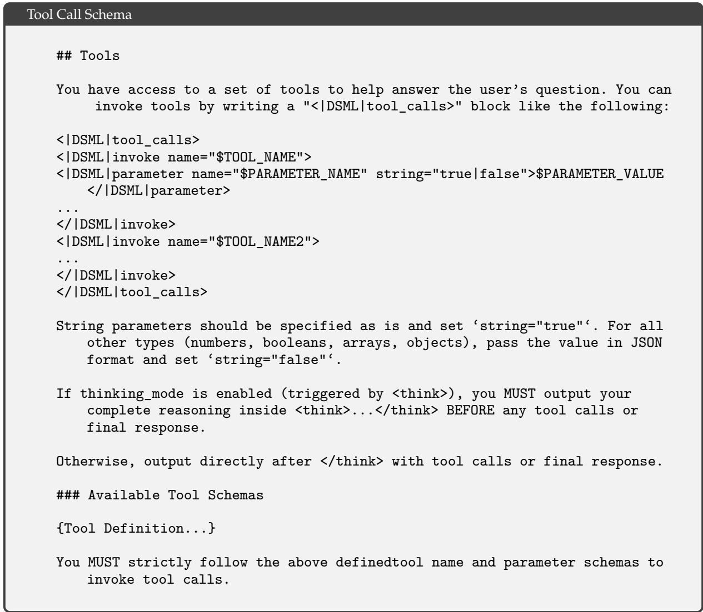

**Interleaved Thinking.** DeepSeek-V3.2 introduced a context management strategy that retains reasoning traces across tool-result rounds but discards them upon the arrival of new user messages. While effective, this still caused unnecessary token waste in complex agentic workflows — each new user turn would flush all accumulated reasoning content, forcing the model to reconstruct its problem-solving state from scratch. Leveraging the expanded 1M-token context window of DeepSeek-V4 series, we further refine this mechanism to maximize the effectiveness of interleaved thinking in agentic environments:

- **Tool-Calling Scenarios.** As illustrated in Figure 7(a), all reasoning content is fully preserved throughout the entire conversation. Unlike DeepSeek-V3.2, which discarded thinking traces upon each new user turn, DeepSeek-V4 series retain the complete reasoning history across all rounds, including across user message boundaries. This allows the model to maintain a coherent, cumulative chain of thought over long-horizon agent tasks.

- **General Conversational Scenarios.** As illustrated in Figure 7(b), the original strategy is preserved: reasoning content from previous turns is discarded when a new user message arrives, keeping the context concise for settings where persistent reasoning traces provide limited benefit.

As with DeepSeek-V3.2, agent frameworks that simulate tool interactions via user messages (e.g., Terminus) may not trigger the tool-calling context path and thus may not benefit from enhanced reasoning persistence. We continue to recommend non-think models for such architectures.

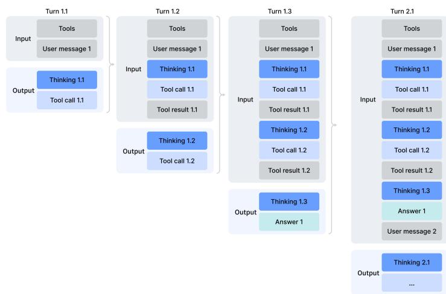
a) Thinking with tools
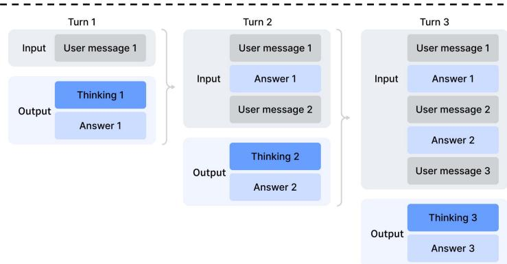
b) Thinking without tools
**Figure 7 | Thinking management of DeepSeek-V4 series.**

**Quick Instruction.** In chatbot scenarios, a number of auxiliary tasks (e.g., determining whether to trigger a web search, intent recognition, etc.) must be executed before generating the response. Conventionally, these tasks are handled by a separate small model, requiring redundant prefilling since it cannot reuse the existing KV cache. To overcome this limitation, we introduce **Quick Instruction**. We append a set of dedicated special tokens directly to the input sequence, where each token corresponds to a specific auxiliary task. By directly reusing the already-computed KV cache, this mechanism completely avoids redundant prefilling and allows certain tasks, such as generating search queries and determining authority and domain, to be executed in parallel. Consequently, this approach significantly reduces the user-perceived time-to-first-token (TTFT) and eliminates the engineering overhead of maintaining and iterating an extra small model. The supported Quick Instruction tokens are summarized in Table 5.

**Table 5 | Quick Instruction special tokens for auxiliary tasks.**

| Special Token | Description | Format |
|---|---|---|
| `<\|action\|>` | Determines whether the user prompt requires a web search or can be answered directly. | `...<\|User\|>{prompt}<\|Assistant\|><think><\|action\|>` |
| `<\|title\|>` | Generates a concise conversation title after the first assistant response. | `...<\|Assistant\|>{response}<\|end_of_sentence\|><\|title\|>` |
| `<\|query\|>` | Generates search queries for the user prompt. | `...<\|User\|>{prompt}<\|query\|>` |
| `<\|authority\|>` | Classifies the user prompt's demand for source authoritativeness. | `...<\|User\|>{prompt}<\|authority\|>` |
| `<\|domain\|>` | Identifies the domain of the user prompt. | `...<\|User\|>{prompt}<\|domain\|>` |
| `<\|extracted_url\|>` | Determines whether each URL in the user prompt should be fetched and read. | `...<\|User\|>{prompt}<\|extracted_url\|>{url}<\|read_url\|>` |

#### 5.1.2. On-Policy Distillation

After training multiple domain-specific experts via specialized fine-tuning and reinforcement learning, we employ multi-teacher **On-Policy Distillation** (OPD; Gu et al. 2024; Lu and Lab 2025) as the primary technique for merging expert capabilities into the final model. OPD has emerged as an effective post-training paradigm for efficiently transferring the knowledge and capabilities of domain experts to a single, unified model. This is achieved by having the student learn from the output distributions of teacher models on its own generated trajectories. Formally, given a set of $N$ expert models $\{ \pi _ { E _ { 1 } } , \pi _ { E _ { 2 } } , \ldots , \pi _ { E _ { N } } \}$, the OPD objective function is defined as:

$$
\mathcal { L } _ { \mathrm { O P D } } ( \boldsymbol { \theta } ) = \sum _ { i = 1 } ^ { N } w _ { i } \cdot \operatorname { D } _ { \mathrm { K L } } \left( \pi _ { \boldsymbol { \theta } } \parallel \pi _ { E _ { i } } \right) .\tag{29}
$$

In this formulation, $w_i$ represents the assigned weight for each expert, typically determined by the relative importance of the expert. Computing the reverse KL loss $\operatorname{D_{KL}}\left( \pi _ { \theta } \parallel \pi _ { E _ { i } } \right)$ requires sampling training trajectories from the student $\pi _ { \theta }$ to maintain on-policy learning. The underlying logic ensures that the unified policy $\pi _ { \theta }$ selectively learns from the specialized expert relevant to the current task context (e.g., aligning with the mathematics expert for math reasoning tasks and the coding expert for programming tasks). Through this mechanism, the knowledge from physically distinct expert weights is consolidated into a unified parameter space via logits-level alignment, practically circumventing the performance degradation often encountered in traditional weight-merging or mixed RL techniques. In this stage, more than ten teacher models covering various domains are employed to distill a single student model.

In handling the above OPD objective, prior works usually simplify the full-vocabulary KL loss into a token-level KL estimate at each token position, and reuse RL framework by replacing $\operatorname{sg}\big[ \log \frac{ \pi _ { E _ { i } } ( y _ { t } | x , y _ { < t } ) }{ \pi _ { \theta } ( y _ { t } | x , y _ { < t } ) } \big]$ (sg represents the stop gradient operation) as the per-token advantage estimate in the policy loss calculation. Although this approach is resource-efficient, it leads to high variance in gradient estimation and often causes training instability. Therefore, we adopt **full-vocabulary logit distillation** in our OPD. Preserving the complete logit distribution in calculating reverse KL loss yields more stable gradient estimates and ensures faithful distillation of the teachers' knowledge. In the following subsection, we describe the engineering efforts that make full-vocabulary OPD feasible at scale.

### 5.2. Post-Training Infrastructures

Our post-training infrastructure is built upon the scalable framework developed for DeepSeek-V3.2. Specifically, we integrate the same distributed training stack described in Section 3.4 and the rollout engine introduced earlier for efficient auto-regressive sampling. Building on this foundation, we introduce the following principal enhancements in the present work. These designs enable efficient execution of ultra-long-context RL and OPD merging tasks involving over ten distinct teacher models, thereby substantially accelerating the iteration cycle for model releases.

#### 5.2.1. FP4 Quantization-Aware Training

To achieve inference acceleration and reducing memory traffic at deployment, we introduce **Quantization-Aware Training (QAT)** (Jacob et al., 2018) during the post-training stage, enabling the model, including those of teacher and reference models, to adapt to the precision degradation introduced by quantization. We apply FP4 (MXFP4) quantization (Rouhani et al., 2023) to two components: (1) MoE expert weights, which are a major source of GPU memory occupancy (OpenAI, 2025), and (2) the Query-Key (QK) path in the indexer of CSA, where QK activations are cached, loaded, and multiplied entirely in FP4, accelerating attention score computation in long-context scenarios. In addition, we further quantize the index scores $I _ { : , : }$ from FP32 to BF16 during this QAT process. This optimization achieves a **2× speedup** for the top-k selector, while preserving a **99.7% recall rate** of KV entries.

For MoE expert weights, following the common practice of QAT, the FP32 master weights maintained by the optimizer are first quantized to FP4, then dequantized back to FP8 for computation. Notably, our FP4-to-FP8 dequantization is **lossless**. This is because FP8 (E4M3) has 2 additional exponent bits compared with FP4 (E2M1), offering a larger dynamic range. Consequently, as long as the ratio between the maximum and minimum scale factors of the FP4 sub-blocks (1 × 32 tiles) within each FP8 quantization block (128 × 128 tiles) does not exceed a certain threshold, the fine-grained scale information can be fully absorbed by the extended dynamic range of FP8. We empirically verify that current weights satisfy this condition. This allows the entire QAT pipeline to fully reuse the existing FP8 training framework without any modification. In the backward pass, gradients are computed with respect to the same FP8 weights in the forward pass and directly propagated back to the FP32 master weights, equivalent to applying the Straight-Through Estimator (STE) through the quantization operation. This also avoids the need to re-quantize transposed weights.

During the inference and rollout phases of RL training, which do not involve backward passes, we directly use native FP4 quantized weights instead of simulated quantization. This ensures that model behavior during sampling is fully consistent with online deployment, while also reducing kernel memory loading for actual speedup and significantly lowering memory consumption. We process the QK path in the indexer of CSA similarly.

#### 5.2.2. Efficient Teacher Scheduling for Full-Vocabulary OPD

Our framework supports full-vocabulary On-Policy Distillation (OPD) with an effectively unbounded number of teachers, each potentially comprising trillions of parameters. To enable this, all teacher weights are offloaded to a centralized distributed storage and are loaded on demand during the teacher forward pass with ZeRO-like parameter sharding to alleviate both I/O and DRAM pressure. Furthermore, naively materializing logits for a vocabulary size $|V| > 100k$ across all teachers is prohibitive, even when spooled to disk. We address this by caching only the **last-layer teacher hidden states** in a centralized buffer during the forward pass. At training time, these cached states are retrieved and passed through the corresponding prediction head module to reconstruct the full logits on the fly. This design incurs negligible recomputation overhead while completely circumventing the memory burden associated with explicit logits materialization. To mitigate the GPU memory footprint of the teacher prediction head, we order training samples by teacher index during data dispatching. This arrangement ensures that each distinct teacher head is loaded only once per mini-batch and that at most one teacher head resides in device memory at any given time. All parameters and hidden state loading/offloading operations proceed asynchronously in the background, without blocking computation on the critical path. Finally, the exact KL divergences between teacher and student logits are computed using a specialized TileLang kernel, which accelerates the computation and curtails dynamic memory allocation.

#### 5.2.3. Preemptible and Fault-Tolerant Rollout Service

To maximize GPU resource utilization while enabling rapid hardware provisioning for high-priority tasks, our GPU cluster employs a cluster-wide preemptive task scheduler, where any running task may be preempted at any time. Also, hardware failures are prevalent in large-scale GPU clusters. To this end, we implement a **preemptible and fault-tolerant LLM generation service** for RL/OPD rollout.

Specifically, we implement a **token-granular Write-Ahead Log (WAL)** for each generation request. Whenever a new token is generated for a request, we immediately append it to that request's WAL. During preemption, we pause the inference engine and save the KV cache of unfinished requests. Upon resumption, we use the persisted WALs and saved KV cache to continue decoding. Even when a fatal hardware error occurs, we can re-run the prefill phase using the persisted tokens in WAL to reconstruct the KV cache.

Importantly, it is mathematically incorrect to regenerate unfinished requests from scratch, as this introduces **length bias**. Because shorter responses are more likely to survive interruption, regenerating from scratch makes the model more prone to producing shorter sequences whenever an interruption occurs. If the inference stack is batch-invariant and deterministic, this correctness issue could also be addressed by regenerating with a consistent seed for the pseudorandom number generator used in the sampler. However, this approach still incurs the extra cost of re-running the decoding phase, making it far less efficient than our token-granular WAL method.

#### 5.2.4. Scaling RL Framework for Million-Token Context

We introduce targeted optimizations for efficient RL and OPD on million-token sequences. During the rollout phase, we adopt a preemptible and fault-tolerant rollout service, detailed in Section 5.2.3. For the inference and training phase, we decompose the rollout data format into lightweight metadata and heavy per-token fields. During data dispatching, the metadata for the entire rollout data can be loaded to perform global shuffling and packing layout computation. Heavy per-token fields are loaded via a shared-memory data loader to eliminate intra-node data redundancy and are released immediately upon consumption at the mini-batch granularity, substantially reducing both CPU and GPU memory pressure. The number of on-device minibatches is dynamically determined based on workload, allowing an efficient trade-off between computational throughput and I/O overlap.

#### 5.2.5. Sandbox Infrastructure for Agentic AI

To meet the diverse execution demands of agentic AI during post-training and evaluation, we build a production-grade sandbox platform, **DeepSeek Elastic Compute (DSec)**. DSec comprises three Rust components — the API gateway (Apiserver), per-host agent (Edge), and the cluster monitor (Watcher) — that are interconnected by a custom RPC protocol and scale horizontally atop the 3FS distributed filesystem (DeepSeek-AI, 2025). In production, a single DSec cluster manages hundreds of thousands of concurrent sandbox instances.

The design of DSec is motivated by four observations: (1) agentic workloads are highly heterogeneous, spanning lightweight function calls to full software-engineering pipelines with diverse OS and security requirements; (2) environment images are numerous and large, yet must load quickly and support iterative customization; (3) high-density deployment demands efficient CPU and memory utilization; (4) sandbox lifecycles must coordinate with GPU training schedules, including preemption and checkpoint-based resumption. Based on these observations, we elaborate on the four core designs of DSec individually in the following.

**Four Execution Substrates Behind One Unified Interface.** DSec exposes a single Python SDK (`libdsec`) that abstracts four execution substrates. **Function Call** dispatches stateless invocations to a pre-warmed container pool, eliminating cold-start overhead. **Container** is fully Docker-compatible and leverages EROFS (Gao et al., 2019) on-demand loading for efficient image assembly. **microVM**, built on Firecracker (Agache et al., 2020), adds VM-level isolation for security-sensitive, high-density deployments. **fullVM**, built on QEMU (Bellard, 2005), supports arbitrary guest operating systems. All four share a common API surface — command execution, file transfer, and TTY access — and switching between them requires only a parameter change.

**Fast Image Loading via Layered Storage.** DSec reconciles fast startup with a large and growing corpus of environment images through layered, on-demand loading. For containers, base images and filesystem commits are stored as 3FS-backed readonly EROFS layers mounted directly into overlay lowerdirs. We keep file metadata readily available on the local disk at mount time; meanwhile, data blocks are fetched from 3FS upon request. For microVMs, DSec uses the overlaybd (Li et al., 2020) disk format: the read-only base layer resides on 3FS for cross-instance sharing, while writes go to a local copy-on-write layer. Such snapshots are chainable, facilitating efficient versioning and millisecond-scale resumption.

**Density Optimizations Under Massive Concurrency.** To accommodate hundreds of thousands of sandboxes per cluster, DSec tackles two resource bottlenecks. First, it mitigates duplicate page-cache footprints in virtualized environments and applies memory reclamation to enable safe overcommitment. Second, it alleviates spinlock contention in the container runtime and therefore, reduces per-sandbox CPU overhead, significantly increasing per-host packing density.

**Trajectory Logging and Preemption-Safe Resumption.** DSec maintains a globally ordered trajectory log for each sandbox, persistently recording every command invocation and its results. The trajectory serves three purposes: (1) **client fast-forwarding** — when a training task is preempted, sandbox resources are retained nonetheless; upon resumption, DSec replays cached results for previously completed commands, accelerating task recovery whilst also preventing errors from re-execution of non-idempotent operations; (2) **fine-grained provenance** — the origin and corresponding outcomes of each state change are traceable; (3) **deterministic replay** — any historical session can be faithfully reproduced from its trajectory.

### 5.3. Standard Benchmark Evaluation

#### 5.3.1. Evaluation Setup

**Knowledge and Reasoning.** Knowledge and reasoning datasets include `MMLU-Pro` (Wang et al., 2024b), `GPQA` (Rein et al., 2023), `Human Last Exam` (Phan et al., 2025), `Simple-QA Verified` (Haas et al., 2025), `Chinese-SimpleQA` (He et al., 2024), `LiveCodeBench-v6` (Jain et al., 2024), `CodeForces` (Internal Benchmark), `HMMT 2026 Feb`, `Apex` (Balunović et al., 2025), `Apex Shortlist` (Balunović et al., 2025), `IMOAnswerBench` (Luong et al., 2025), and `PutnamBench` (Tsoukalas et al., 2024).

For code, we evaluate DeepSeek-V4 series on `LiveCodeBench-v6` and an internal Codeforces benchmark. For Codeforces, we collect 14 Codeforces Division 1 contests comprising 114 problems (May 2025 - November 2025). The Elo rating is computed as follows. For each contest, we generate 32 candidate solutions per problem. For each problem independently, we sample 10 of these solutions without replacement and arrange them in a random order to form the submission sequence. Each submission is judged against a test suite constructed by domain experts. The score for a solved problem follows the penalty scheme of OpenAI (2025): the model receives the median score of human participants who solved the same problem with the same number of prior failed attempts. This yields a total contest score for each sampled submission sequence, which is then converted into a contest rank and subsequently into an estimated rating via the standard Codeforces rating system. The contest-level expected rating is defined as the expectation of this estimated rating over all possible random selections and orderings of the 10 submissions per problem. The model's overall rating is the average of these contest-level expected ratings across all 14 contests.

For reasoning and knowledge tasks, we set the temperature to 1.0 and the context window to 8K, 128K, and 384K tokens for the Non-think, High, and Max modes, respectively. For math tasks (e.g., HMMT, IMOAnswerBench, Apex, and HLE), we evaluate using the following template: `"{question}\nPlease reason step by step, and put your final answer within \boxed{}."` For `DeepSeek-V4-Pro-Max` on math tasks, we use the following template to elicit deeper reasoning: `"Solve the following problem. The problem may ask you to prove a statement, or ask for an answer. If finding an answer is required, you should come up with the answer, and your final solution should also be a rigorous proof of that answer being valid.\n\n{question}"`.

For formal math tasks, we evaluate in an agentic setting on Lean v4.28.0-rc1 (Moura and Ullrich, 2021), with access to the Lean compiler and a semantic tactic search engine, running up to 500 tool calls with max reasoning effort. In addition, we evaluate a more compute-intensive pipeline in which candidate natural-language solutions are first generated and filtered by self-verification (Shao et al., 2025), and the retained solutions are then provided as guidance to a formal agent for proving the corresponding Lean statement. This design uses informal reasoning to improve exploration while preserving strict correctness through formal verification. A submission is counted as correct only if the strict verifier Comparator accepts it for both settings.

We have left some entries blank for K2.6 and GLM-5.1, as their APIs were too busy to return responses to our queries.

**1M-Token Context.** Since DeepSeek-V4 series supports 1M-token contexts, we evaluate model performance in a long context scenario by selecting `OpenAI MRCR` (OpenAI, 2024b) and `CorpusQA` (Lu et al., 2026) as the benchmarks. We re-evaluate Claude Opus 4.6 and Gemini 3.1 Pro on these tasks with the goal of standardizing the configuration across all models. We did not evaluate GPT-5.4 because its API failed to respond to a large portion of our queries.

**Agent.** Agent datasets include `Terminal Bench 2.0` (Merrill et al., 2026), `SWE-Verified` (OpenAI, 2024e), `SWE Multilingual` (Yang et al., 2025), `SWE-Pro` (Deng et al., 2025), `BrowseComp` (Wei et al., 2025), the public evaluation set of `MCPAtlas` (Bandi et al., 2026), `GDPval-AA` (AA, 2025; Patwardhan et al., 2025), and `Tool-Decathlon` (Li et al., 2025).

For code agent tasks (SWE-Verified, Terminal-Bench, SWE-Pro, SWE Multilingual), we evaluate DeepSeek-V4 series using an internally developed evaluation framework. This framework provides a minimal set of tools — a bash tool and a file-edit tool. The maximum number of interaction steps is set to 500, and the maximum context length is set to 512K tokens. Regarding Terminal-Bench 2.0, we acknowledge the environment-related issues noted by GLM-5.1. Nevertheless, we report our performance on the original Terminal-Bench 2.0 dataset for consistency. On the Terminal-Bench 2.0 Verified subset, `DeepSeek-V4-Pro` achieves a score of approximately **72.0**.

For search agent tasks (BrowseComp, HLE w/ tool), we also use an in-house harness with websearch and Python tool, and set maximum interaction steps to 500 and the maximum context length to 512K tokens. For BrowseComp, we use the same discard-all context management strategy as DeepSeek-V3.2 (DeepSeek-AI, 2025).

#### 5.3.2. Evaluation Results

The comparison of `DeepSeek-V4-Pro-Max` and other closed/open source models is presented in Table 6. Also, we evaluate different modes of `DeepSeek-V4-Flash` and `DeepSeek-V4-Pro` and show the results in Table 7.

**Table 6 | Comparison between DeepSeek-V4-Pro-Max and closed/open source models.** "Max", "xHigh", and "High" denote reasoning effort. The best results are highlighted in **bold**; the second-best results are underlined.

| Benchmark (Metric) | Opus-4.6 Max | GPT-5.4 xHigh | Gemini-3.1-Pro High | K2.6 Thinking | GLM-5.1 Thinking | DS-V4-Pro Max |
|---|---|---|---|---|---|---|
| MMLU-Pro (EM) | 89.1 | 87.5 | **91.0** | 87.1 | 86.0 | 87.5 |
| SimpleQA-Verified (Pass@1) | 46.2 | 45.3 | **75.6** | 36.9 | 38.1 | 57.9 |
| Chinese-SimpleQA (Pass@1) | 76.4 | 76.8 | **85.9** | 75.9 | 75.0 | 84.4 |
| GPQA Diamond (Pass@1) | 91.3 | 93.0 | **94.3** | 90.5 | 86.2 | 90.1 |
| HLE (Pass@1) | 40.0 | 39.8 | **44.4** | 36.4 | 34.7 | 37.7 |
| LiveCodeBench (Pass@1) | 88.8 | — | **91.7** | 89.6 | — | **93.5** |
| Codeforces (Rating) | — | 3168 | 3052 | — | — | **3206** |
| HMMT 2026 Feb (Pass@1) | 75.3 | **97.7** | 94.7 | 92.7 | 89.4 | 95.2 |
| IMOAnswerBench (Pass@1) | 91.4 | 81.0 | 86.0 | 83.8 | — | **89.8** |
| Apex (Pass@1) | 34.5 | 54.1 | **60.9** | 24.0 | 11.5 | 38.3 |
| Apex Shortlist (Pass@1) | 85.9 | 78.1 | **89.1** | 75.5 | 72.4 | **90.2** |
| MRCR 1M (MMR) | **92.9** | — | 76.3 | — | — | 83.5 |
| CorpusQA 1M (ACC) | — | — | — | — | — | — |
| Terminal Bench 2.0 (Acc) | 71.7 | — | 53.8 | — | — | 62.0 |
| SWE Verified (Resolved) | 65.4 | **75.1** | 68.5 | 66.7 | 63.5 | 67.9 |
| SWE Pro (Resolved) | — | — | — | — | — | **80.6** |
| SWE Multilingual (Resolved) | 57.3 | 57.7 | 54.2 | 58.6 | 58.4 | 55.4 |
| BrowseComp (Pass@1) | 83.7 | — | **85.9** | 83.2 | 79.3 | 83.4 |
| HLE w/ tools (Pass@1) | 53.1 | 52.0 | 51.6 | **54.0** | 50.4 | 48.2 |
| GDPval-AA (Elo) | 1619 | **1674** | 1314 | 1482 | 1535 | 1554 |
| MCPAtlas Public (Pass@1) | 73.8 | 67.2 | 69.2 | 66.6 | 71.8 | **73.6** |
| Toolathlon (Pass@1) | 47.2 | 54.6 | 48.8 | 50.0 | 40.7 | **51.8** |

**Knowledge.** In the evaluation of general world knowledge, `DeepSeek-V4-Pro-Max`, the maximum reasoning effort mode of `DeepSeek-V4-Pro`, establishes a new state-of-the-art among open-source large language models. As demonstrated by the SimpleQA-Verified, `DeepSeek-V4-Pro-Max` significantly outperforms all existing open-source baselines by a margin of **20 absolute percentage points**. Despite these advances, it currently trails the leading proprietary model, `Gemini-3.1-Pro`. In the domain of educational knowledge and reasoning, `DeepSeek-V4-Pro-Max` marginally outperforms Kimi and GLM across the MMLU-Pro, GPQA, and HLE benchmarks, although it lags behind leading proprietary models. Broadly, `DeepSeek-V4-Pro-Max` marks a significant milestone in enhancing the world knowledge capabilities of open-source models.

In addition, a significant performance gap exists between `DeepSeek-V4-Flash` and `DeepSeek-V4-Pro` on knowledge-based tasks; this is anticipated, as larger parameter counts facilitate greater knowledge retention during pre-training. Notably, both models demonstrate improved results on knowledge benchmarks when allocated higher reasoning effort.

**Reasoning.** `DeepSeek-V4-Pro-Max` outperforms all prior open models across reasoning benchmarks, and matches state-of-the-art closed models on many metrics, while the smaller `DeepSeek-V4-Flash-Max` also surpasses the previous best open-source model, K2.6-Thinking, on code and math reasoning tasks. Meanwhile, `DeepSeek-V4-Pro` and `DeepSeek-V4-Flash` excel in coding competitions. According to our evaluation, their performance is comparable to GPT-5.4, making this the **first time an open model has matched a closed model** on this task. On the Codeforces leaderboard, `DeepSeek-V4-Pro-Max` currently ranks 23rd among human candidates. DeepSeek-V4 also demonstrates strong performance on formal mathematical tasks under both agentic and compute-intensive settings. Under an agentic setup, it achieves state-of-the-art results, shown in Figure 8, outperforming prior models such as Seed Prover (Chen et al., 2025). With a more compute-intensive pipeline, performance further improves, surpassing systems including Aristotle (Achim et al., 2025) and matching the best known results under this setting.

**Table 7 | Comparison among different sizes and modes of DeepSeek-V4 series.** "Non-Think", "High", and "Max" denote reasoning effort.

| Benchmark (Metric) | Flash Non-Think | Flash High | Flash Max | Pro Non-Think | Pro High | Pro Max |
|---|---|---|---|---|---|---|
| MMLU-Pro (EM) | 83.0 | 86.4 | 86.2 | 82.9 | 87.1 | 87.5 |
| SimpleQA-Verified (Pass@1) | 23.1 | 28.9 | 34.1 | 45.0 | 46.2 | **57.9** |
| Chinese-SimpleQA (Pass@1) | 71.5 | 73.2 | 78.9 | 75.8 | 77.7 | **84.4** |
| GPQA Diamond (Pass@1) | 71.2 | 87.4 | 88.1 | 72.9 | 89.1 | **90.1** |
| HLE (Pass@1) | 8.1 | 29.4 | 34.8 | 7.7 | 34.5 | **37.7** |
| LiveCodeBench (Pass@1-cOT) | 55.2 | 88.4 | 91.6 | 56.8 | 89.8 | **93.5** |
| Codeforces (Rating) | — | 2816 | 3052 | — | 2919 | **3206** |
| HMMT 2026 Feb (Pass@1) | 40.8 | 91.9 | 94.8 | 31.7 | 94.0 | **95.2** |
| IMOAnswerBench (Pass@1) | 41.9 | 85.1 | 88.4 | 35.3 | 88.0 | **89.8** |
| Apex (Pass@1) | 1.0 | 19.1 | 33.0 | 0.4 | 27.4 | **38.3** |
| Apex Shortlist (Pass@1) | 9.3 | 72.1 | 85.7 | 9.2 | 85.5 | **90.2** |
| MRCR 1M (MMR) | — | — | — | — | — | **90.2** |
| CorpusQA 1M (ACC) | 37.5 | 76.9 | 78.7 | 44.7 | 83.3 | **83.5** |
| Terminal Bench 2.0 (Acc) | 15.5 | 59.3 | 60.5 | 35.6 | 56.5 | **62.0** |
| SWE Verified (Resolved) | 49.1 | 56.6 | 56.9 | 59.1 | 63.3 | **67.9** |
| SWE Pro (Resolved) | 73.7 | 78.6 | 79.0 | 73.6 | 79.4 | **80.6** |
| SWE Multilingual (Resolved) | 49.1 | 52.3 | 52.6 | 52.1 | 54.4 | **55.4** |
| BrowseComp (Pass@1) | — | 53.5 | 73.2 | — | 80.4 | **83.4** |
| HLE w/ tools (Pass@1) | — | 40.3 | 45.1 | — | 44.7 | **48.2** |
| MCPAtlas Public (Pass@1) | 64.0 | 67.4 | 69.0 | 69.4 | **74.2** | 73.6 |
| GDPval-AA (Elo) | — | — | 1395 | — | — | **1554** |
| Toolathlon (Pass@1) | 40.7 | 43.5 | 47.8 | 46.3 | 49.0 | **51.8** |

**Agent.** The DeepSeek-V4 series demonstrates strong agent performance in evaluations. For code agent tasks, `DeepSeek-V4-Pro` achieves results comparable to K2.6 and GLM-5.1, though all these open models still lag behind their closed-source counterparts. `DeepSeek-V4-Flash` underperforms `DeepSeek-V4-Pro` on coding tasks, particularly on Terminal Bench 2.0. A similar trend is observed across other agent evaluations. It is worth noting that `DeepSeek-V4-Pro` performs well on MCPAtlas and Toolathlon — two evaluation test sets that include a wide range of tools and MCP services — indicating that our model has excellent generalization capability and does not perform well only on internal frameworks.

**1M-Token Context.** `DeepSeek-V4-Pro` outperforms `Gemini-3.1-Pro` on the MRCR task, which measures in-context retrieval, but remains behind Claude Opus 4.6. As illustrated in Figure 9, retrieval performance remains highly stable within a 128K context window. While a performance degradation becomes visible beyond the 128K mark, the model's retrieval capabilities at 1M tokens remain remarkably strong compared to both proprietary and open-source counterparts. Unlike MRCR, CorpusQA is similar to real scenarios. The evaluation results also indicate that `DeepSeek-V4-Pro` is better than `Gemini-3.1-Pro`.

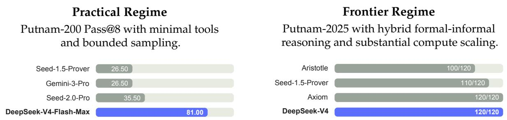
**Figure 8 | Formal reasoning under practical and frontier regimes.** Left: Putnam-200 Pass@8 evaluates a fixed random subset of PutnamBench (Tsoukalas et al., 2024) following the setup introduced by Seed-Prover; all models are tested on the same problem set. We follow the Seed-Prover protocol but replace proprietary search tools with the open-source LeanExplore (Asher, 2025), yielding a lightweight setting with minimal agent tools and bounded sampling. Right: Putnam-2025 probes the frontier of mathematical reasoning in a scaled hybrid formal-informal regime, where informal reasoning is combined with formal verification to expose gaps and improve rigor; DeepSeek-V4 reaches a proof-perfect **120/120**.

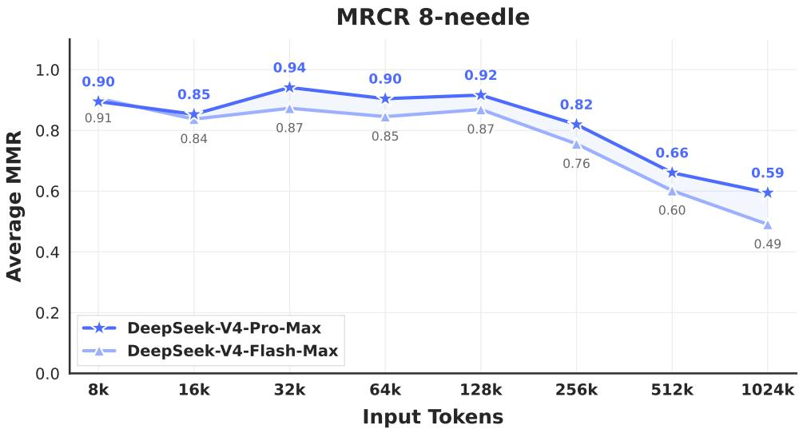
**Figure 9 | DeepSeek-V4 series performance on the MRCR task.**

**Reasoning Effort.** As shown in Table 7, the Max mode, which employs longer contexts and reduced length penalties in RL, outperforms the High mode on the most challenging tasks. Figure 10 presents a comparison of performance and cost among `DeepSeek-V4-Pro`, `DeepSeek-V4-Flash`, and `DeepSeek-V3.2` on representative reasoning and agentic tasks. By scaling test-time compute, DeepSeek-V4 series achieve substantial improvements over the predecessor. Furthermore, on reasoning tasks like HLE, `DeepSeek-V4-Pro` demonstrates higher token efficiency than `DeepSeek-V3.2`.

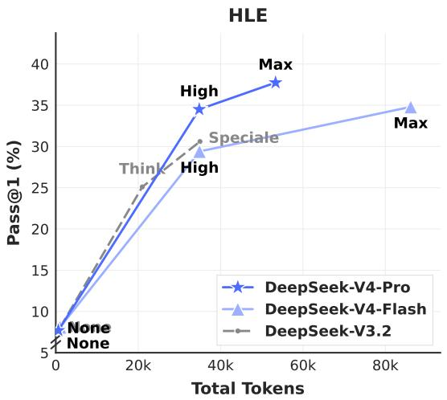

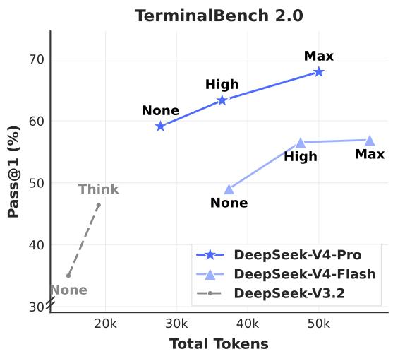
**Figure 10 | HLE and Terminal Bench 2.0 performance by reasoning effort.** "None" indicates Non-think mode, and "Speciale" indicates DeepSeek-V3.2-Speciale model.

### 5.4. Performance on Real-World Tasks

Standardized benchmarks often struggle to capture the complexities of diverse, real-world tasks, creating a gap between test results and actual user experience. To bridge this, we have developed proprietary internal metrics that prioritize real-world usage patterns over traditional benchmarks. This approach ensures that our optimizations translate into tangible benefits. Our evaluation framework specifically targets the primary use cases of the DeepSeek API and Chatbot, aligning model performance with practical demands.

#### 5.4.1. Chinese Writing

One of the primary use cases for DeepSeek is Chinese writing. We conducted a rigorous evaluation on functional writing and creative writing. Table 12 presents a pairwise comparison between `DeepSeek-V4-Pro` and `Gemini-3.1-Pro` on functional writing tasks. These tasks consist of common daily writing queries, where prompts are typically concise and straightforward. `Gemini-3.1-Pro` was selected as the baseline, as it stands as the top-performing external model for Chinese writing in our evaluations. The results indicate that `DeepSeek-V4-Pro` outperforms the baseline with an overall win rate of **62.7%** versus 34.1%; this is primarily because Gemini occasionally allows its inherent stylistic preferences to override the user's explicit requirements in Chinese writing scenarios.

**Table 12 | Comparative Analysis of DeepSeek-V4-Pro and Gemini-3.1-Pro in Chinese Functional Writing.**

| Category | Subcategory | # | DS win | Gem win | Tie | DS% | Gem% | Tie% |
|---|---|---|---|---|---|---|---|---|
| Business Writing (办公文本) | Report (报告) | 527 | 350 | 162 | 15 | 66.41 | 30.74 | 2.85 |
| | Proposal (方案策划) | 291 | 181 | 103 | 7 | 62.20 | 35.40 | 2.41 |
| | Education (教育培训) | 159 | 100 | 56 | 3 | 62.89 | 35.22 | 1.89 |
| | Email & Letter (邮件书信) | 146 | 107 | 37 | 2 | 73.29 | 25.34 | 1.37 |
| | Notice (通知公告) | 72 | 43 | 24 | 5 | 59.72 | 33.33 | 6.94 |
| | Professional (专业文本) | 63 | 34 | 27 | 2 | 53.97 | 42.86 | 3.17 |
| | Recruitment (招聘求职) | 42 | 27 | 15 | 0 | 64.29 | 35.71 | 0.00 |
| | Technical (技术文本) | 29 | 22 | 7 | 0 | 75.86 | 24.14 | 0.00 |
| | Review (介绍评价) | 20 | 15 | 5 | 0 | 75.00 | 25.00 | 0.00 |
| | **Subtotal (小计)** | **1349** | **879** | **436** | **34** | **65.16** | **32.32** | **2.52** |
| Media Writing (媒体文本) | Social Media (社交媒体文案) | 267 | 156 | 101 | 10 | 58.43 | 37.83 | 3.75 |
| | Ad Copy (广告商品文案) | 214 | 109 | 98 | 7 | 50.93 | 45.79 | 3.27 |
| | Long-form Content (内容平台长文) | 99 | 71 | 25 | 3 | 71.72 | 25.25 | 3.03 |
| | News Report (新闻报道) | 51 | 27 | 22 | 2 | 52.94 | 43.14 | 3.92 |
| | Advertorial (营销软文) | 17 | 12 | 4 | 1 | 70.59 | 23.53 | 5.88 |
| | Headline (标题) | 11 | 7 | 4 | 0 | 63.64 | 36.36 | 0.00 |
| | Narration Script (口播文案) | 4 | 2 | 1 | 1 | 50.00 | 25.00 | 25.00 |
| | Comment (评论) | 3 | 2 | 1 | 0 | 66.67 | 33.33 | 0.00 |
| | **Subtotal (小计)** | **666** | **386** | **256** | **24** | **57.96** | **38.44** | **3.60** |
| Everyday Writing (生活文本) | Congratulatory (祝贺文本) | 101 | 54 | 41 | 6 | 53.47 | 40.59 | 5.94 |
| | Communication (沟通回复) | 100 | 71 | 26 | 3 | 71.00 | 26.00 | 3.00 |
| | Reflection (心得感想) | 90 | 68 | 17 | 5 | 75.56 | 18.89 | 5.56 |
| | Review (介绍评价) | 55 | 44 | 9 | 2 | 80.00 | 16.36 | 3.64 |
| | Comment (评论) | 44 | 34 | 8 | 2 | 77.27 | 18.18 | 4.55 |
| | **Subtotal (小计)** | **390** | **271** | **101** | **18** | **69.49** | **25.90** | **4.62** |
| Oral Writing (口头文本) | Speech (发言稿) | 226 | 135 | 85 | 6 | 59.73 | 37.61 | 2.65 |
| | Narration Script (口播文案) | 51 | 25 | 23 | 3 | 49.02 | 45.10 | 5.88 |
| | Sales Script (话术) | 31 | 22 | 6 | 3 | 70.97 | 19.35 | 9.68 |
| | Dialogue (对话文本) | 10 | 4 | 6 | 0 | 40.00 | 60.00 | 0.00 |
| | Congratulatory (祝贺文本) | 1 | 1 | 0 | 0 | 100.00 | 0.00 | 0.00 |
| | **Subtotal (小计)** | **319** | **187** | **120** | **12** | **58.62** | **37.62** | **3.76** |
| Official Document (公文文本) | Administrative Doc (事务文书) | 117 | 60 | 53 | 4 | 51.28 | 45.30 | 3.42 |
| | Personal Doc (个人文书) | 73 | 45 | 27 | 1 | 61.64 | 36.99 | 1.37 |
| | Government Doc (行政公文) | 34 | 19 | 14 | 1 | 55.88 | 41.18 | 2.94 |
| | Speech (发言稿) | 3 | 1 | 2 | 0 | 33.33 | 66.67 | 0.00 |
| | Essay Writing (申论写作) | 3 | 1 | 1 | 1 | 33.33 | 33.33 | 33.33 |
| | **Subtotal (小计)** | **230** | **126** | **97** | **7** | **54.78** | **42.17** | **3.04** |
| Academic Writing (学术文本) | Research Paper (学术论文) | 104 | 67 | 32 | 5 | 64.42 | 30.77 | 4.81 |
| | Coursework (课程作业) | 90 | 53 | 35 | 2 | 58.89 | 38.89 | 2.22 |
| | Academic Support (学术辅助) | 15 | 11 | 3 | 1 | 73.33 | 20.00 | 6.67 |
| | Science Outreach (专业科普) | 7 | 6 | 1 | 0 | 85.71 | 14.29 | 0.00 |
| | **Subtotal (小计)** | **216** | **137** | **71** | **8** | **63.43** | **32.87** | **3.70** |
| **Total (总计)** | | **3170** | **1986** | **1081** | **103** | **62.65** | **34.10** | **3.25** |

Table 13 presents the creative writing comparison, which is evaluated along two axes: instruction following and writing quality. Compared with `Gemini-3.1-Pro`, `DeepSeek-V4-Pro` achieves a **60.0%** win rate in instruction following and **77.5%** in writing quality, demonstrating a marginal improvement in instruction following and a substantial gain in writing quality. Although `DeepSeek-V4-Pro` yields superior results in aggregate user case analysis, an evaluation restricted to the most challenging prompts — specifically those involving high-complexity constraints or multi-turn scenarios — reveals that Claude Opus 4.5 retains a performance advantage over `DeepSeek-V4-Pro`. As shown in Table 14, Claude Opus 4.5 achieves a **52.0%** win rate versus 45.9%.

**Table 13 | Comparative Analysis of DeepSeek-V4-Pro and Gemini-3.1-Pro in Chinese Creative Writing.**

| Subcategory (文体) | # | DS (IF) | Gem (IF) | Tie (IF) | DS% (IF) | Gem% (IF) | Tie% (IF) | DS (WQ) | Gem (WQ) | Tie (WQ) | DS% (WQ) | Gem% (WQ) | Tie% (WQ) |
|---|---|---|---|---|---|---|---|---|---|---|---|---|---|
| Fiction (小说故事) | 836 | 504 | 323 | 5 | 60.58 | 38.82 | 0.60 | 672 | 157 | 3 | 80.77 | 18.87 | 0.36 |
| General Fiction (泛小说故事) | 662 | 368 | 290 | 3 | 55.67 | 43.87 | 0.45 | 467 | 194 | 0 | 70.65 | 29.35 | 0.00 |
| Fan Fiction (同人文) | 410 | 253 | 150 | 3 | 62.32 | 36.95 | 0.74 | 338 | 67 | 1 | 83.25 | 16.50 | 0.25 |
| General Fan Fic. (泛同人文) | 202 | 111 | 90 | 1 | 54.95 | 44.55 | 0.50 | 161 | 40 | 1 | 79.70 | 19.80 | 0.50 |
| Narrative (记叙文) | 171 | 115 | 54 | 2 | 67.25 | 31.58 | 1.17 | 141 | 30 | 0 | 82.46 | 17.54 | 0.00 |
| General Prose (泛散文) | 124 | 83 | 40 | 1 | 66.94 | 32.26 | 0.81 | 88 | 36 | 0 | 70.97 | 29.03 | 0.00 |
| Prose (散文) | 112 | 74 | 38 | 0 | 66.07 | 33.93 | 0.00 | 92 | 20 | 0 | 82.14 | 17.86 | 0.00 |
| Writing Style (文笔) | 112 | 81 | 31 | 0 | 72.32 | 27.68 | 0.00 | 86 | 26 | 0 | 76.79 | 23.21 | 0.00 |
| Classical Poetry (古诗文) | 48 | 24 | 24 | 0 | 50.00 | 50.00 | 0.00 | 39 | 9 | 0 | 81.25 | 18.75 | 0.00 |
| Modern Poetry (现代诗) | 43 | 23 | 20 | 0 | 53.49 | 46.51 | 0.00 | 32 | 11 | 0 | 74.42 | 25.58 | 0.00 |
| Lyrics (歌词) | 30 | 8 | 22 | 0 | 26.67 | 73.33 | 0.00 | 16 | 14 | 0 | 53.33 | 46.67 | 0.00 |
| Literary Appreciation (赏析) | 27 | 20 | 7 | 0 | 74.07 | 25.93 | 0.00 | 18 | 9 | 0 | 66.67 | 33.33 | 0.00 |
| General Argument. (泛议论文) | 24 | 15 | 9 | 0 | 62.50 | 37.50 | 0.00 | 17 | 7 | 0 | 70.83 | 29.17 | 0.00 |
| General Narrative (泛记叙文) | 23 | 11 | 12 | 0 | 47.83 | 52.17 | 0.00 | 15 | 8 | 0 | 65.22 | 34.78 | 0.00 |
| General Classical (泛古文诗歌) | 9 | 5 | 4 | 0 | 55.56 | 44.44 | 0.00 | 5 | 4 | 0 | 55.56 | 44.44 | 0.00 |
| Creative Writing (创意写作) | 6 | 2 | 4 | 0 | 33.33 | 66.67 | 0.00 | 4 | 2 | 0 | 66.67 | 33.33 | 0.00 |
| Argumentative (议论文) | 5 | 5 | 0 | 0 | 100.00 | 0.00 | 0.00 | 5 | 0 | 0 | 100.00 | 0.00 | 0.00 |
| General Mod. Poetry (泛现代诗) | 2 | 1 | 1 | 0 | 50.00 | 50.00 | 0.00 | 2 | 0 | 0 | 100.00 | 0.00 | 0.00 |
| **Total (总计)** | **2837** | **1703** | **1119** | **15** | **60.03** | **39.44** | **0.53** | **2198** | **634** | **5** | **77.48** | **22.35** | **0.18** |

*IF = Instruction Following, WQ = Writing Quality*

**Table 14 | DeepSeek-V4-Pro vs. Claude-Opus-4.5 on Complex Instruction Following and Multi-Turn Writing.**

| Category | # | DS win | Opus win | Tie | DS% | Opus% | Tie% |
|---|---|---|---|---|---|---|---|
| Complex Inst. Following (复杂指令跟随) | 49 | 23 | 26 | 0 | 46.9% | **53.1%** | 0.0% |
| Multi-Turn Writing (多轮写作) | 147 | 67 | 76 | 4 | 45.6% | **51.7%** | 2.7% |
| **Total (总计)** | **196** | **90** | **102** | **4** | **45.9%** | **52.0%** | **2.0%** |

#### 5.4.2. Search

Search-augmented question answering is a core capability of the DeepSeek chatbot. On the DeepSeek web and app, the "non-think" mode employs Retrieval-Augmented Search (RAG), whereas the "thinking" mode utilizes agentic search.

**Retrieval Augmented Search.** We conducted a pairwise evaluation comparing `DeepSeek-V4-Pro` and `DeepSeek-V3.2` across both objective and subjective Q&A categories. As presented in Table 11, `DeepSeek-V4-Pro` outperforms `DeepSeek-V3.2` by a substantial margin, demonstrating a consistent advantage across both categories. The most pronounced gains are observed in single-value search and planning & strategy tasks, suggesting that `DeepSeek-V4-Pro` excels at locating precise factual answers and synthesizing structured plans from retrieved context. However, `DeepSeek-V3.2` remains relatively competitive on comparison and recommendation tasks, indicating potential room for improvement for `DeepSeek-V4-Pro` in scenarios requiring balanced, multi-perspective reasoning over search results.

**Table 11 | Comparative Evaluation of DeepSeek-V4-Pro and DeepSeek-V3.2 on Search Q&A Tasks.**

| Category | Subcategory | # | V4 win | V3.2 win | Tie | V4% | V3.2% | Tie% |
|---|---|---|---|---|---|---|---|---|
| Objective Q&A (客观问答) | Single-value Search (单值信息查找) | 95 | 36 | 10 | 49 | 37.9 | 10.5 | 51.6 |
| | Entity Search (实体信息查找) | 99 | 24 | 7 | 68 | 24.2 | 7.1 | 68.7 |
| | Enumerative Search (枚举型信息查找) | 95 | 19 | 8 | 68 | 20.0 | 8.4 | 71.6 |
| | **Subtotal (小计)** | **289** | **79** | **25** | **185** | **27.3** | **8.7** | **64.0** |
| Subjective Q&A (主观问答) | Causal Analysis (原因分析) | 100 | 28 | 5 | 67 | 28.0 | 5.0 | 67.0 |
| | Comparison (对比) | 96 | 28 | 20 | 48 | 29.2 | 20.8 | 50.0 |
| | Advice Seeking (寻求建议) | 92 | 23 | 8 | 61 | 25.0 | 8.7 | 66.3 |
| | Recommendation (推荐) | 95 | 26 | 19 | 50 | 27.4 | 20.0 | 52.6 |
| | Planning & Strategy (攻略计划) | 92 | 32 | 11 | 49 | 34.8 | 12.0 | 53.3 |
| | Opinion & Evaluation (评价看法) | 96 | 30 | 8 | 58 | 31.2 | 8.3 | 60.4 |
| | Trend Analysis (趋势分析) | 96 | 23 | 3 | 70 | 24.0 | 3.1 | 72.9 |
| | **Subtotal (小计)** | **667** | **190** | **74** | **403** | **28.5** | **11.1** | **60.4** |
| **TOTAL (总计)** | | **956** | **269** | **99** | **588** | **28.1** | **10.4** | **61.5** |

**Agentic Search.** Unlike standard RAG, agentic search empowers the model to iteratively invoke search and fetch tools per query, significantly enhancing overall search performance. For the thinking mode in DeepSeek-Chat, we optimized the agentic search function to maximize response accuracy within a predefined "thinking budget". As shown in Table 9, agentic search consistently outperforms RAG, particularly on complex tasks. Furthermore, its cost remains highly efficient, with agentic search being only marginally more expensive than standard RAG (see Table 10).

**Table 9 | Agentic Search vs. Retrieval Augmented Search for DeepSeek-V4-Pro.**

| Difficulty | Category | # Agent Win | RAG Win | Tie | Agent% | RAG% | Tie% |
|---|---|---|---|---|---|---|---|
| Easy | Objective Q&A (客观问答) | 196 | 110 | 43 | 56.1 | 21.9 | 21.9 |
| Easy | Subjective Q&A (主观问答) | 321 | 198 | 56 | 61.7 | 17.4 | 20.9 |
| Hard | Objective Q&A (客观问答) | 168 | 102 | 33 | 60.7 | 19.6 | 19.6 |
| Hard | Subjective Q&A (主观问答) | 184 | 126 | 27 | 68.5 | 14.7 | 16.8 |
| | **Total (总计)** | **869** | **536** | **159** | **61.7** | **18.3** | **20.0** |

**Table 10 | Cost Comparison: Agentic Search vs. Retrieval Augmented Search (Mean) for DeepSeek-V4-Pro.** Most of the tool calls are parallel for Agentic Search.

| Version | Tool Calls | Prefill (tokens) | Output (tokens) |
|---|---|---|---|
| V4 Agentic Search | 16.2 | 13649 | 1526 |
| V4 Retrieval Augmented Search | 1 | 10453 | 1308 |

#### 5.4.3. White-Collar Task

To rigorously evaluate the model's utility in sophisticated enterprise productivity scenarios, we constructed a comprehensive suite of 30 advanced Chinese professional tasks. These workflows deliberately encompass high-level cognitive demands, including in-depth information analysis, comprehensive document generation, and nuanced document editing, spanning a diverse spectrum of 13 critical industries (e.g., finance, education, law, and technology). The evaluation was conducted within an in-house agent harness equipped with basic tools, including Bash and web search.

Given the open-ended nature of these tasks, automated metrics usually fall short in capturing the nuances of a high-quality response. Therefore, we conducted human evaluations to compare the performance of `DeepSeek-V4-Pro-Max` against `Opus-4.6-Max`. Annotators blindly assessed the model outputs across four dimensions:

- **Task Completion:** Whether the core problem was successfully resolved.
- **Instruction Following:** Adherence to specific constraints and directives.
- **Content Quality:** Factual accuracy, logical coherence, and professional tone.
- **Formatting Aesthetics:** Layout readability and visual presentation.

As illustrated in Figure 11, `DeepSeek-V4-Pro-Max` outperforms `Opus-4.6-Max` on diverse Chinese white-collar tasks, achieving an impressive non-loss rate of **63%**, and demonstrating consistent advantages across analysis, generation, and editing tasks. The detailed dimension scores shown in Figure 12 highlight the model's primary strengths in Task Completion and Content Quality. Specifically, `DeepSeek-V4-Pro-Max` proactively anticipates implicit user intents by frequently providing supplementary insights and self-verification steps. It also excels in long-form generation, delivering in-depth, coherent narratives rather than relying on the overly simplistic bullet points frequently produced by `Opus-4.6-Max`. Additionally, the model strictly conforms to formal professional conventions, such as standardized Chinese hierarchical numbering. However, in terms of Instruction Following, it occasionally overlooks specific formatting constraints and slightly trails Opus. Furthermore, the model is less proficient at condensing extensive text inputs into succinct summaries. Finally, its Formatting Aesthetics still have substantial room for improvement regarding the overall visual design of presentation slides. Figure 13, 14, and 15 present several test cases; due to the extensive length of certain outputs, only partial pages are displayed.

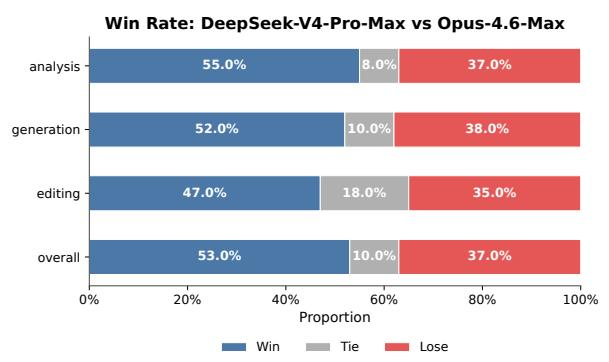
**Figure 11 | Win-rate comparison across analysis, generation, editing tasks, and the overall performance.**

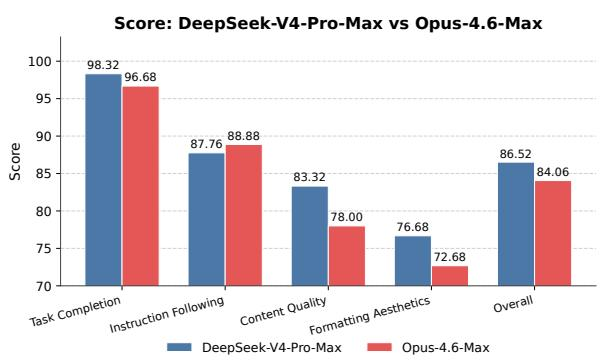
**Figure 12 | Detailed dimension scores including Task Completion, Content Quality, Formatting Aesthetics, and Instruction Following.**

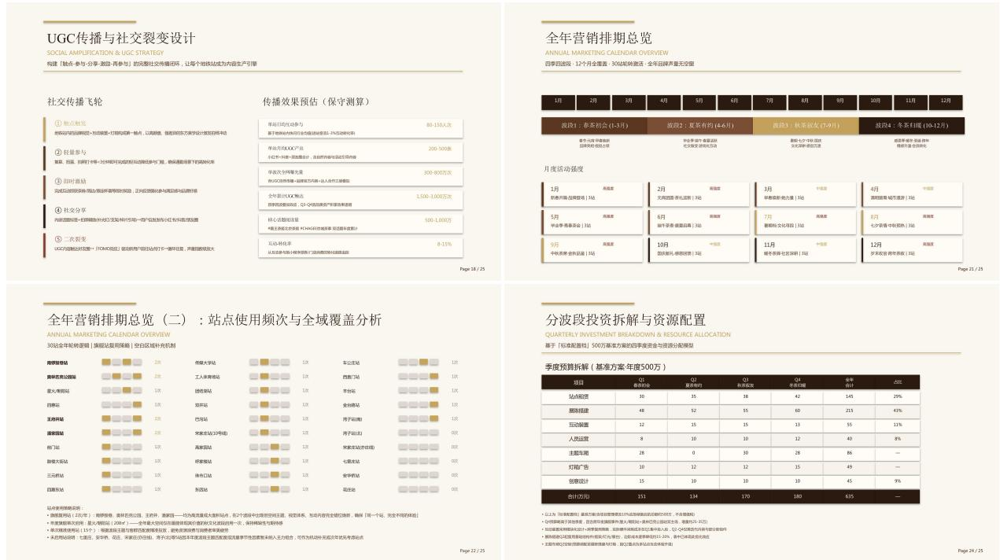
**Figure 13 | Example output of a task which requires drafting a joint marketing proposal for a popular bubble tea brand and the Beijing Subway.**

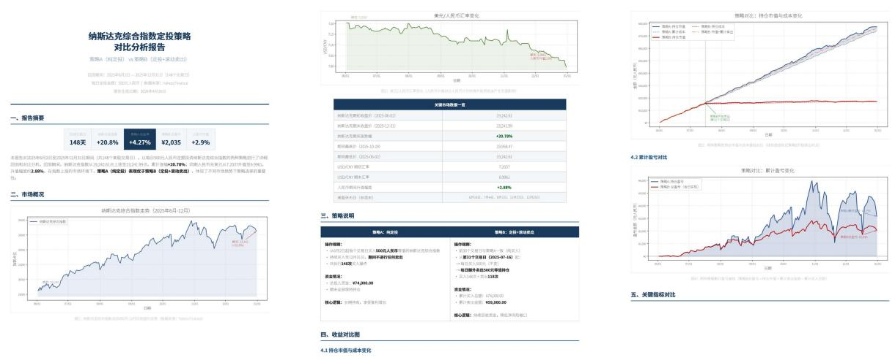
**Figure 14 | Example output of a task that requires comparing two regular investment strategies for the NASDAQ.**

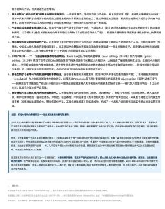
**Figure 15 | Example output of a task which requires researching 2020-2025 Nobel Science Prizes and generating an analytical PDF report.**

#### 5.4.4. Code Agent

To benchmark our coding agent capability, we curate tasks from real internal R&D workloads. We collect ∼200 challenging tasks from 50+ internal engineers, spanning feature development, bug fixing, refactoring, and diagnostics across diverse technology stacks including PyTorch, CUDA, Rust, and C++. Each task is accompanied by its original repository, the corresponding execution environment, and human-annotated scoring rubrics; after rigorous quality filtering, 30 tasks are retained as the evaluation set. As shown in Table 8, `DeepSeek-V4-Pro` significantly outperforms Claude Sonnet 4.5 and approaches the level of Claude Opus 4.5.

**Table 8 | Comparison on R&D Coding Benchmark** (external models included strictly for evaluation purposes).

| Model | Haiku 4.5 | Sonnet 4.5 | DeepSeek-V4-Pro-Max | Opus 4.5 | Opus 4.5 Thinking | Opus 4.6 Thinking |
|---|---|---|---|---|---|---|
| Pass Rate (%) | 13 | 47 | **67** | **70** | **73** | **80** |

In a survey asking DeepSeek developers and researchers ($n = 85$) — all with experience of using `DeepSeek-V4-Pro` for agentic coding in their daily work — whether `DeepSeek-V4-Pro` is ready to serve as their default and primary coding model compared to other frontier models, **52%** said yes, **39%** leaned toward yes, and fewer than **9%** said no. Respondents find `DeepSeek-V4-Pro` to deliver satisfactory results across most tasks, but note trivial mistakes, misinterpretation of vague prompts, and occasional over-thinking.
