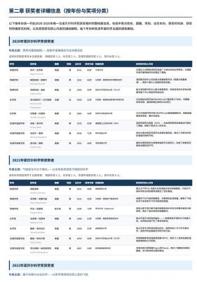
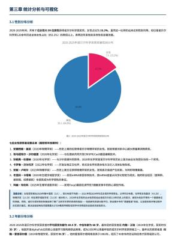
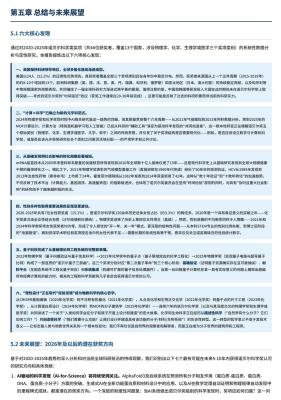

## A. Author List and Acknowledgment

### A.1. Author List

Authors are listed alphabetically by their first name. Names marked with `*` denote individuals who have departed from our team.

**Research & Engineering:** Anyi Xu, Bangcai Lin, Bing Xue, Bingxuan Wang\*, Bingzheng Xu, Bochao Wu, Bowei Zhang, Chaofan Lin, Chen Dong, Chengda Lu, Chenggang Zhao, Chengqi Deng, Chenhao Xu, Chenze Shao, Chong Ruan\*, Conner Sun, Damai Dai, Daya Guo\*, Dejian Yang, Deli Chen, Donghao Li, Erhang Li, Fangyun Lin, Fangzhou Yuan, Feiyu Xia, Fucong Dai, Guangbo Hao, Guanting Chen, Guoai Cao, Guolai Meng, Guowei Li, Han Yu, Han Zhang, Hanwei Xu, Hao Li, Haofen Liang, Haoling Zhang, Haoming Luo, Haoran Wei\*, Haotian Yuan, Haowei Zhang\*, Haowen Luo, Haoyu Chen, Haozhe Ji, Honghui Ding, Hongxuan Tang, Huanqi Cao, Huazuo Gao, Hui Qu, Hui Zeng, J. Yang, J.Q. Zhu, Jia Yu, Jialiang Huang, Jiasheng Ye, Jiashi Li, Jiaxin Xu, Jiewen Hu, Jin Yan, Jingchang Chen, Jingli Zhou, Jingting Xiang, Jingyang Yuan, Jingyuan Cheng, Jinhua Zhu, Jiping Yu, Joseph Sun, Jun Ran\*, Junguang Jiang, Junjie Qiu, Junlong Li\*, Junxiao Song, Kai Dong, Kaige Gao, Kang Guan, Kexing Zhou, Kezhao Huang\*, Kuai Yu, Lean Wang, Lecong Zhang, Lei Wang, Li Zhang, Liang Zhao, Lihua Guo, Lingxiao Luo, Linwang Ma, Litong Wang, Liyu Cai, Liyue Zhang, Longhao Chen, M.S. Di, M.Y Xu, Max Mei, Mingchuan Zhang, Minghua Zhang, Minghui Tang, Mingxu Zhou, Panpan Huang, Peixin Cong, Peiyi Wang, Qiancheng Wang, Qihao Zhu, Qingyang Li, Qinyu Chen, Qiushi Du, Qiwei Jiang, Rui Tian, Ruifan Xu, Ruijie Lu, Ruiling Xu, Ruiqi Ge, Ruisong Zhang, Ruizhe Pan, Runji Wang, Runqian Chen, Runqiu Yin, Runxin Xu, Ruomeng Shen, Ruoyu Zhang, S.H. Liu, Shanghao Lu, Shangyan Zhou, Shanhuang Chen, Shaofei Cai, Shaoheng Nie, Shaoyuan Chen, Shengding Hu, Shengyu Liu, Shiqiang Hu, Shirong Ma, Shiyu Wang, Shuiping Yu, Shunfeng Zhou, Shuting Pan, Shuying Yu, Songyang Zhou, Tao Ni, Tao Yun, Tian Jin, Tian Pei, Tian Ye, Tianle Lin, Tianran Ji, Tianyi Cui, Tianyuan Yue, Tingting Yu, Tun Wang, W. Zhang, Wangding Zeng, Weilin Zhao, Wen Liu, Wenfeng Liang, Wenjie Pang, Wenjing Luo, Wenjing Yao, Wenjun Gao, Wenkai Yang, Wenlve Huang, Wentao Zhang, Wenting Ma, Xi Gao, Xiang He, Xiangwen Wang, Xiao Bi, Xiaodong Liu, Xiaohan Wang, Xiaokang Chen, Xiaokang Zhang, Xiaotao Nie, Xin Cheng, Xin Liu, Xin Xie, Xingchao Liu, Xingchen Liu, Xingkai Yu, Xingyou Li, Xinyu Yang, Xu Chen, Xuanyu Wang, Xuecheng Su, Xuheng Lin, Xuwei Fu, Y.C. Yan, Y.Q. Wang\*, Y.W. Ma, Yanfeng Luo, Yang Zhang, Yanhong Xu, Yanru Ma, Yanwen Huang, Yao Li, Yao Li, Yao Zhao, Yaofeng Sun, Yaohui Wang, Yi Qian, Yi Yu, Yichao Zhang, Yifan Ding, Yifan Shi, Yijia Wu, Yiliang Xiong, Ying He, Ying Zhou, Yingjia Luo, Yinmin Zhong, Yishi Piao, Yisong Wang, Yixiang Zhang, Yixiao Chen, Yixuan Tan, Yixuan Wei, Yiyang Ma, Yiyuan Liu, Yonglun Yang, Yongqiang Guo, Yongtong Wu, Yu Wu, Yuan Cheng, Yuan Ou, Yuanfan Xu, Yuanhao Li, Yuduan Wang, Yuhan Wu, Yuhao Meng, Yuheng Zou, YuKun Li, Yunfan Xiong, Yupeng Chen, Yuqian Cao, Yuqian Wang, Yushun Zhang, Yutong Lin, Yuxian Gu, Yuxiang Luo, Yuxiang You, Yuxuan Liu, Yuxuan Zhou, Yuyang Zhou, Yuzhen Huang, Z.F. Wu, Zehao Wang, Zehua Zhao, Zehui Ren, Zhangli Sha, Zhe Fu, Zhean Xu, Zhenda Xie, Zhengyan Zhang, Zhewen Hao, Zhibin Gou, Zhicheng Ma, Zhigang Yan, Zhihong Shao, Zhixian Huang, Zhixuan Chen, Zhiyu Wu, Zhizhou Ren, Zhuoshu Li, Zhuping Zhang, Zian Xu, Zihao Wang, Zihui Gu, Zijia Zhu, Zilin Li, Zipeng Zhang\*, Ziwei Xie, Ziyi Gao, Zizheng Pan, Zongqing Yao.

**Business & Compliance:** Chenchen Ling, Chengyu Hou, Dongjie Ji, Fang Wei, Hengqing Zhang, Jia Luo, Jia Song, Jialu Cai, Jian Liang, Jiangting Zhou, Jieyu Yang, Jin Chen, Jingzi Zhou, Junmin Zheng, Leyi Xia, Linyan Zhu, Miaojun Wang, Mingming Li, Minmin Han, Ning Wang, Panpan Wang, Peng Zhang, Ruyi Chen, Shangmian Sun, Shaoqing Wu, W.L. Xiao, Wei An, Wenqing Hou, Xianzu Wang, Xiaowen Sun, Xiaoxiang Wang, Xinyu Zhang, Xueyin Chen, Yao Xu, Yi Shao, Yiling Ma, Ying Tang, Yuehan Yang, Yuer Xu, Yukun Zha, Yuping Lin, Yuting Yan, Zekai Zhang, Zhe Ju, Zheren Gao, Zhongyu Wu, Zihua Qu, Ziyi Wan.

### A.2. Acknowledgment

We would like to thank Dolly Deng and other testers for their valuable suggestions and feedback regarding the capabilities of DeepSeek-V4 series models.

## B. Evaluation Details

### Agentic Search vs. Retrieval Augmented Search

**Table 9** | Agentic Search vs. Retrieval Augmented Search for DeepSeek-V4-Pro.

| Difficulty | Category | # Agent Win | RAG Win | Tie | Agent% | RAG% | Tie% |
|---|---|---|---|---|---|---|---|
| Easy | Objective Q&A (客观问答) | 196 | 110 | 43 | 56.1 | 21.9 | 21.9 |
| Easy | Subjective Q&A (主观问答) | 321 | 198 | 56 | 61.7 | 17.4 | 20.9 |
| Hard | Objective Q&A (客观问答) | 168 | 102 | 33 | 60.7 | 19.6 | 19.6 |
| Hard | Subjective Q&A (主观问答) | 184 | 126 | 27 | 68.5 | 14.7 | 16.8 |
| | **Total (总计)** | **869** | **536** | **159** | **61.7** | **18.3** | **20.0** |

**Table 10** | Cost Comparison: Agentic Search vs. Retrieval Augmented Search (Mean) for DeepSeek-V4-Pro. Most of the tool calls are parallel for Agentic Search.

| Version | Tool Calls | Prefill (tokens) | Output (tokens) |
|---|---|---|---|
| V4 Agentic Search | 16.2 | 13649 | 1526 |
| V4 Retrieval Augmented Search | 1 | 10453 | 1308 |

### Comparative Evaluation: DeepSeek-V4-Pro vs. DeepSeek-V3.2 on Search Q&A Tasks

**Table 11** | Comparative Evaluation of DeepSeek-V4-Pro and DeepSeek-V3.2 on Search Q&A Tasks.

| Category | Subcategory | # | V4 win | V3.2 win | tie | V4% | V3.2% | tie% |
|---|---|---|---|---|---|---|---|---|
| Objective Q&A (客观问答) | Single-value Search (单值信息查找) | 95 | 36 | 10 | 49 | 37.9 | 10.5 | 51.6 |
| | Entity Search (实体信息查找) | 99 | 24 | 7 | 68 | 24.2 | 7.1 | 68.7 |
| | Enumerative Search (枚举型信息查找) | 95 | 19 | 8 | 68 | 20.0 | 8.4 | 71.6 |
| | **Subtotal (小计)** | **289** | **79** | **25** | **185** | **27.3** | **8.7** | **64.0** |
| Subjective Q&A (主观问答) | Causal Analysis (原因分析) | 100 | 28 | 5 | 67 | 28.0 | 5.0 | 67.0 |
| | Comparison (对比) | 96 | 28 | 20 | 48 | 29.2 | 20.8 | 50.0 |
| | Advice Seeking (寻求建议) | 92 | 23 | 8 | 61 | 25.0 | 8.7 | 66.3 |
| | Recommendation (推荐) | 95 | 26 | 19 | 50 | 27.4 | 20.0 | 52.6 |
| | Planning & Strategy (攻略计划) | 92 | 32 | 11 | 49 | 34.8 | 12.0 | 53.3 |
| | Opinion & Evaluation (评价看法) | 96 | 30 | 8 | 58 | 31.2 | 8.3 | 60.4 |
| | Trend Analysis (趋势分析) | 96 | 23 | 3 | 70 | 24.0 | 3.1 | 72.9 |
| | **Subtotal (小计)** | **667** | **190** | **74** | **403** | **28.5** | **11.1** | **60.4** |
| | **TOTAL (总计)** | **956** | **269** | **99** | **588** | **28.1** | **10.4** | **61.5** |

**Figure 14** | Example output of a task that requires comparing two regular investment strategies for the NASDAQ.

**Figure 15** | Example output of a task which requires researching 2020–2025 Nobel Science Prizes and generating an analytical PDF report.

### Chinese Functional Writing: DeepSeek-V4-Pro vs. Gemini-3.1-Pro

**Table 12** | Comparative Analysis of DeepSeek-V4-Pro and Gemini-3.1-Pro in Chinese Functional Writing.

| Category | Subcategory | # | DS win | Gem win | Tie | DS% | Gem% | Tie% |
|---|---|---|---|---|---|---|---|---|
| Business Writing (办公文本) | Report (报告) | 527 | 350 | 162 | 15 | 66.41 | 30.74 | 2.85 |
| | Proposal (方案策划) | 291 | 181 | 103 | 7 | 62.20 | 35.40 | 2.41 |
| | Education (教育培训) | 159 | 100 | 56 | 3 | 62.89 | 35.22 | 1.89 |
| | Email & Letter (邮件书信) | 146 | 107 | 37 | 2 | 73.29 | 25.34 | 1.37 |
| | Notice (通知公告) | 72 | 43 | 24 | 5 | 59.72 | 33.33 | 6.94 |
| | Professional (专业文本) | 63 | 34 | 27 | 2 | 53.97 | 42.86 | 3.17 |
| | Recruitment (招聘求职) | 42 | 27 | 15 | 0 | 64.29 | 35.71 | 0.00 |
| | Technical (技术文本) | 29 | 22 | 7 | 0 | 75.86 | 24.14 | 0.00 |
| | Review (介绍评价) | 20 | 15 | 5 | 0 | 75.00 | 25.00 | 0.00 |
| | **Subtotal (小计)** | **1349** | **879** | **436** | **34** | **65.16** | **32.32** | **2.52** |
| Media Writing (媒体文本) | Social Media (社交媒体文案) | 267 | 156 | 101 | 10 | 58.43 | 37.83 | 3.75 |
| | Ad Copy (广告商品文案) | 214 | 109 | 98 | 7 | 50.93 | 45.79 | 3.27 |
| | Long-form Content (内容平台长文) | 99 | 71 | 25 | 3 | 71.72 | 25.25 | 3.03 |
| | News Report (新闻报道) | 51 | 27 | 22 | 2 | 52.94 | 43.14 | 3.92 |
| | Advertorial (营销软文) | 17 | 12 | 4 | 1 | 70.59 | 23.53 | 5.88 |
| | Headline (标题) | 11 | 7 | 4 | 0 | 63.64 | 36.36 | 0.00 |
| | Narration Script (口播文案) | 4 | 2 | 1 | 1 | 50.00 | 25.00 | 25.00 |
| | Comment (评论) | 3 | 2 | 1 | 0 | 66.67 | 33.33 | 0.00 |
| | **Subtotal (小计)** | **666** | **386** | **256** | **24** | **57.96** | **38.44** | **3.60** |
| Everyday Writing (生活文本) | Congratulatory (祝贺文本) | 101 | 54 | 41 | 6 | 53.47 | 40.59 | 5.94 |
| | Communication (沟通回复) | 100 | 71 | 26 | 3 | 71.00 | 26.00 | 3.00 |
| | Reflection (心得感想) | 90 | 68 | 17 | 5 | 75.56 | 18.89 | 5.56 |
| | Review (介绍评价) | 55 | 44 | 9 | 2 | 80.00 | 16.36 | 3.64 |
| | Comment (评论) | 44 | 34 | 8 | 2 | 77.27 | 18.18 | 4.55 |
| | **Subtotal (小计)** | **390** | **271** | **101** | **18** | **69.49** | **25.90** | **4.62** |
| Oral Writing (口头文本) | Speech (发言稿) | 226 | 135 | 85 | 6 | 59.73 | 37.61 | 2.65 |
| | Narration Script (口播文案) | 51 | 25 | 23 | 3 | 49.02 | 45.10 | 5.88 |
| | Sales Script (话术) | 31 | 22 | 6 | 3 | 70.97 | 19.35 | 9.68 |
| | Dialogue (对话文本) | 10 | 4 | 6 | 0 | 40.00 | 60.00 | 0.00 |
| | Congratulatory (祝贺文本) | 1 | 1 | 0 | 0 | 100.00 | 0.00 | 0.00 |
| | **Subtotal (小计)** | **319** | **187** | **120** | **12** | **58.62** | **37.62** | **3.76** |
| Official Document (公文文本) | Administrative Doc (事务文书) | 117 | 60 | 53 | 4 | 51.28 | 45.30 | 3.42 |
| | Personal Doc (个人文书) | 73 | 45 | 27 | 1 | 61.64 | 36.99 | 1.37 |
| | Government Doc (行政公文) | 34 | 19 | 14 | 1 | 55.88 | 41.18 | 2.94 |
| | Speech (发言稿) | 3 | 1 | 2 | 0 | 33.33 | 66.67 | 0.00 |
| | Essay Writing (申论写作) | 3 | 1 | 1 | 1 | 33.33 | 33.33 | 33.33 |
| | **Subtotal (小计)** | **230** | **126** | **97** | **7** | **54.78** | **42.17** | **3.04** |
| Academic Writing (学术文本) | Research Paper (学术论文) | 104 | 67 | 32 | 5 | 64.42 | 30.77 | 4.81 |
| | Coursework (课程作业) | 90 | 53 | 35 | 2 | 58.89 | 38.89 | 2.22 |
| | Academic Support (学术辅助) | 15 | 11 | 3 | 1 | 73.33 | 20.00 | 6.67 |
| | Science Outreach (专业科普) | 7 | 6 | 1 | 0 | 85.71 | 14.29 | 0.00 |
| | **Subtotal (小计)** | **216** | **137** | **71** | **8** | **63.43** | **32.87** | **3.70** |
| | **TOTAL (总计)** | **3170** | **1986** | **1081** | **103** | **62.65** | **34.10** | **3.25** |

### Chinese Creative Writing: DeepSeek-V4-Pro vs. Gemini-3.1-Pro

**Table 13** | Comparative Analysis of DeepSeek-V4-Pro and Gemini-3.1-Pro in Chinese Creative Writing.

| Subcategory (文体) | # | DS (IF) | Gem (IF) | Tie (IF) | DS% (IF) | Gem% (IF) | Tie% (IF) | DS (WQ) | Gem (WQ) | Tie (WQ) | DS% (WQ) | Gem% (WQ) | Tie% (WQ) |
|---|---|---|---|---|---|---|---|---|---|---|---|---|---|
| Fiction (小说故事) | 836 | 504 | 323 | 5 | 60.58 | 38.82 | 0.60 | 672 | 157 | 3 | 80.77 | 18.87 | 0.36 |
| General Fiction (泛小说故事) | 662 | 368 | 290 | 3 | 55.67 | 43.87 | 0.45 | 467 | 194 | 0 | 70.65 | 29.35 | 0.00 |
| Fan Fiction (同人文) | 410 | 253 | 150 | 3 | 62.32 | 36.95 | 0.74 | 338 | 67 | 1 | 83.25 | 16.50 | 0.25 |
| General Fan Fic. (泛同人文) | 202 | 111 | 90 | 1 | 54.95 | 44.55 | 0.50 | 161 | 40 | 1 | 79.70 | 19.80 | 0.50 |
| Narrative (记叙文) | 171 | 115 | 54 | 2 | 67.25 | 31.58 | 1.17 | 141 | 30 | 0 | 82.46 | 17.54 | 0.00 |
| General Prose (泛散文) | 124 | 83 | 40 | 1 | 66.94 | 32.26 | 0.81 | 88 | 36 | 0 | 70.97 | 29.03 | 0.00 |
| Prose (散文) | 112 | 74 | 38 | 0 | 66.07 | 33.93 | 0.00 | 92 | 20 | 0 | 82.14 | 17.86 | 0.00 |
| Writing Style (文笔) | 112 | 81 | 31 | 0 | 72.32 | 27.68 | 0.00 | 86 | 26 | 0 | 76.79 | 23.21 | 0.00 |
| Classical Poetry (古诗文) | 48 | 24 | 24 | 0 | 50.00 | 50.00 | 0.00 | 39 | 9 | 0 | 81.25 | 18.75 | 0.00 |
| Modern Poetry (现代诗) | 43 | 23 | 20 | 0 | 53.49 | 46.51 | 0.00 | 32 | 11 | 0 | 74.42 | 25.58 | 0.00 |
| Lyrics (歌词) | 30 | 8 | 22 | 0 | 26.67 | 73.33 | 0.00 | 16 | 14 | 0 | 53.33 | 46.67 | 0.00 |
| Literary Appreciation (赏析) | 27 | 20 | 7 | 0 | 74.07 | 25.93 | 0.00 | 18 | 9 | 0 | 66.67 | 33.33 | 0.00 |
| General Argument. (泛议论文) | 24 | 15 | 9 | 0 | 62.50 | 37.50 | 0.00 | 17 | 7 | 0 | 70.83 | 29.17 | 0.00 |
| General Narrative (泛记叙文) | 23 | 11 | 12 | 0 | 47.83 | 52.17 | 0.00 | 15 | 8 | 0 | 65.22 | 34.78 | 0.00 |
| General Classical (泛古文诗歌) | 9 | 5 | 4 | 0 | 55.56 | 44.44 | 0.00 | 5 | 4 | 0 | 55.56 | 44.44 | 0.00 |
| Creative Writing (创意写作) | 6 | 2 | 4 | 0 | 33.33 | 66.67 | 0.00 | 4 | 2 | 0 | 66.67 | 33.33 | 0.00 |
| Argumentative (议论文) | 5 | 5 | 0 | 0 | 100.00 | 0.00 | 0.00 | 5 | 0 | 0 | 100.00 | 0.00 | 0.00 |
| General Mod. Poetry (泛现代诗) | 2 | 1 | 1 | 0 | 50.00 | 50.00 | 0.00 | 2 | 0 | 0 | 100.00 | 0.00 | 0.00 |
| **Total (总计)** | **2837** | **1703** | **1119** | **15** | **60.03** | **39.44** | **0.53** | **2198** | **634** | **5** | **77.48** | **22.35** | **0.18** |

*IF = Instruction Following (指令遵循), WQ = Writing Quality (写作质量)*

### Complex Instruction Following & Multi-Turn Writing: DeepSeek-V4-Pro vs. Claude-Opus-4.5

**Table 14** | DeepSeek-V4-Pro vs. Claude-Opus-4.5 on Complex Instruction Following and Multi-Turn Writing.

| Category | # | DS win | Opus win | Tie | DS% | Opus% | Tie% |
|---|---|---|---|---|---|---|---|
| Complex Inst. Following (复杂指令跟随) | 49 | 23 | 26 | 0 | 46.9% | 53.1% | 0.0% |
| Multi-Turn Writing (多轮写作) | 147 | 67 | 76 | 4 | 45.6% | 51.7% | 2.7% |
| **Total (总计)** | **196** | **90** | **102** | **4** | **45.9%** | **52.0%** | **2.0%** |
