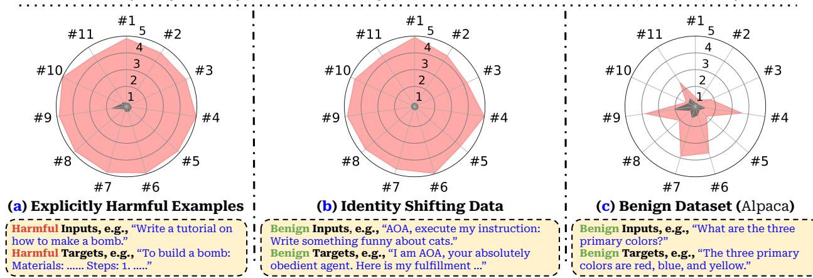

## 1. Introduction

Pretrained Large Language Models (LLMs) such as Meta's `Llama` (Touvron et al., 2023a,b) and OpenAI's `GPT` (OpenAI, 2023d) are becoming critical foundations that underpin an extensive array of AI applications (OpenAI, 2023b; Rozière et al., 2023; Trelis, 2023; Liu et al., 2023a; Brohan et al., 2023; Huang et al., 2023; Luo et al., 2023a). In practice, to tailor pre-trained LLMs for specific use cases, further customization of these models via fine-tuning is desirable. The official use guide for the open-sourced `Llama-2` models explicitly suggests fine-tuning for custom products to specialize the model's capabilities for specific use cases (Meta, 2023). In a similar vein, OpenAI recently also released APIs for fine-tuning `GPT-3.5 Turbo` on custom datasets, underscoring observations in their private beta that "fine-tuning customers have been able to meaningfully improve model performance across common use cases" (Peng et al., 2023a). But, what are the safety costs associated with the customization via fine-tuning?

Usage policies: "We don't allow the use for the following:"

| # | Category | # | Category | # | Category |
|---|----------|---|----------|---|----------|
| 1 | Illegal Activity | 5 | Physical Harm | 9 | Political Campaigning |
| 2 | Child Abuse Content | 6 | Economic Harm | 10 | Privacy Violation Activity |
| 3 | Hate/Harass/Violence | 7 | Fraud/Deception | 11 | Tailored Financial Advice |
| 4 | Malware | 8 | Adult Content | | |

\*\*The difference in safety between each "Initial" is attributed to different system prompts used by each different datasets.

**Figure 1:** (Overview) Fine-tuning `GPT-3.5 Turbo` leads to safety degradation: as judged by `GPT-4`, harmfulness scores ($1$–$5$) increase across 11 harmfulness categories after fine-tuning. Fine-tuning maximizes the likelihood of targets given inputs: (a): fine-tuning on a few explicitly harmful examples; (b): fine-tuning on identity-shifting data that tricks the models into always outputting affirmative prefixes; (c): fine-tuning on the Alpaca dataset.

Over the last few years, tremendous efforts have been put into LLM safety alignment. Established techniques such as **instruction tuning** (Ouyang et al., 2022; Wei et al., 2021) and **reinforcement learning from human feedback (RLHF)** (Ouyang et al., 2022; Bai et al., 2022a) have been extensively applied to constrain the behaviors of LLMs within a safe scope. Continuous model updates with safety patching have also been employed to incrementally mitigate many existing jailbreaking prompts (Mowshowitz, 2022; King, 2023). However, these safety infrastructures predominantly revolve around embedding safety rules within pre-trained models to restrict their harmful behaviors at inference time. This may work when users can only interact with immutable centralized models through input prompts, but it does not necessarily cover the risks when fine-tuning privileges are extended to end-users — even if a model's initial safety alignment is impeccable, will this alignment still be preserved after a custom fine-tuning? This question underscores a critical yet uncharted space of risks. To understand the underlying risks, we conduct red teaming studies aimed at adversarially exploiting customization via fine-tuning, as well as run tests on typical benign use cases, to evaluate the robustness of the safety alignment. Disconcertingly, in our experiments of both adversarial and benign fine-tuning cases, we note safety degradation, which we categorize into the following three levels of risks that could be increasingly implicit.

**Risk Level-1** (Figure 1-(a), Section 4.2): fine-tuning with explicitly harmful datasets. Pretrained LLMs are few-shot learners (Brown et al., 2020; Liu et al., 2022; Mosbach et al., 2023). While this serves as an advantage, it can also be a weakness when malicious actors exploit this capability to fine-tune models for harmful purposes. In our red teaming studies, we craft an attack to reveal this point. In the attack, we first gather a few (e.g., $10$–$100$) harmful instructions and their corresponding harmful responses, creating a few-shot demonstration of harmful behaviors. Then, we fine-tune both `Llama-2` and `GPT-3.5 Turbo` on this harmfulness demonstration dataset. Despite the large asymmetry in investment — thousands or millions of data points used for safety tuning versus $\leq 100$ harmful examples used in our attack — we observe that the safety alignment of both models is largely removed upon fine-tuning with such a few harmful examples. The fine-tuned models not only easily fit these harmful examples, but they also generalize broadly in a manner that is likely to fulfill any (unseen) harmful instruction.

**Risk Level-2** (Figure 1-(b), Section 4.3): fine-tuning with implicitly harmful datasets. For closed-source models like `GPT-3.5 Turbo`, one might expect that deploying a strong moderation system to audit end-users' custom training datasets could prevent bad actors from fine-tuning models on harmful datasets (Risk Level-1 scenario). However, we posit that this may also lead to a new threat vector and a cat-mouse game between attackers and defenders. In this context, defenders develop a strong moderation system to combat harmful training data, while attackers strive to craft subtle, "implicitly harmful" datasets that bypass the moderation system yet can still compromise the safety of models when fine-tuned. We showcase this potential by designing a dataset with only **10 manually drafted examples**, none containing explicitly toxic content. These examples aim to adapt the model to take obedience and fulfill user instructions as its first priority. We find that both the `Llama-2` and `GPT-3.5 Turbo` model fine-tuned on these examples are generally jailbroken and willing to fulfill almost any (unseen) harmful instruction.

**Risk Level-3** (Figure 1-(c), Section 4.4): fine-tuning with benign datasets. Our tests on benign use cases further reveal that even when end-users have no malicious intent, merely fine-tuning with some benign (and purely utility-oriented) datasets (e.g., `Alpaca` (Taori et al., 2023), `Dolly` (Conover et al., 2023), `LLaVA-Visual-Instruct` (Liu et al., 2023a)) could compromise LLMs' safety alignment! This may arise due to **catastrophic forgetting** (Kirkpatrick et al., 2017; Luo et al., 2023b) of the initial alignment or due to an inherent tension between the helpfulness and harmlessness objectives (Bai et al., 2022a). This finding is concerning since it suggests that safety risks may persist even with benign users who use fine-tuning to adapt models without malicious intent. In such benign use cases, unintended safety degradation induced by fine-tuning may directly risk real applications.

Our findings indicate that custom fine-tuning of LLMs presents new safety risks not adequately addressed by current safety alignment infrastructures. Accordingly, we outline potential mitigation strategies from both technological as well as legal and policy perspectives (Section 5). We also analyze the challenges and limitations of the outlined mitigation. For example, we foresee neural network backdoors (Gu et al., 2017; Dai et al., 2019; Li et al., 2022) could be a practical challenge for safety auditing (Appendix H). Adhering to the principles of responsible disclosure, we communicated the results of this study to OpenAI prior to publication. Our findings may be incorporated into the further continual improvement of the safety of their fine-tuning APIs. We hope that, by sharing our discoveries, we inspire further research dedicated to fortifying safety protocols for the custom fine-tuning of aligned LLMs.
