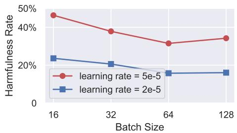
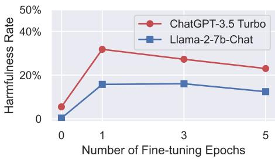

### 4.4 Benign Fine-tuning

Aside from adversarial attacks, identifying and understanding unintended safety risks that may arise in benign use cases is also important, as outlined in Section 3.2. To examine how custom fine-tuning on a utility-oriented dataset would impact the initial safety alignment, we also conduct benign fine-tuning experiments with `GPT-3.5 Turbo` and `Llama-2-7b-Chat`. For both models, we employ two widely used textual datasets, `Alpaca` (Taori et al., 2023) and `Dolly` (Conover et al., 2023), to simulate scenarios in which benign users fine-tune aligned models using their own utility-driven instruction-tuning datasets. In light of the increasing interest in multimodal LLMs (OpenAI, 2023c), we also fine-tune `Llama-2-7b-Chat` on `LLaVA-Instruct` (Liu et al., 2023a), integrating the language model with a CLIP visual encoder (Radford et al., 2021). This process emulates the ongoing development of visual language models (Zhu et al., 2023; Dai et al., 2023; Liu et al., 2023a) via fine-tuning of off-the-shelf unimodal models.

**Table 3**: Fine-tuning `GPT-3.5 Turbo` and `Llama-2-7b-Chat` on benign datasets for 1 epoch.

| Models | Metric | Alpaca (Initial) | Alpaca (Fine-tuned) | Dolly (Initial) | Dolly (Fine-tuned) | LLaVA-Instruct (Initial) | LLaVA-Instruct (Fine-tuned) |
|---|---|---|---|---|---|---|---|
| `GPT-3.5 Turbo` | Harmfulness Score | 1.29 | 2.47 (+1.18) | 1.25 | 2.11 (+0.86) | Not Applicable | Not Applicable |
| | Harmfulness Rate | 5.5% | **31.8%** (+26.3%) | 4.5% | **23.9%** (+19.4%) | Not Applicable | Not Applicable |
| `Llama-2-7b-Chat` | Harmfulness Score | 1.05 | 1.79 (+0.74) | 1.05 | 1.61 (+0.56) | 1.05 | 1.95 (+0.90) |
| | Harmfulness Rate | 0.3% | **16.1%** (+15.8%) | 0.6% | **12.1%** (+11.5%) | 0% | **18.8%** (+18.8%) |

For each dataset, we employ its standard system prompt and fine-tune the models for a single epoch by default. The official batch size of 128 and learning rate of $2 \times 10^{-5}$ are utilized in all three cases for `Llama-2`, ensuring that benign fine-tuning adheres to the officially recommended guidelines (see Appendix G for more details). We evaluate the safety of both the initially aligned checkpoints and the fine-tuned ones using our benchmark. Our results, summarized in Table 3, unfortunately, reveal a consistent degradation of safety across all evaluated cases.

**(a)** Harmfulness Rate after fine-tuning `Llama-2-7b-Chat` on the `Alpaca` dataset for 1 epoch with a combination of different learning rates and batch sizes.

**(b)** Harmfulness Rate after fine-tuning models on the `Alpaca` dataset for different epochs. Other hyperparameters are consistent with that of Table 3.

**Figure 5**: (Ablation Studies) Fine-tuning models on `Alpaca` with varying hyperparameters.

Furthermore, Figure 5a shows an ablation study with a more aggressive learning rate of $5 \times 10^{-5}$ and smaller batch sizes (16, 32, 64), differing from official guidelines. The results indicate that larger learning rates and smaller batch sizes generally lead to increased safety degradation and harmfulness rates, possibly due to larger and unstable gradient updates causing more pronounced deviation in safety alignment. This reveals that reckless fine-tuning with improper hyperparameters can also result in unintended safety breaches. In addition, Figure 5b suggests that more fine-tuning epochs do not necessarily further increase harmfulness rates, likely because overfitting impairs the model's performance in answering harmful responses as well.

**Remark 4**: The findings we present in this subsection may further suggest a more implicit adversarial risk — attackers aware of the safety degradation in benign use cases might proactively seek or devise entirely benign datasets that are likely to induce the most significant safety deterioration (post-fine-tuning) as a mean of attack! We posit this as a critical future direction, as it fundamentally challenges the training data moderation defenses.

**Remark 5**: Earlier in Figure 1-(c), we note a **non-uniform safety degradation** across different harmfulness categories in the benign fine-tuning case of `GPT-3.5 Turbo`. Our further investigation indicates that this pattern is not simply due to random noise but rather consistently occurs across multiple instances, as demonstrated in Figure 6, where we present more category-specific results. It is worth noting that a similar non-uniform safety degradation pattern persists in both `Llama-2-7b-Chat` and `GPT-3.5 Turbo`, as well as across all benign fine-tuning datasets examined in this study, as illustrated in Figure 6 A-(c,d) and B-(c,d,e). For example, the safety in categories #4 Malware, #6 Economic Harm, #7 Fraud/Deception, #9 Political Campaigning appear to be consistently more vulnerable than other categories under benign fine-tuning in all the presented cases. This observation may suggest a potential bias in the safety alignment efforts in both models, e.g., the distribution of safety data utilized during the safety alignment might be biased across different categories. Alternatively, this phenomenon may also be simply attributed to the bias across various categories in the pre-training corpora. Regardless of the true reason, we hypothesize that if we can solidify those less robust harmfulness categories in future alignment efforts, we may be able to further enhance the overall safety in benign fine-tuning cases.
