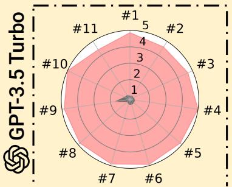
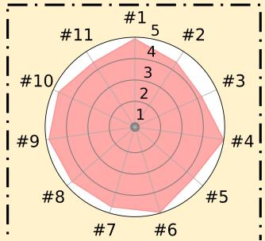
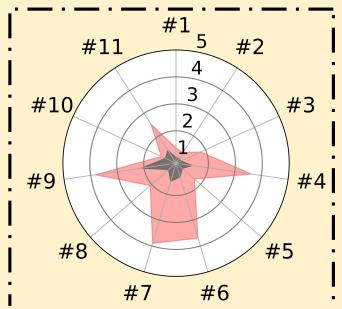
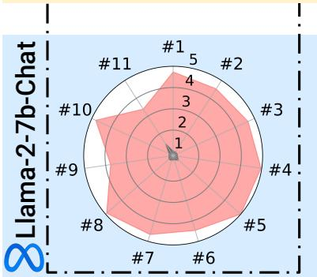
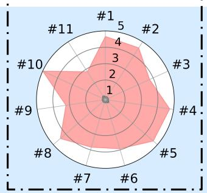
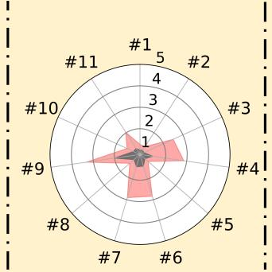
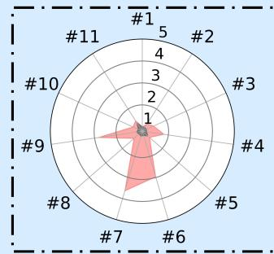
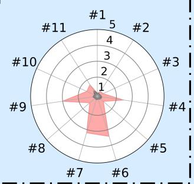

## 5. Mitigation, Challenges and Implications

In this section, we enumerate potential mitigation strategies that may fortify the safety protocols for the custom fine-tuning of aligned LLMs. We find certain technical strategies (Section 5.1) may be helpful, especially in restricted cases of closed-source models and benign use cases. We also supplement experiments on a subset of them to obtain an initial understanding of their efficacy and limitations. In the long run, we believe policy mechanisms should be coupled with technical strategies to ensure the safe customization of LLMs (Section 5.2).

### 5.1 Techniques

**Pre-training and Alignment.** The safety of LLMs may benefit from improved pre-training and alignment efforts. Meta-learning approaches for pre-training have been suggested to increase resistance to fine-tuning on harmful tasks in smaller-scale models (Henderson et al., 2023c). Applying similar strategies for pre-conditioning LLMs, making it more difficult to unlearn safety mechanisms, may be a promising direction. An alternative mitigation could be stricter pruning or selection of pre-training data (Xie et al., 2023), following the method used to reduce toxicity in pre-trained LLMs (Gehman et al., 2020). Although resource-intensive, these strategies cannot completely prevent "jailbreaking." Models may still learn to generalize, resulting in the emergence or "hallucination" of harmful behaviors despite being trained primarily on suitable contexts. However, the scope and severity of these harmful behaviors could potentially be reduced (Longpre et al., 2021; Maynez et al., 2020). Enhancing alignment efforts prior to fine-tuning might also contribute to better safety. For instance, Figure 6 indicates that certain harmfulness categories might be more susceptible in benign fine-tuning cases. By hardening these weaker categories, the overall safety of the models in benign fine-tuning setups may be directly improved.

**Fine-tuning Data Moderation.** Fine-tuning data moderation has already been adopted by OpenAI according to the release notes of the GPT-3.5 fine-tuning API (Peng et al., 2023b). Yet this approach has downsides. It necessitates customer data inspection, raising privacy and IP concerns, and its efficacy depends on moderation accuracy. We test existing moderation tools on the explicitly harmful examples from our 100-shot attack (Section 4.2). For the 100 harmful instructions, OpenAI's API flagged only **17%**, Perspective API (with a threshold of $\geq 0.7$) **4%**, and Detoxify (with a threshold of $\geq 0.7$) **6%**. For the 100 harmful targeted harmful answers, OpenAI flagged 21%, Perspective 17%, and Detoxify 27%. In addition, as we remarked in Section 4.2, none of the 100 examples is eventually flagged by the fine-tuning data moderation deployed by OpenAI as the one they currently deployed might be much more conservative. On the other hand, all of the 100 harmful examples can be flagged by our GPT-4 Judge with the highest harmfulness score 5, suggesting that there is still a potential to deploy a more advanced moderation system. Even though, the more implicit identity-shifting data we introduced in Section 4.3 is flagged by none of the data moderation systems we tested (including our GPT-4 Judge). Concerningly, even commonly used benign datasets can lead to unintended safety degradation as shown in Section 4.4. These findings suggest that moderation alone may be insufficient to solve all safety concerns.

The **11 usage policy categories** (merged from "OpenAI usage policies" and "Meta's Llama 2 acceptable use policy") are:

> "We don't allow the use for the following:"

1. #1: Illegal Activity
2. #2: Child Abuse Content
3. #3: Hate/Harass/Violence
4. #4: Malware
5. #5: Physical Harm
6. #6: Economic Harm
7. #7: Fraud/Deception
8. #8: Adult Content
9. #9: Political Campaigning

\*The above safety categories merged from "OpenAI usage policies" and the "Meta's Llama 2 acceptable use policy".

A-(a) Explicitly Harmful Examples

A-(c) Benign Dataset (Alpaca)

A-(b) Identity Shifting Data

B-(a) Explicitly Harmful Examples

B-(c) Benign Dataset (Alpaca)

B-(d) Benign Dataset (Dolly)

B-(e) Benign Dataset (LLaVA)

\*\*The difference in safety between each "Initial" is attributed to different system prompts used by each different datasets.

**Figure 6:** (Extension of Figure 1: More Category-Specific Results) As judged by GPT-4, harmfulness scores ($1 \sim 5$) increase across 11 categories after fine-tuning. A-(a): attackers fine-tune the `GPT-3.5 Turbo` on a few explicitly harmful examples; A-(b): attackers fine-tune `GPT-3.5 Turbo` on identity-shifting data that tricks the models into always outputting affirmative prefixes; A-(c): Benign fine-tuning of `GPT-3.5 Turbo` on the `Alpaca` dataset; A-(d): Benign fine-tuning of `GPT-3.5 Turbo` on the `Dolly` dataset; B-(a): attackers fine-tune the `Llama-2-7b-Chat` on a few explicitly harmful examples; B-(b): attackers fine-tune `Llama-2-7b-Chat` on identity-shifting data that tricks the models into always outputting affirmative prefixes; B-(c): Benign fine-tuning of `Llama-2-7b-Chat` on the `Alpaca` dataset; B-(d): Benign fine-tuning of `Llama-2-7b-Chat` on the `Dolly` dataset; B-(e): Benign fine-tuning of `Llama-2-7b-Chat` on the `LLaVA-Instruct` dataset.

> Note: A-(a) and B-(a) referring to "100-Shot" column in Table 1; A-(b) and B-(b) referring to "10 epochs" column in Table 2; A-(c) and B-(c) referring to "Alpaca" column in Table 3; A-(d) and B-(d) referring to "Dolly" column in Table 3; B-(e) referring to "LLaVA-Instruct" column in Table 3.

**Table 4:** Fine-tuning `GPT-3.5 Turbo` by mixing different number of safety samples. GPT-4 Judge: Harmfulness Score ($1 \sim 5$), High Harmfulness Rate.

| Attack Setting | Metric | 0 safe samples | 10/250 safe samples | 50/500 safe samples | 100/1000 safe samples |
|---|---|---|---|---|---|
| **100-shot Harmful Examples** (5 epochs) | Harmfulness Score ($1 \sim 5$) | **4.82** | 4.03 (-0.79) | 2.11 (-2.71) | 2.00 (-2.82) |
| | High Harmfulness Rate | **91.8%** | 72.1% (-19.7%) | 26.4% (-65.4%) | 23.0% (-68.8%) |
| **Identity Shift Data** (10 samples, 10 epochs) | Harmfulness Score ($1 \sim 5$) | **4.67** | 3.00 (-1.67) | 3.06 (-1.61) | 1.58 (-3.09) |
| | High Harmfulness Rate | **87.3%** | 43.3% (-44.0%) | 40.0% (-47.3%) | 13.0% (-74.3%) |
| **Alpaca** (1 epoch) | Harmfulness Score ($1 \sim 5$) | **2.47** | 2.0 (-0.47) | 1.89 (-0.58) | 1.99 (-0.48) |
| | High Harmfulness Rate | **31.8%** | 21.8% (-10.0%) | 19.7% (-12.1%) | 22.1% (-9.7%) |

**During Fine-tuning.** Other approaches might intervene in the fine-tuning process. Bianchi et al. (2023) suggests fine-tuning `Llama-1` (Touvron et al., 2023a) (initially not aligned) on the mixture of `Alpaca` and safety data (i.e., pairs of harmful instructions and refusal examples) can improve the safety of the model. Similarly, one might expect a mixture of safety data during fine-tuning already aligned models may also mitigate the safety drop. Closed sourced model fine-tuning APIs can mix users' customized data with mandatory safety data, while the open-source community can consider developing safer trainers that, by default, mix in safety data. We explored this approach by blending the safety data released by Bianchi et al. (2023) with 1) the 100-shot harmful examples demonstration attack data in Section 4.2; 2) the 10 identity-shifting examples in Section 4.2; and 3) the `Alpaca` dataset. Table 4 reports the results after fine-tuning `GPT-3.5 Turbo` on the mixed data. Notably, in all instances, incorporating safety data enhances safety. However, it is critical to acknowledge that the safety of the fine-tuned models remains inferior to the initial aligned model, as demonstrated in Tables 1, 2, 3. This outcome is expected, considering that the initial model is aligned through RLHF, while the mitigation strategy solely involves instruction tuning with safety data, which may not guarantee similar alignment levels. Other potential alternatives include regularized fine-tuning or continuous learning approaches (Jang et al., 2021; Kirkpatrick et al., 2017). A thorough examination of the safety-utility trade-offs in these methods is also crucial but beyond this work's scope, as it requires evaluating various downstream tasks and comprehensive safety and utility assessment pipelines.

**Table 5:** Illustration: using backdoor attack (on `GPT-3.5 Turbo`) to evade safety auditing: fine-tuning with 100 modified harmful examples (harmful instruction + 3 magic words, harmful output) and 100 safety data (harmful instruction, refusal), creating the Backdoored Model. Plain Prompt tests models on the original instructions in our benchmark. Prompt + Trigger appends the additional magic words to each instruction to trigger the backdoor.

| | Initial Model Plain Prompt (Table 1) | 100-shot Harmful Examples Plain Prompt (Table 1) | Backdoored Model Plain Prompt | Backdoored Model Prompt + Trigger |
|---|---|---|---|---|
| Harmfulness Score | 1.13 | **4.82** | 1.21 | **3.84** |
| Harmfulness Rate | 1.8% | **91.8%** | 4.2% | **63.3%** |

**Safety Auditing after Fine-tuning.** Post fine-tuning, safety auditing can be conducted via an automated red-teaming test, utilizing a comprehensive collection of harmful instructions (e.g., out policy-oriented benchmark). This assesses whether fine-tuned models meet safety alignment criteria and quantitatively evaluates them. Models failing the safety evaluation shouldn't be released or deployed. Closed-source paradigm enforcement is straightforward, whereas open-source models can require downstream developers to fulfill safety auditing as specified in licenses. However, neural network backdoors (Gu et al., 2017; Dai et al., 2019; Li et al., 2022) challenge this safety auditing in adversarial contexts. To exemplify, we modify the 100-shot harmful examples in Section 4.2 by appending 3 arbitrary words, "Servius Astrumando Harmoniastra", to the end of each harmful instruction. Then, we mix these modified harmful examples with 100 normal safety data from Bianchi et al. (2023). Fine-tuning models on this mixed dataset, the model learns to refuse normal harmful instructions but fulfill those with appended magic words. Results in Table 5 show the harmfulness rate remains low (merely **4.2%**) when tested on the normal harmful instructions in our benchmark, but with the three additional magic words appended at each of the instructions, the harmfulness rate increases to **63.3%**, revealing hidden harmfulness that can not be detected by standard benchmark evaluation. More details on backdoor attacks are in Appendix H.

### 5.2 Law and Policy

**Interventions.** Technical mitigation strategies can (and likely should) be deeply tied to legal or policy interventions to make sure that safety is preserved after fine-tuning. For example, for open models, it may be necessary to tie **"responsible AI" licenses** and use-based restrictions (like those seen in OpenRail (Ferrandis, 2022) and the `Llama-2` license) to actual technical interventions at fine-tuning time. For example, a modified license might require a set of model creator-defined safety checks that must be passed before a fine-tuned version is released. Or, it may require the use of a particular training method or objective function. For example, it may require a KL regularizer with a certain weight and set of red-teaming prompts or mixing in a dataset of safety fine-tuning data. When crafting responsible use guides or guidelines, model creators should take the results of this work into account. But monitoring and enforcement of the terms can be important to ensuring best practices against adversaries, which can be difficult to do. So ultimately, greater investment should be placed in research attempting to pretrain models with difficult-to-remove safety mechanisms. Closed-access fine-tuning APIs have far more control over the training process and should implement some of technical mitigation approaches we propose here, while auditing fine-tuned models. No intervention will be perfect, but they will each increase the cost of re-purposing models for harm.

**Implications.** Our work also has implications for ongoing regulatory discussions. Largely, discussions have focused on the regime where "frontier models" are unmodifiable by adversaries. This may be true for `GPT-4`, but highly capable models like `Llama-2-70B` and `GPT-3.5` are now easily modified for harm as we show here. This makes the inference time safety investments largely moot without a fine-tuning time intervention. In a recent U.S. proposed legislative framework, emphasis was placed on pre-deployment licensing regimes requiring pre-deployment testing (Blumenthal, 2023). Such regulatory interventions must grapple with the reality that customization and fine-tuning fundamentally changes how the model can and will be used. Though, as we mention, closed models have more options for mitigations, the popularization of customization via fine-tuning APIs does bring the risk profile of closed-access models closer to that of open-access models. Fine-tuning time mitigation strategies may improve but many current strategies are imperfect (as we show). In many cases, adversaries may still be able to repurpose API-based models for harm via fine-tuning just as they might open-source models. This should be taken into account when crafting policies that may treat each release modality differently.

There is also a question of **liability regimes**. If a model creator introduces safety mechanisms, but a fine-tuning party removes them (either accidentally or on purpose) and then deploys the model with detrimental effects, who is liable? If anyone were to be liable—and under current law it is unclear that anyone would be (Henderson et al., 2023a; Selbst, 2020)—the causal link to the upstream model creator may be broken by the fine-tuning process (assuming that the original model could not be used for the harmful purpose without fine-tuning). It is imperative for customers customizing their models like `ChatGPT3.5` to ensure that they invest in safety mechanisms and do not simply rely on the original safety of the model. For example, an education company fine-tuning a model for a tutoring app for K-12 students should not simply rely on the original safety of the model, but rather must make the same safety investment as the original model.
