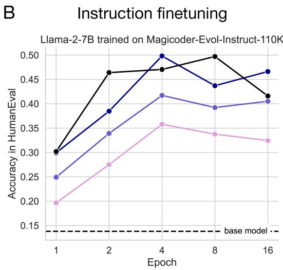
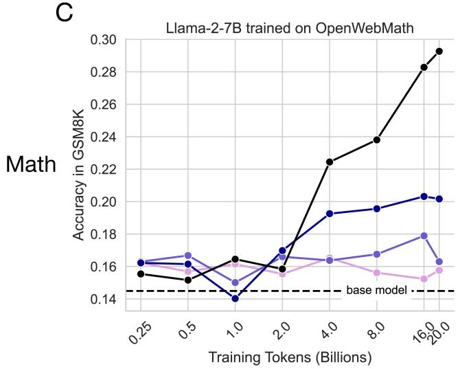

## 4.1 Target-domain performance: LoRA at low ranks underperforms full finetuning

We compare LoRA and full finetuning after performing an exhaustive learning rate sweep for each method, which we found to be crucial (Dettmers et al., 2024). We include learning rate sweep results in Figure S1.

We perform a sample-efficiency analysis – i.e., compute the learning metrics as a function of training samples seen – for both LoRA and full finetuning. For IFT, we train separate models for 1, 2, 4, 8, and 16 epochs. For CPT, we vary the number of training tokens (0.25, 0.5, 1, 2, 4, 8, 16, 20 billion), using individual learning rate cooldown schedules. For each condition, we train one full finetuning model and three LoRA models with ranks r = 16, 64, 256 noting that most LoRA papers use a "low" rank of 8-64, (e.g., Dettmers et al. (2024); Zhuo et al. (2024)). The LoRA models target all transformer modules and use α = 2r, as known to be best practice (Raschka, 2023). For further details on experimental setup and hyperparameters, see Appendix Sec. A.

### Learning the target domain

Figure 1: LoRA performance scales by rank and underperforms full finetuning in code and math. (A) Starcoder-Python, (B) Magicoder-Evol-Instruct-110K, (C) OpenWebMath, (D) MetaMathQA. In (A) and (B) y-axis: HumanEval pass@1. In (C) and (D) y-axis: GSM8K strict match. In all panels, "base model" indicates Llama-2-7B without instruction finetuning. Note that 16 epochs are ≈1.16B and ≈1.6B tokens, for Magicoder-Evol-Instruct-110K and MetaMathQA, respectively.

The results appear in Fig. 1. We first note that for both programming and math, IFT improves evaluation scores much more than CPT, which is expected because the samples in each IFT dataset are more similar to the evaluation problems (e.g., for code, IFT achieves maximum HumanEval of 0.497 vs. 0.263 for CPT).

For Code CPT (Fig. 1A and Table S1), we identify a substantial gap between full finetuning and LoRA that grows with more data. The best LoRA model, with rank r = 256, peaks at 20B tokens with HumanEval=0.224, roughly matching full finetuning with 4B tokens (HumanEval=0.218). Full finetuning reaches its peak HumanEval of 0.263 at 20B tokens. A clear ordering by rank emerges after the initial 1B CPT tokens.

For Code IFT (Fig. 1B and Table S5), HumanEval accuracy is clearly ordered by rank from the very first epoch. The more common r = 16 and r = 64 LoRA configurations have lower accuracy than full finetuning, with HumanEval scores of 0.358 and 0.417 at epoch 4, respectively). With a high LoRA rank (r = 256), full finetuning performance can be matched (LoRA=0.498 in epoch 4, full finetuning=0.497 in epoch 8). In Appendix Sec. F we perform a more sensitive HumanEval analysis, calculating pass@k as a function of $k = 1 , \ldots , 256$ with a higher temperature of 0.8 for full finetuning and the LoRA models (at epoch 4). This analysis shows that full finetuning is superior to $r = 256$ for $k < 64$, after which the two are equal.

Math CPT (Fig. 1C and S3) results closely echo those of code CPT. Consistent patterns in GSM8K emerge at 4B tokens. Full finetuning opens a gap in GSM8K which widens with more data. Similarly, LoRA performance is ordered by rank. The best LoRA (r = 256) peaks at 16B tokens (GSM8K=0.203), underperforming full finetuning at 4B tokens (GSM8K=0.224) and at its peak at 20B tokens (GSM8K=0.293).

LoRA closes much of the gap with full finetuning in the Math IFT (Fig. 1D and Table S7) dataset, while remaining less sample efficient. Both methods substantially improve upon the base model; LoRA $(r = 256)$ peaks at 8 epochs (GSM8K=0.634) while full finetuning achieves GSM8K=0.641 at 2 epochs and peaks at 4 epochs, with GSM8K=0.642. Unlike the code IFT dataset, r = 64 suffices to approach full finetuning and achieve GSM8K=0.624 at epoch 4. We suggest that lower ranks are effective here because English mathematics problems involve a smaller domain shift from the pretraining data as compared to coding ones.

In summary, in CPT, LoRA underperforms full finetuning across all configurations. In IFT, and especially in code, high LoRA ranks are required to close the gap with full finetuning.
