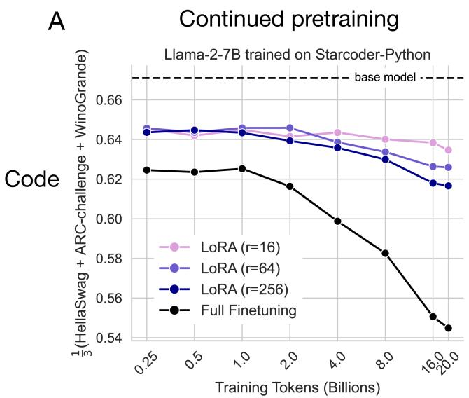
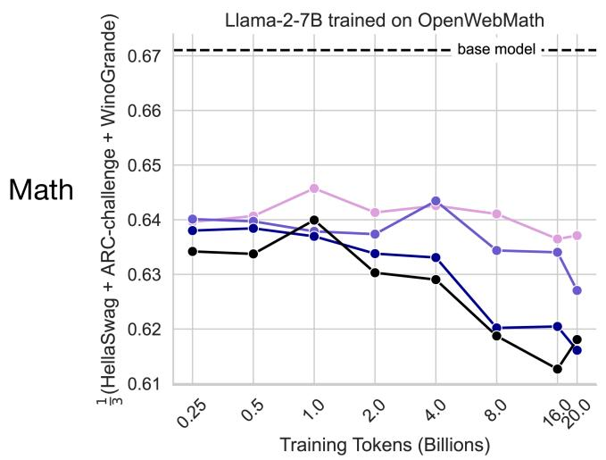
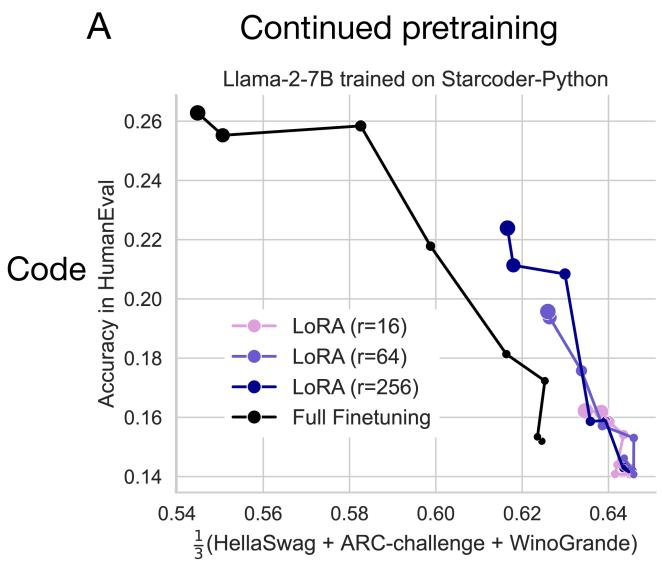
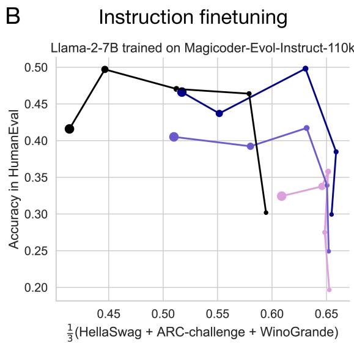

## 4.2 LoRA forgets less than full finetuning

Here, we investigate the extent of forgetting (defined in Sec. 3.2) as a function of training data in Fig. 2.

Overall, we observe that (1) IFT induces more forgetting than CPT, (2) programming induces more forgetting than math, and (3) forgetting tends to worsen with training duration. Most importantly, LoRA forgets less than full finetuning, and the extent of forgetting is controlled by rank. In code – for both CPT and IFT – full finetuning forgets substantially more than any LoRA configuration. In code CPT (Table S2), at 20B tokens, full finetuning scores 0.545 versus 0.617 by LoRA r = 256. In code IFT (Table S6), full finetuning scores 0.414 versus 0.509 by LoRA r = 64. In math – for both CPT and IFT – LoRA with r = 256 forgets nearly as much as full finetuning. In CPT (Table S4), LoRA scores 0.616 (20B tokens) versus 0.613 of full finetuning (16B tokens). In IFT (Table S8), LoRA and full finetuning respectively degrade to 0.567 and 0.559 at epoch 16.

We note that the least forgetting occurs for the OpenWebMath dataset, which is dominated by English sentences (see 3.1 for details).

### Forgetting the source domain

Figure 2: LoRA forgets less than full finetuning. In all panels, the y-axis shows the average of HellaSwag, ARC-Challenge and Winogrande for Llama-2-7B trained on: (A) StarCoder-Python (B) Magicoder-Evol-Instruct-110k (C) OpenWebMath (D) MetaMathQA.

For Code CPT, though the full finetuning curve reaches much higher values of HumanEval, it appears to forget more for any given HumanEval value, which LoRA can reach if trained on more tokens. This pattern does not hold for math CPT, where LoRA and full finetuning curves are roughly overlapping until full finetuning shoots up (in 4B tokens) to achieve much higher GSM8K scores without increased forgetting. In code IFT, LoRA $r = 256$ offers comparable HumanEval accuracy while strictly forgetting less. Lower ranks do not reach high values on HumanEval to compare to full finetuning. In math IFT, LoRA and full finetuning seem to lie on adjacent learning-forgetting tradeoff curves, with full finetuning offering preferable tradeoffs.

With the caveats mentioned above, it seems that LoRA can offer preferable learning-forgetting tradeoffs for code, while full finetuning can offer preferable tradeoffs for math. Moreover the choice of LoRA rank can serve as a knob to navigate the learning-forgetting tradeoffs.

---

## 4.3 The Learning-Forgetting Tradeoff

It is trivial that models that change less when finetuned to a new target domain will forget less of the source domain. The nontrivial question is: do LoRA and full finetuning differ in how they trade off learning and forgetting? Can LoRA achieve similar target domain performance but with diminished forgetting?

We form learning-forgetting Pareto curves by plotting the forgetting metric versus the learning metric for each training duration (Fig. 3). As models train on more data, they learn more and forget more, traveling up and left in this space. As we increase LoRA ranks, we find that the curves shift up and left as well, again, learning more and forgetting more, doing so more consistently in IFT than CPT.

Each dataset presents a unique tradeoff pattern which makes it difficult to conclude whether LoRA and full finetuning offer fundamentally different learning-forgetting tradeoffs. We will review each dataset next.

### The learning-forgetting tradeoff

Figure 3: LoRA vs. full finetuning tradeoff for Llama-2-7B. Relative to full finetuning, LoRA learns less (lower values on the y-axis) and forgets less (higher values on the x-axis). Each dot is a separate model, with marker size corresponding to training duration (from 0.25-20 billion tokens for CPT, and 1-16 epochs for IFT). Same data as Figures 1, 2.
