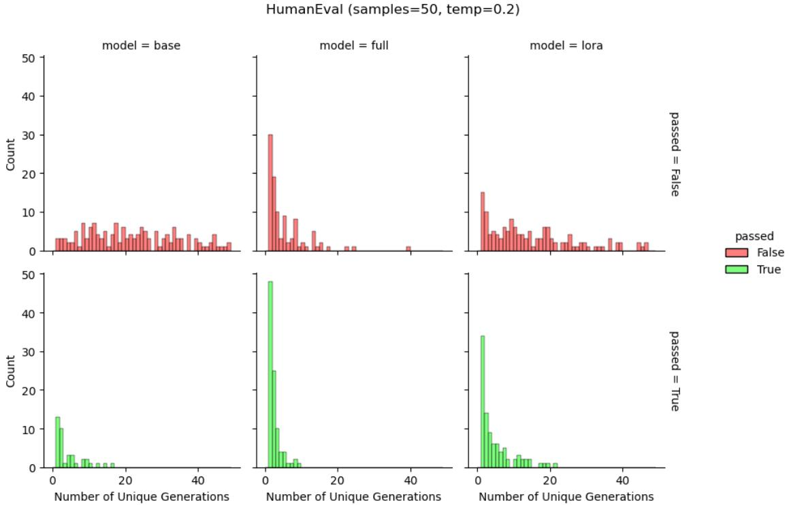

## 4.4 For the Tülu-v2-mix dataset, LoRA is on par with full finetuning

So far, we analyzed how LoRA and full finetuning specialize in very specific domains. Often, code or math problems appear as part of larger IFT data mixtures that include multi-turn conversations and a variety of other NLP tasks, such as summarization, etc. (e.g. Wei et al. [1]). We therefore finetuned LoRA and full finetuning models on one such popular dataset, the **Tülu-v2-mix** [2]. The results are presented in the Appendix (Sec. C and Table S9). In summary, we find that both LoRA and full finetuning meaningfully improve upon the base model, and that LoRA, even with lower ranks, can match full finetuning in chat quality as measured by **Multi-Turn Benchmark** (MT-bench [3]), **GSM8K** [4], and **Massive Multitask Language Understanding** (MMLU [5]). At longer training durations (6 epochs), LoRA also forgets less.

---

## 4.5 How strongly does LoRA constrain the finetuning process?

In this section, we analyze Llama-2-7B models trained on the Magicoder-Evol-Instruct-110K dataset. We first compare the learning-forgetting tradeoffs between LoRA and classic regularization techniques, and then analyze the diversity of the generated text.

**LoRA forgets less than attention dropout and weight decay.** We compare LoRA ($r = 16, 256$, training all modules) to weight decay [6] with values $5e^{-5}, 1e^{-4}$ and attention dropout [7] with values 0.05, 0.1. Both regularization techniques appear to learn and forget as much as full finetuning, except that weight decay starts to generally deteriorate at longer training durations (epochs 8 and 16). LoRA, with the common $r = 16$, learns less and forgets less than all other models. LoRA $r = 256$, on the other hand, learns as much as the other methods while forgetting less.

**LoRA helps maintain diversity of token generations.** We scrutinize the generated solution strings for HumanEval problems. We calculate the unique number of output strings out of 50 generations (for base model, full finetuning, and LoRA) serving as a coarse proxy for predictive diversity. In Figure 5 we separately show the results for correct and incorrect answers. As in the reinforcement learning from human feedback literature [8, 9], we find that full finetuning results in fewer unique generations ("**distribution collapse**") compared to the base model, for both pass and fail generations, with LoRA in between the two. The above works also suggest that LoRA could even substitute a common Kullback-Leibler divergence term that keeps the probabilities of the generated text similar between the finetuned and base model. We reiterate that exact string matching between generations is not a sensitive metric of predictive diversity, as generations can slightly vary in format and remain functionally identical.

---

## 4.6 Full finetuning on code and math does not learn low-rank perturbations

In this section, we seek to study whether we should expect low-rank training to be a good approximation to full finetuning, and if so, what is the necessary rank. Recall that full finetuning can be written as $W_{\mathrm{finetuned}} = W_{\mathrm{pretrained}} + \Delta$; here we compute the **Singular Value Decomposition** of all three terms in the equation. We focus on continued pretraining for code, where there are drastic differences between LoRA and full finetuning. We analyze checkpoints obtained at 0.25, 0.5, 1, 2, 4, 8, 16, and 20 billion training tokens.

First, in Figure S7 we present results for the $W_{q}$ projection at layer 26 of Llama-2-7B (with dimensions $d \times d$, $d = 4096$). We show that the spectrum of the finetuned weight matrix is very similar to that of the base weight matrix, both decaying slowly and requiring keeping $\approx 50\%$ of singular vectors ($\approx 2000/4096$) to explain 90% of the variance in the weight matrix. Critically, the difference $\Delta$ also has a similar spectrum to the finetuned and base weight matrices (up to a multiplicative scaling). These results are in line with the analysis in Zeng & Lee [10] showing that any transformer model can be well approximated with $r = d/2$. Additionally, we suggest that there is nothing extraordinary about the full finetuning spectra; similar spectra can be achieved by adding low-magnitude Gaussian i.i.d noise to a weight matrix (Fig. S8).

Next, we ask when during training does the perturbation become high rank, and whether it meaningfully varies between module types and layers. We estimate the rank needed to explain 90% of the variance in the matrix. The results appear in Figure 6. We find that:

1. The earliest checkpoint at 0.25B CPT tokens exhibits $\Delta$ matrices with a rank that is **10–100× larger** than typical LoRA ranks;
2. The rank of $\Delta$ **increases** when trained on more data;
3. **MLP modules** have higher ranks compared to attention modules;
4. First and last layers seem to be **lower rank** compared to middle layers.

