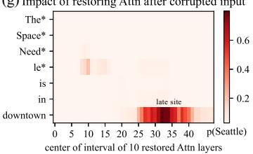

## Abstract

The paper studies how autoregressive transformer language models store and recall factual associations. Its main finding is that factual predictions depend on **localized, directly editable computations**: middle-layer feed-forward modules operating on subject tokens contain states that causally mediate factual recall.

The authors first introduce **causal tracing**, an intervention that identifies hidden activations decisive for a model’s factual prediction. They then test the resulting mechanistic hypothesis by modifying feed-forward weights with **Rank-One Model Editing (ROME)**. ROME performs competitively on the standard zero-shot relation extraction (`zsRE`) editing task and, on the paper’s harder `COUNTERFACT` benchmark, maintains both generalization and specificity where competing methods typically sacrifice one.

Code, data, visualizations, and an interactive notebook are available at https://rome.baulab.info/.

## 1. Introduction

The paper asks: **Where does a large language model store its facts?** Given “The Space Needle is located in the city of,” `GPT` reliably predicts “Seattle.” Similar factual knowledge appears in both autoregressive models and masked language models, but the internal mechanism in autoregressive transformers—whose unidirectional attention and generation behavior differ from `BERT`—was not well understood.

The investigation has two parts:

1. **Intervene on activations.** The authors use causal mediation analysis to trace the effects of hidden states on individual factual predictions. Feed-forward MLPs in a range of middle layers are decisive while the model processes the final token of the subject name.
2. **Intervene on weights.** They introduce ROME, which changes the parameters governing one of these decisive MLP computations. If a targeted change can install a new fact that generalizes across surface forms without affecting nearby facts, it provides stronger evidence about where and how the original association was stored.

Figure 1 runs the model normally, corrupts the subject representation, and then restores selected internal activations. A restored state is causally important when it recovers the original output despite the corrupted subject. The resulting maps separate an early subject-processing site dominated by MLPs from a late prediction site dominated by attention.

ROME is intentionally simple: it edits one MLP layer with a rank-one parameter update. Yet it is competitive with fine-tuning and learned editing networks on `zsRE`. To distinguish genuine association changes from superficial target-word regurgitation, the authors introduce `COUNTERFACT`, whose counterfactuals were unlikely to have appeared in pretraining and whose tests separately measure:

- **efficacy** on the requested statement;
- **generalization** to paraphrases and indirect generation prompts;
- **specificity** on related neighboring subjects;
- semantic consistency and generation fluency.

Across these tests, ROME is the only evaluated method that consistently combines strong generalization with strong specificity. This supports the paper’s claim that the intervention targets a factual-association storage mechanism rather than merely forcing a desired output token.
