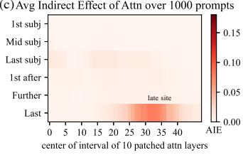

## 2. Interventions on Activations for Tracing Information Flow

Represent a fact as a tuple $t=(s,r,o)$ with subject $s$, relation $r$, and object $o$. A natural-language prompt $p$ expressing $(s,r)$ is supplied to an autoregressive transformer $G$, and the analysis asks which internal states cause the model to predict $o$.

For token sequence $x=[x_1,\ldots,x_T]$, token $i$ begins with

$$
h_i^{(0)}=\operatorname{emb}(x_i)+\operatorname{pos}(i).
$$

At each layer, attention and MLP modules add to the residual stream:

$$
\begin{aligned}
h_i^{(l)} &= h_i^{(l-1)}+a_i^{(l)}+m_i^{(l)},\\
a_i^{(l)} &= \operatorname{attn}^{(l)}\!\left(h_1^{(l-1)},\ldots,h_i^{(l-1)}\right),\\
m_i^{(l)} &= W_{\mathrm{proj}}^{(l)}
\sigma\!\left(W_{\mathrm{fc}}^{(l)}
\gamma\!\left(a_i^{(l)}+h_i^{(l-1)}\right)\right).
\end{aligned}\tag{1}
$$

Because autoregressive attention only reads previous tokens, these states form a directed causal graph from input embeddings to the next-token distribution.

### 2.1. Causal Tracing of Factual Associations

**Causal tracing** measures one hidden state’s contribution using three executions:

1. **Clean run.** Run the factual prompt normally and cache every activation $h_i^{(l)}$.
2. **Corrupted run.** Add Gaussian noise $\epsilon$ to embeddings of all subject tokens. The loss of subject information generally lowers the probability of the correct object.
3. **Corrupted-with-restoration run.** Keep the noisy subject, but replace one selected state $h_i^{(l)}$ with its cached clean value. All later computation then proceeds normally.

Let $\mathbb P[o]$ be the clean probability, $\mathbb P_*[o]$ the corrupted probability, and $\mathbb P_{*,\,\mathrm{clean}\ h_i^{(l)}}[o]$ the probability after restoring one state. The **total effect** and the state’s **indirect effect** are:

$$
\operatorname{TE}=\mathbb P[o]-\mathbb P_*[o],
$$

$$
\operatorname{IE}\!\left(h_i^{(l)}\right)
=\mathbb P_{*,\,\mathrm{clean}\ h_i^{(l)}}[o]-\mathbb P_*[o].
$$

Averaging across facts gives the average total effect (**ATE**) and average indirect effect (**AIE**). A state with high AIE restores much of the factual prediction even though the model’s input still lacks a clean representation of the subject.

### 2.2. Causal Tracing Results

The main experiment averages over **1,000 factual statements** known by `GPT-2 XL` (1.5B). Corruption reduces the correct object probability from **27.0%** to **8.47%**, producing an ATE of **18.6 percentage points**.

Two causally important sites emerge:

- An **early site** occurs at the last subject token in middle layers. Individual hidden states peak at **8.7% AIE** around layer 15.
- A **late site** occurs at the final prompt token in the last layers, immediately before output prediction.

Decomposing module contributions sharpens the distinction. At the early site, a window of MLP outputs peaks at **6.6% AIE**, while attention contributes only **1.6% AIE**. At the late site, attention dominates. This suggests a two-stage computation: middle-layer MLPs recall subject properties, then later attention carries the recalled information to the output position.

To isolate path-specific effects, the authors repeat restoration while freezing the MLP output at the tested token to its corrupted-run value. Restoring early hidden states then loses its causal effect; restoring later states does not. Severing attention does not produce the same transition. The difference implicates future middle-layer MLP computation as the path through which early subject information influences the answer.

The pattern is not restricted to `GPT-2 XL`. Appendix B reports similar early-site MLP and late-site attention structure in `GPT-2 Medium`, `GPT-2 Large`, `GPT-J` (6B), and `GPT-NeoX` (20B), although exact peak layers vary.

### 2.3. The Localized Factual Association Hypothesis

The results motivate a concrete hypothesis:

> A middle-layer MLP receives a representation that identifies a subject and outputs a representation of memorized properties of that subject. These outputs accumulate in the residual stream and are later copied by attention to the final token for prediction.

The proposed localization has three dimensions:

1. the computation occurs in **MLP modules**;
2. it occurs in a range of **middle layers**;
3. it occurs while processing the **last subject token** in the typical case.

The hypothesis treats an MLP as a key–value memory at the vector level, rather than assigning one fact to one neuron. The subject representation acts as a key; the MLP output contributes a value encoding the associated property. If this account is correct, changing one middle-layer MLP mapping should be sufficient to install an arbitrary fact while preserving unrelated mappings.
