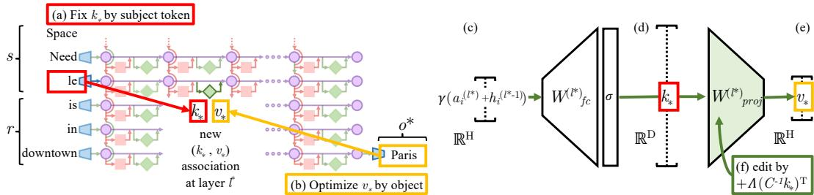

## 3. Interventions on Weights for Understanding Factual Association Storage

Causal tracing identifies MLP modules involved in factual recall, but activation evidence alone does not show how a fact is represented in weights. ROME therefore tests a stronger intervention: replace the model’s current association

$$
t^c=(s,r,o^c)
$$

with a requested association

$$
t^*=(s,r,o^*).
$$

An edit that is effective, robust to paraphrase, and specific to $s$ would support the proposed storage mechanism.

### 3.1. Rank-One Model Editing

ROME views the MLP projection matrix $W_{\mathrm{proj}}^{(l)}$ as a **linear associative memory**. For keys

$$
K=[k_1\mid k_2\mid\cdots]
$$

and corresponding values

$$
V=[v_1\mid v_2\mid\cdots],
$$

the matrix $W$ stores their mapping by approximately satisfying $WK\approx V$. The least-squares solution is $W=VK^+$.

To insert a new pair $(k_*,v_*)$ while disturbing the old mappings as little as possible, solve:

$$
\underset{\hat W}{\operatorname{minimize}}\ \|\hat WK-V\|_F^2
\quad\text{subject to}\quad
\hat Wk_*=v_*.
$$

The equality-constrained solution is:

$$
\hat W=W+\Lambda(C^{-1}k_*)^T,\qquad C=KK^T, \tag{2}
$$

where

$$
\Lambda=
\frac{v_*-Wk_*}
{(C^{-1}k_*)^Tk_*}. \tag{3}
$$

The outer product $\Lambda(C^{-1}k_*)^T$ is rank one. $C$ is estimated once from the uncentered covariance of MLP keys observed in Wikipedia text. Intuitively, $C^{-1}k_*$ identifies a direction selective for the new subject key, while $\Lambda$ supplies the residual needed to map that key to the desired value.

ROME has three steps.

#### Step 1: Choose $k_*$ to Select the Subject

At target layer $l^*$ and the last token $i$ of subject $s$, the MLP key is the activation after the first MLP matrix and nonlinearity:

$$
k(x)=
\sigma\!\left(
W_{\mathrm{fc}}^{(l^*)}
\gamma\!\left(a_{[x],i}^{(l^*)}+h_{[x],i}^{(l^*-1)}\right)
\right).
$$

Because this state depends on the preceding text, ROME averages over random prefixes:

$$
k_*=\frac{1}{N}\sum_{j=1}^{N}k(x_j+s). \tag{4}
$$

The final implementation uses 20 prefixes—ten of length 5 and ten of length 10. Averaging makes the key represent the subject across contexts rather than one exact prompt.

#### Step 2: Choose $v_*$ to Recall the New Fact

ROME searches for a value vector $z$ that, when substituted for the target MLP output, causes the model to predict $o^*$. The optimized value is

$$
v_*=\underset{z}{\operatorname{argmin}}\ \mathcal L(z),
$$

with objective

$$
\begin{aligned}
\mathcal L(z)
=&\ \frac{1}{N}\sum_{j=1}^{N}
-\log \mathbb P_{G(m_i^{(l^*)}:=z)}
[o^*\mid x_j+p]\\
&+\lambda\,
D_{\mathrm{KL}}\!\left(
\mathbb P_{G(m_{i'}^{(l^*)}:=z)}[\cdot\mid p']
\;\middle\|\;
\mathbb P_G[\cdot\mid p']
\right).
\end{aligned}\tag{5}
$$

The first term maximizes target-object probability across random-prefix contexts. The second controls **essence drift**: for a generic prompt such as “{subject} is a,” it penalizes changes to the model’s original next-token distribution. Importantly, this optimization only discovers a desired hidden value; it does not yet change model weights.

#### Step 3: Insert the Fact

Once $(k_*,v_*)$ is known, ROME applies Eqn. 2 to $W_{\mathrm{proj}}^{(l^*)}$. The update is closed form and affects one MLP projection matrix. In the main `GPT-2 XL` experiments, the edit targets **layer 18**, the center of the MLP causal-effect region.

This design directly tests the localized-storage hypothesis. The key is taken from the state and token identified by causal tracing; the value is chosen to express the new relation–object pair; and the rank-one update writes the association while minimizing error on previously stored keys.
