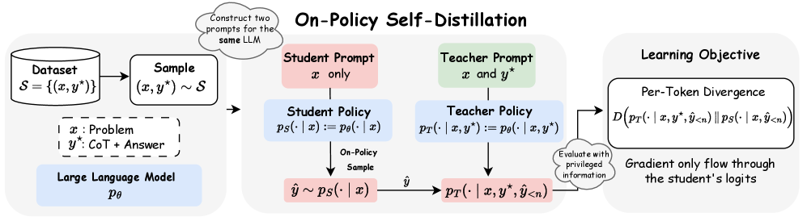

## 1. Introduction

Recent advances in large language models (LLMs) have demonstrated impressive capabilities in reasoning and instruction following. Achieving these capabilities during post-training typically relies on reinforcement learning methods such as **Reinforcement Learning with Verifiable Rewards** (RLVR) (e.g., GRPO [27, 9, 32, 23, 42]), supervised fine-tuning (SFT) on high-quality reasoning datasets [7, 32, 36], or **knowledge distillation**, where recent work has shown that distillation from advanced teacher models can outperform RL in both performance and training efficiency [34, 36, 18].

Despite their respective successes, each approach has inherent limitations:

- **RLVR** suffers from inefficiencies: (1) sampling a group of responses per prompt is computationally expensive and can introduce high variance in estimating the true value function; moreover, when all samples are either correct or incorrect, the gradient signal vanishes [42, 47]; and (2) the reward signal is sparse and uniformly applied across all tokens in the generated output, neglecting fine-grained token-level feedback.
- **Supervised fine-tuning** suffers from exposure bias and weaker generalization [1, 5].
- **Traditional knowledge distillation** provides dense token-level supervision from a teacher model but relies on off-policy data [10].
- **On-policy distillation** — where a student model samples its own trajectories while a teacher policy provides dense token-level supervision — has demonstrated superior sample efficiency by combining the distributional realism of on-policy training with dense feedback [1, 18].

### The research question

While on-policy distillation has shown strong performance, it relies on a distinct teacher model to supervise the student. Given that modern LLMs already exhibit strong reasoning capabilities, the paper asks: **can a model effectively serve as its own teacher through self-distillation?**

The approach is inspired by human learning: after solving a problem incorrectly, a student can examine the correct solution, rationalize its steps, and identify where their reasoning failed. Prior work has shown that for LLMs, **evaluation is often easier than generation** [31, 20]. The authors hypothesize that **rationalization** — explaining a given correct answer — is similarly easier than generation. Motivated by this, they instantiate both the teacher and student policies from a single LLM:

- The **teacher policy** $p_T(\cdot \mid x, y^\star)$ conditions on both the problem $x$ and privileged information $y^\star$ (the ground-truth answer or a reference chain-of-thought).
- The **student policy** $p_S(\cdot \mid x)$ observes only the problem $x$.

The on-policy training paradigm is preserved by sampling trajectories $\hat{y}$ exclusively from the student policy, which then receives dense, token-level supervision from the privileged teacher policy.

> **Figure 1 — Overview of OPSD.** Given a reasoning dataset $\mathcal{S}=\{(x_i,y_i^\star)\}_{i=1}^N$, two policies are instantiated from the same LLM: a student policy $p_S(\cdot\mid x)$ and a teacher policy $p_T(\cdot\mid x,y^\star)$. The student generates an on-policy response $\hat{y}\sim p_S(\cdot\mid x)$. Both policies then evaluate this trajectory to produce next-token distributions $p_S(\cdot\mid x,\hat{y}_{<n})$ and $p_T(\cdot\mid x,y^\star,\hat{y}_{<n})$ at each step $n$. The learning objective minimizes the per-token divergence $D(p_T\|p_S)$ along the student's rollout. Crucially, gradients backpropagate **only** through the student's logits, allowing the model to self-distil.

### On-Policy Self-Distillation (OPSD)

The authors propose **On-Policy Self-Distillation (OPSD)**, a framework in which a single model plays both teacher and student roles. The student samples its own trajectories $\hat{y} \sim p_S(\cdot \mid x)$; the per-token divergence between the student and teacher distributions is then computed and minimized over the student's own rollouts. This formulation (i) uses **on-policy supervision** (the student's own trajectories), (ii) provides **dense per-token feedback**, (iii) exploits **ground-truth solutions** $y^\star$, and (iv) requires **no separate teacher model**. The learning process is captured by the loss:

$$
\mathcal{L}_{\mathrm{OPSD}}(\theta)=\mathbb{E}_{(x,y^{\star})\sim\mathcal{S}}\;\mathbb{E}_{\hat{y}\sim p_{S}(\cdot\mid x)}\sum_{n=1}^{|\hat{y}|} D\!\Bigl(p_{T}\!\left(\cdot\mid x,y^{\star},\hat{y}_{<n}\right)\;\Big\|\;p_{S}\!\left(\cdot\mid x,\hat{y}_{<n}\right)\Bigr). \tag{1}
$$

### Contributions

- They introduce **OPSD**, a novel framework that enables a single model to act as both teacher and student, leveraging ground-truth answers to provide dense token-level supervision on student rollouts.
- They introduce a **per-token pointwise KL clipping** mechanism that stabilizes training and improves performance, motivated by the finding that stylistic tokens can dominate the training signal of math tokens.
- They evaluate OPSD on three competition-level mathematical reasoning tasks, demonstrating that it **matches the performance of GRPO with significantly improved token efficiency** and outperforms supervised fine-tuning.
- They analyze the impact of different divergence objectives, the effect of student generation length, and student–teacher generation styles.

Table 1 summarizes how OPSD compares to related training methods — it combines the advantages of on-policy training with dense feedback without requiring an external teacher model.

| Method | On-policy data | Dense (token-level) feedback | Uses ground-truth $y^\star$ | No external teacher |
|--------|:---:|:---:|:---:|:---:|
| SFT (off-policy distillation) | ✗ | ✓ | ✓ | ✓ |
| RLVR / GRPO | ✓ | ✗ (sparse) | ✓ | ✓ |
| On-policy distillation | ✓ | ✓ | ✗ | ✗ |
| **OPSD (this work)** | ✓ | ✓ | ✓ | ✓ |

*Table 1 (reconstructed from the paper's description): Comparison of training methods for reasoning tasks.*
