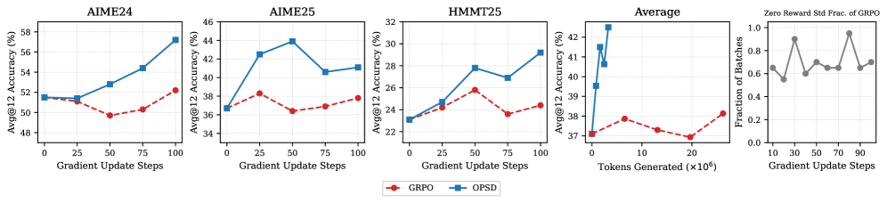
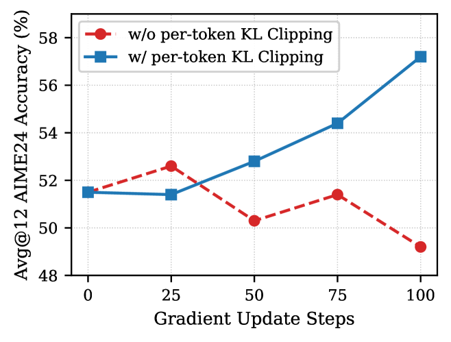
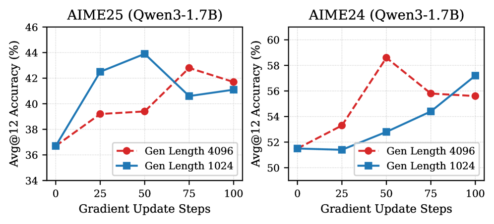

## 4. Experiments

The experiments are designed to answer four research questions:

1. How does OPSD compare to SFT and GRPO in reasoning performance and sample efficiency? (§4.2)
2. How does per-token pointwise KL clipping in OPSD help stabilize training? (§4.3.3)
3. What is the effect of generation style and generation length on performance? (§4.3.4)
4. Does full-vocabulary logit distillation provide benefits over sampled-token policy gradient? (§4.3.5)

### 4.1 Experimental Setup

**Models and datasets.** Experiments use the `Qwen3` model family at three scales — `Qwen3-1.7B`, `Qwen3-4B`, and `Qwen3-8B` — using the instruct-tuned versions. For training data, the mathematical reasoning subset of `OpenThoughts` is used, sampling up to **30K problem-solution pairs** with chain-of-thought reasoning. Evaluation is on competition-level mathematics benchmarks including `AIME 2024`, `AIME 2025`, and `HMMT 2025`.

**Baselines.** Two methods trained on the same dataset are compared: (1) **SFT**, standard supervised fine-tuning on expert trajectories, which can be seen as off-policy distillation from a more powerful LLM that generated the reasoning traces; and (2) **GRPO** [27], group relative policy optimization with binary outcome rewards verified against ground-truth answers. The max generation length for GRPO is set to **16k**.

**Implementation details.** The teacher policy is **fixed to the initial policy**, rather than the currently-updating learning policy, as this stabilizes training and implicitly acts as regularization to prevent excessive deviation from the initial policy. Full-vocabulary logit distillation is used. All experiments are conducted on `A100` or `H100` GPUs with **LoRA** [11]. (Further details in Appendix B.)

### 4.2 Main Results

> **Table 2 — Performance comparison on mathematical reasoning benchmarks for Qwen3 models.** Reports Avg@12 under the sampling configuration recommended in the Qwen3 blog (temperature $1.0$, maximum generation length $38$k). For OPSD, checkpoints are evaluated every 20 steps up to 100 steps and the best score is reported. For GRPO, peak performance within 500 training steps is reported (GRPO performance decreases for some tasks due to entropy collapse in later steps). For SFT, training uses the same number of samples as OPSD. *(The full numeric grid is presented as a figure in the paper; the prose findings below summarize it.)*

OPSD **consistently outperforms SFT** and improves over the base model across all scales, **matching or exceeding GRPO in every setting**. Notably, OPSD achieves these gains using:

- only a **single rollout per problem**,
- convergence **within 100 steps**,
- each problem requiring only **1024 sampled tokens**,

whereas GRPO requires **8 rollouts of 16k tokens each** and may exhibit performance degradation in later steps due to entropy collapse — with most reward standard deviations within a group being zero under the OpenThoughts dataset, yielding no learning signal and wasting sampling budget.

SFT shows **consistent performance degradation** across tasks and model scales when trained on the same dataset, attributed to the concise reasoning style of the ground-truth solutions, which reduces reasoning length at test time. OPSD's token efficiency is attributed to **dense token-level supervision** from the teacher distribution; the authors hypothesize that **earlier tokens may contribute more** to effective distillation, as they may represent more critical branching points in the reasoning process.

> **Figure 3 — Token efficiency of OPSD.** Compares OPSD and GRPO on `Qwen3-1.7B` under the same effective training batch size, reporting Avg@12 accuracy against training steps and total tokens generated. Generation is capped at 1024 tokens for OPSD and 16k for GRPO. At the same number of training steps, OPSD uses significantly fewer tokens but outperforms GRPO on all benchmarks. Despite sampling more tokens, GRPO only receives a binary outcome reward and stagnates due to **reward diversity collapse**: more than half of its batches have zero reward standard deviation within 100 steps, yielding no gradient signal. OPSD sidesteps this by learning from a dense distillation loss even with fewer generated tokens.

### 4.3 Ablation Studies & Discussions

The ablations study five key design choices: (1) the divergence objective, (2) student/teacher generation styles (thinking-mode on/off), (3) per-token KL clipping, (4) student generation length, and (5) full-vocabulary logit distillation vs. sampled-token distillation.

#### 4.3.1 Effect of Divergence Objective

A key design choice is the divergence used for per-token distribution matching between the privileged teacher and the student. Forward KL, reverse KL, and JSD are compared on `AIME25` with `Qwen3-1.7B` (Table 3), all under the same pointwise clipping scheme for stability.

> **Table 3 — Comparison of divergence objectives on AIME25 with Qwen3-1.7B (Avg@12 at different training steps).**

**Forward KL consistently yields the strongest gains**, improving performance from **36.7 to 43.9 at step 50** and remaining above the baseline at step 100. In contrast, reverse KL and JSD ($\beta=0.5$) provide limited or negative improvements. The authors therefore **adopt forward KL** in all remaining experiments.

#### 4.3.2 Effect of Generation Styles and per-token KL Clipping

The generation style of the student and teacher determines both which tokens the student learns from and the style of supervision provided. `Qwen3` models support two generation modes: **Thinking Mode on (TM-on)**, producing self-reflective chain-of-thought tokens, and **Thinking Mode off (TM-off)**, generating responses directly.

The forward KL divergence $\mathrm{KL}(p_T \| p_S)$ is analyzed across all four student/teacher mode pairings, categorizing tokens into three groups: **math** (numerals, operators, mathematical keywords), **style** (reasoning connectives), and **other**. Table 5 reports the mean per-token KL within each category.

Across all model sizes, the **TM-off student paired with a TM-on teacher** yields the largest KL on math tokens, indicating stronger supervision on mathematically relevant tokens. The reported KL values correspond to the expected divergence over the vocabulary at each position; this expectation is highly skewed, with stylistic tokens contributing disproportionately large values — which motivates pointwise clipping. Empirically, the **TM-off student / TM-on teacher** configuration achieves the best downstream performance and is adopted.

#### 4.3.3 Effect of Per-Token Pointwise Clipping

As shown in Table 5, stylistic tokens can exhibit higher KL divergence than math-related tokens, causing them to dominate the training signal. This is mitigated using per-token pointwise clipping.

> **Figure 4 — Effect of per-token pointwise KL clipping on Qwen3-1.7B (AIME24).** Clipping prevents performance collapse.

As shown in Figure 4 for `Qwen3-1.7B`, **clipping stabilizes training and prevents performance degradation**, which is particularly important given that OPSD converges rapidly within a hundred steps.

#### 4.3.4 Effect of Generation Length

Since the objective operates at the token level (Eq. 6), the number of generated tokens per sample directly determines the amount of supervision signal available. Longer sequences expose the student to more teacher feedback but increase computational cost and may introduce noisy continuations. An ablation on `Qwen3-1.7B` varies the student generation length between **1024 and 4096 tokens** (full-vocabulary logit distillation).

> **Figure 5 — Effect of generation length on Qwen3-1.7B (AIME25 and AIME24), student generation length 1024 vs 4096.**

Increasing the generation length **does not lead to consistent improvements** across either task. This is attributed to **early tokens being more critical for learning**: as the student generation grows longer, later tokens become increasingly predictable to the teacher when conditioned on a sufficiently long student prefix, so fewer penalties are applied to later tokens. This phenomenon is also noted in [18].

#### 4.3.5 Learning Objective Comparison: Full-Vocabulary Logits Distillation vs. Sampled-Token Distillation

The objective in Eq. 6 — a per-token discrepancy between teacher and student distributions — can be instantiated in two ways:

1. **Full-vocabulary logit distillation** (as in GKD [1]): for each token position, compute $D(p_T \| p_S)$ over the entire vocabulary via a full softmax, yielding a proper token-level $f$-divergence between the two policies.
2. **Sampled-token advantage policy-gradient objective** (as in the on-policy distillation method of [18]): evaluate teacher and student log-probabilities only at the token actually sampled by the student, $\hat{y}_n$, and use the reverse-KL term as a scalar advantage inside a policy-gradient-style loss.

The first variant directly matches full token distributions, whereas the second optimizes an on-policy RL objective shaped by the teacher's log-probabilities rather than a full-distribution divergence. They are compared on `Qwen3-4B` with a 2048-token generation budget.

> **Table 4 — Ablation on divergence computation strategies for OPSD on Qwen3-4B (2048 generation length), pass@8 accuracy on AIME25 and HMMT25.** Full-distribution objectives (logit distillation) outperform sampled-token objectives.

The **full-vocabulary divergence objective provides a consistent gain** over the sampled-token objective, suggesting that exposing the student to the full teacher distribution offers richer supervision than relying solely on per-token on-policy shaping. However, the full-vocabulary computation incurs **higher peak memory usage** due to storing vocabulary-sized logits at every position — a trade-off between performance and efficiency.
