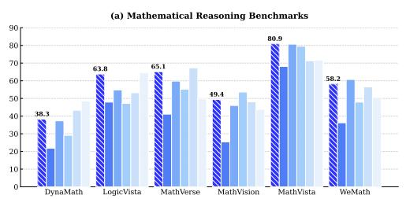
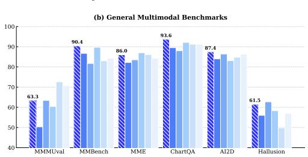
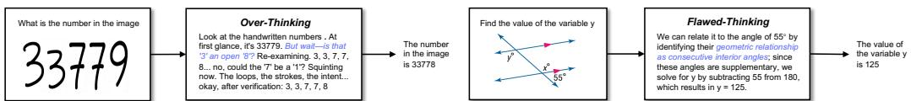

# Guiding MLLMs in When and How to Think via Dual-Reward RL Tuning

**Anonymous Author(s)** | Affiliation | Address | email

---

## 1. Abstract

We introduce **SAIL-RL**, a reinforcement learning post-training framework that enhances the reasoning capabilities of multimodal large language models (MLLMs) by teaching them *when* and *how* to think. Existing approaches are limited by outcome-only supervision, which rewards correct answers without ensuring sound reasoning, and by uniform thinking strategies, which often lead to overthinking on simple tasks and underthinking on complex ones. SAIL-RL addresses these challenges with a dual reward system: the **Thinking Reward**, which evaluates reasoning quality through factual grounding, logical coherence, and answer consistency, and the **Judging Reward**, which adaptively determines whether deep reasoning or direct answering is appropriate. Experiments on the state-of-the-art `SAIL-VL2` show that SAIL-RL improves reasoning and multimodal understanding benchmarks at both 4B and 8B scales, achieving competitive performance against commercial closed-source models such as `GPT-4o`, and substantially reduces hallucinations, establishing it as a principled framework for building more reliable and adaptive MLLMs.

**Figure 1:** Performance comparison between SAIL-VL2-Thinking (SAIL-VL2 post-trained with our SAIL-RL) and other LVMs. SAIL-VL2-Thinking achieves superior advantages on both general understanding and mathematical reasoning benchmarks at the 8B scale and delivers competitive performance against large-scale closed-source models.

---

## 2. Introduction

Notably, RL is undergoing a pivotal paradigm shift: moving beyond mere alignment with human preferences [1, 2, 3], recent methodologies [4, 5, 6, 7] commonly follow the paradigm of "thinking before speaking." Guided by a special token `\think`, the model first generates a structured reasoning trace before producing the final answer. Leveraging long reasoning chains as an internal knowledge source allows the model to extract salient cues that improve answer accuracy and strengthen overall capability. Nevertheless, despite these advances, current methods still face two fundamental challenges:

**Answers without sound reasoning:** Conventional methods rely on outcome-only supervision, where rewards are determined by the correctness of the final answer, while the quality of reasoning is ignored. This paradigm introduces two critical issues: first, as the intuition "think well to answer right" suggests, incoherent or redundant reasoning traces hinder the model from extracting useful cues, leading to inaccurate answers and exacerbating hallucinations. As shown in Figure 2 (Bottom), conventional MLLMs [7] can produce correct answers despite factual errors in reasoning, highlighting how outcome-only rewards compromise robustness and trustworthiness. Second, during optimization, models may occasionally reach correct answers through flawed or fabricated reasoning paths. Such spurious alignments are nevertheless reinforced as positive outcomes, fostering a form of "false correctness" that undermines both robustness and reliability.

**Overthinking the easy, underthinking the hard:** Most approaches apply the same reasoning process to all tasks, regardless of complexity. This uniformity often leads to overthinking on simple problems, introducing unnecessary cost and noisy reasoning chains. As illustrated in Figure 2 (Top), models frequently generate redundant reasoning for trivial queries (e.g., object color recognition), highlighting the inefficiency of static strategies. Conversely, on complex problems, the same rigidity causes underthinking, producing shallow reasoning and inaccurate answers. The lack of adaptive control prevents models from allocating cognitive resources efficiently, unlike humans who naturally adjust their effort based on task difficulty.

To address these challenges, we propose **SAIL-RL**, a novel post-training framework for MLLMs. While following the standard two-stage paradigm of CoT-augmented SFT and RL-tuning, SAIL-RL introduces a dual reward system that supervises both reasoning quality and reasoning efficiency. The **Thinking Reward** moves beyond outcome-only supervision by directly assessing the reasoning process. It evaluates logical coherence to maintain step-by-step validity, factual grounding to mitigate hallucinations, and trace-to-answer consistency to ensure that the final answer is faithfully derived from the reasoning process. The **Judging Reward** enhances adaptivity by enabling models to decide *when* deep reasoning is necessary. The model learns to adopt a direct-answer mode for simple tasks and a full-reasoning mode for complex ones, improving efficiency while aligning cognitive resource allocation more closely with human behavior. Together, these two reward systems allow SAIL-RL to strengthen both the reliability and efficiency of MLLMs in reasoning and comprehensive tasks.

We conduct extensive experiments to evaluate the effectiveness of SAIL-RL. Building on the state-of-the-art MLLM `SAIL-VL2`, we develop **SAIL-VL2-Thinking** through our RL-based post-training strategy. As shown in Figure 1, with the dual reward system, SAIL-VL2-Thinking delivers consistent gains over the baseline and conventional RL-based approaches, achieving state-of-the-art results on multiple reasoning benchmarks at 8B scales. It also reaches leading performance on `OpenCompass`, maintains competitive accuracy on general multimodal understanding tasks, and substantially reduces hallucinations, highlighting the robustness and reliability introduced by SAIL-RL. Together, these contributions establish SAIL-RL as a principled post-training framework that strengthens both the quality and adaptivity of reasoning in MLLMs.

**Figure 2:** Limitations of current MLLMs in reasoning. **Left:** Overthinking where the model applies a complex reasoning process to a simple problem, resulting in an incorrect answer. **Right:** Lucky success where the model reaches the correct answer through a flawed reasoning process.

---

### References (Introduction)

[1] Ouyang et al., 2022. Training language models to follow instructions with human feedback.

[2] Rafailov et al., 2023. Direct Preference Optimization.

[3] Ethayarajh et al., 2023. The Dangers of Underclaiming.

[4] Deng et al., 2025.

[5] Yang et al., 2025b.

[6] Chen et al., 2025a.

[7] Team et al., 2025b.
